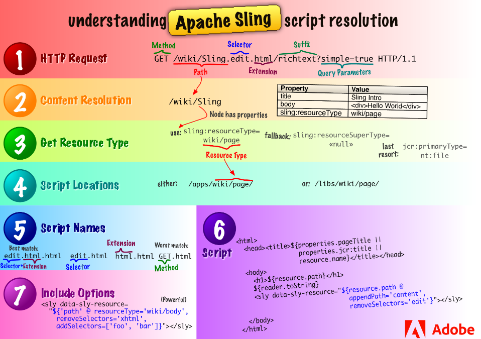
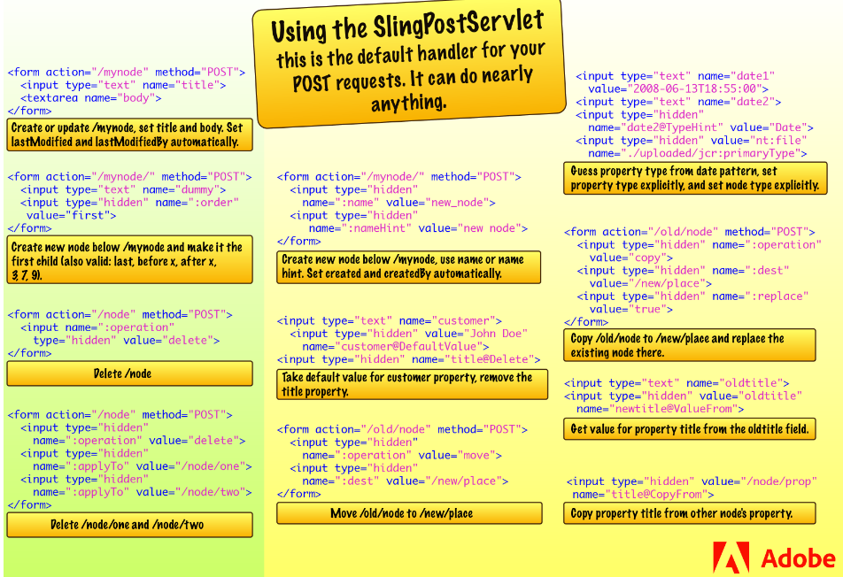

# INTRODUCTION FOR DEVELOPERS

## Getting Started Developing AEM Sites-WKND Tutorial

## AEM Core Concepts

### Java Content Repository

JCR standard is a set of specification which allows a vendor-independent and implementation-independent way to access content bi-directionally on a granular level within a content repository.

Specification lead is held by Adobe Research (Switzerland) AG.

[JCR283](https://developer.adobe.com/experience-manager/reference-materials/spec/jcr/2.0/index.html)

[AEM Reference Materials](https://developer.adobe.com/experience-manager/reference-materials/)

JCR is embeded to Experience Server based on [Apache Jackrabbit](https://jackrabbit.apache.org/jcr/index.html)

### Sling Request Processing

#### Introduction to Sling

- [Sling](https://sling.apache.org/index.html) is a Web application framework based on REST.
- Sling uses JCR as data store.
- Apache Jackrabbit implemented JCR.
- Sling does not care about the type of content it serves, it only cares about if URL resolves to a content object.
- So since the content type is not limited, it gives flexibility for authors to create customized pages.
- WCM stands for Web Content Management System.
- Following picture shows a flow from a HTTP request to a content node, a content node to a resource type, a resource type to a script, and what script variables are available.

#### RESTful Sling

- traditional web application framework:
  1. URL structure
  2. business object
  3. DB Schema
- JCR:
  1. URL
  2. JCR node
  3. scripts

#### URL Decomposition

`https://myhost/tools/spy.printable.a4.html`

| protocol | host   | content path | selectors      | extension | suffix | params |
| -------- | ------ | ------------ | -------------- | --------- | ------ | ------ |
| https:// | myhost | tools/spy    | .printable.a4. | html      | a / b  | x=12   |

- With sling, use `sling:resourceType` to direct reques to find rendering scripts.

##### Steps of Mapping requests to store

1. Check if a node exists for `/content/corporate/jobs/developer.html`
2. If none, check if `/content/corporate/jobs/developer` exists
3. If none, reture 404.

- All scripts are located at `/apps` or `/libs`
