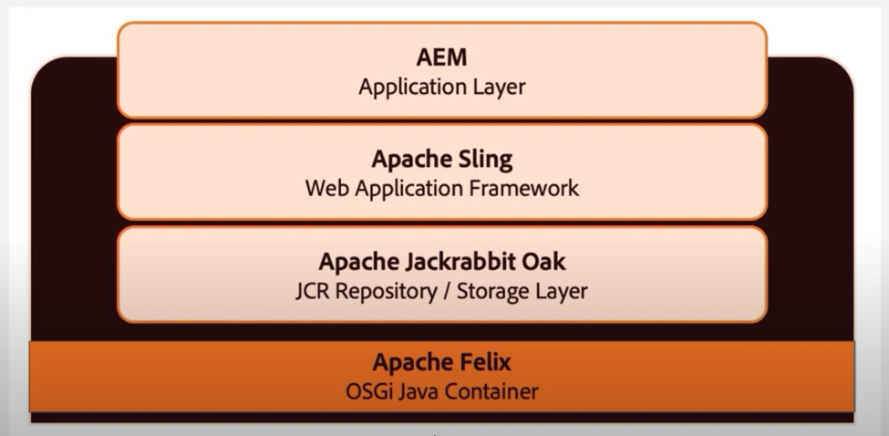
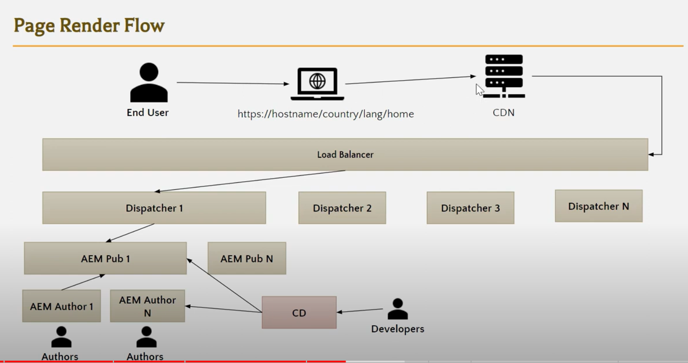

# What is AEM?

1. Content Management System:
   1. what is the content (html structure and content within it)
   2. What is the representation of content (CSS styles)
2. Experience Management System:
   fluent/not-biased experience
   1. between desktops and mobiles
   2. between touch and click operations
3. Organization Specific Experience:
   eg. like global business organization, would provide 15 services accross different countries and different cities within those countries.

   The services and language might be different corresponding to the country/city.

   AEM enable you to configure the same site and switching features on and off, and also providing localization.

4. Experience Fragment:

   AEM also able to classify customerers into groups, like classified by gender, age, etc. And provide "Experience Fragment" which perticularly fit in the classified customers.

# AEM Architecture

## Web Development Architecture


The flow when you visit a site:

1. Client send out the http request
2. If the url request a static page, Web Server will serve the static content directly.
3. If the url requested page contains dynamic data, the request will goes to App Server.

App server contains a framework, like .net asp.net core web api, will decide which "class" will be executed for that particular url and retrieve data from database and send back html format data to Web server, and Web server will do the rest.

## AEM Web Development Architecture


When http request comes in, the Web server dispatch to the App server(Sling framework), and will goes to the content root node part of the JCR(Database). Under the same route address, you will find a node with jcr:content, jcr:content will contains a sling:resourceType which will tell sling framework the route address to find the corresponding code. Sling framework will execute the code and finally build a html format data back to the Web server.

Also, if the resource requested is a page, then the jcr:content/root will contains all the components which composite the page. Each component will have its own node. The properties of that node will contain their own sling:resourceType, by which sling will find the corresponding code.

At same time, we can see that JCR is a nosql database, it has property files and code files. Property file will map to the requested route address, and each property file has names of properties, and values of properties. And one of the important property is the sling:resourceType property which direct to the route address of code file.

# AEM OSGI Container and it's purpose



OSGI is to maintain modularity. It solves name collision, dependency, visibility of exposure issues.

How it works is it plays as a message broker, when a OSGI Service 1(a module) is asking another module's content, it initialize the content and inject the initialized content.

Also since the referencer and referencee are not tightly coupled, when one dependency is down, the OSGI will put all referencee into hold, and prevent the whole application down time.


# AEM paths

## Brief

1. AEM Author
2. AEM Frontend Developer
3. AEM Backend Developer
4. AEM Administrator

## AEM Authoring skill set

- AEM Dynamic Templates:

  page could be dependent on a template, which will define set of available components,

- Component Policy Creation:

  component could have its own policy, like variation definition of componnent

- Page Authoring
- Multisite Management:

  localization

- Content Fragments & Experience Fragments

_Advanced_

- Domain knowledge

  domain knowledge about the industry you are working within

- Content Writing Skills
- Page performance analysis

## AEM Developer skill set

- AEM Architecture
- Sling Resolution
- Authoring

_FrontEnd_

- HTML CSS JS JQuery
- HTL Template Language
- Sass
- How AEM compiles CSS and JS Files

- Context Hub & Personalization

  Context Hub can provide geographic info / age info about the customer.

- Frontend framework, such as React/Angular
- how AEM SPA works

_BackEnd_

- Project Structure
- Maven
- Custom Component Creation
- Sling Servlets
- OSGI Services
- Workflow Administration
- Content Model Creation (For content fragment)

- Java Microservices

# AEM Templates & Components Authoring

https://aemcomponents.dev/

Documentation for buit-in components of AEM


Page must be based on a template, that template could also be other pages' template. A template has multiple allowed components, the same component could be used in different templates, and that component could be assigned to only one component policy. Although, the component policy could be changed corresponds to different templates.

- Entry of Sites:

  localhost:4502/sites.html

- Entry of Authored Components within Page:

  Top-left 1st icon and content tree

- Entry of Component Allowed Style

  Hover component, click on brush

- Entry of Editing Template

  Top-left 2nd icon and Edit Template

- Entry of Component Policy

  Editing Template, click on configure button on component

# AEM Author, Publish & Dispatcher

## Authoring and Publishing


Once click on quick publish, the page content will packed into zip file by Replication Agents and send to the particular url in Publish Environment, that particular url has a servlet to be triggered and deploy the zip file to the Publish Environment and End user can see it.

## Page Rendering Flow



1. Once the url is entered, request is sent, it will visit the nearest CDN(Content Delivery Networks), which will work as cache of static files.
2. If the CDN does not have the content, the request will visit Load Balancer, then the Dispatcher, a apache web server. Load Balancer will decide which Dispatcher is free.
3. Dispatcher will have rewrite rules, which will map the end user url to the real private path in AEM Publish Instance.
4. Dispatcher also cache HTML page
5. If content is not cached, then visit AEM Publish Instance and try to render the page. And then cache it.
6. Dispatcher also has allowed path configuration.
7. Dispatcher also can do the load balancer among AEM Publish Instances.
8. If the URL has dynamically elements, eg. parameters of query appears in the URL, dispatcher will also send request to the AEM Publish Instance.
9. Also if dispatcher is configured that specific path is not able to serve by dispatcher, then the request will goes to the AEM Publisher.

## Debug

If the end user is not able to see the newly edited content, what should we do?

1. Check if the CD Server has deployed the edited content?
2. If deployed, the Author Instance can view the edited content correctly.
3. Check if the edited content is published to the publish instance.
4. Check if the Dispatcher cache is old version, if so, clear cache and make sure it read content from the latest Publish Instance.
5. Check if there's issue with CDN

# Dispatcher Configuration

When the request cannot be served by CDN, it will send request to the Dispatcher. The Dispatcher, an apache server, will listen at particular port. This is configured by a httpd.config file.

It has Three properties that are very important

```
ServerRoot "D:/aem/apache"
Listen 8080
LoadModule dispatcher_module modules/disp_apache2.2.dll

<Directory />
  <IfModule disp_apache2.c>
    ModMimeUsePathInfo On
    SetHandler dispatcher-handler
  </IfModule>
  Options FollowSymLinks
  AllowOverride None
  Order deny, allow
  Deny from all
</Directory>
```

> TODO: Need to drop here, finish in future

# AEM Sling End to End Flow


When the request comes to the publish instance, the first thing get hit is OSGI Framework(container of everything), There would be OSGI HTTP Service runing which has Sling servlet registered. The Sling Main Servlet is the first Entry Point. HTTP Servlet Request & Response get wrapped as HTTP Sling Servlet Request & Response.


Inside Sling Framework,

1. First check if Resource Resolver Factory is available
2. Factory create resource resolver by Resource Provider, any backend resource can have resource resolver that fit in the interface. So sling is able to access any type of backend resource, not just JCR.
3. Wrap resource resolver, inject into Sling servlet request.
4. Resource Resolver has resolve method will return everything under requested URL.
5. Sling Main servlet will see sling:resourceType and render the page.

## Two types of resources

When the Resource Resolver return the resource, there are two types of resources could be returned.

1. page and its scripts(HTML, HTL, JS, CSS)
2. A Custom Sling Servlet

## Custom Sling Servlet Registration

There are two ways of registering Sling Servlet


1. use the sling:resourceType property on the JCR node
2. use the OSGI configuration

## Page rendering

Render the HTL or anything if the resource is page.

# AEM Page Authoring & Component Development

- Usage of left panel, view as published, and developer view.

- Usage of experienceleague.adobe.com/docs/experience-manager-core-components: description/docs of components

- Usage of cq:dialog node: is for the wrench icon for edit mode on component.

- Usage of developer.adobe.com/experience-manager/reference-materials/6-5/granite-ui/: description/docs for dialog UIs.

# AEM HTL Language Syntax Practice

Goal of HTL

1. Variable Setting

```htl
<p data-sly-set.x="${1}">${x}</p>
<ul data-sly-list.x="${[1,2,3,4]}">
  <li>${x}</li>
</ul>

<p data-sly-test="${x == 1}"></p>
```

2. If condition
3. Operators
4. Loops
5. Function
6. Include another file
7. Display Context
8. Global Objects

# Global Object

The traditional flow of MVC in AEM

Browser => Controller => Sling Model => database => Sling Model => HTL => Controller => Browser

The global object flow

Browser => Controller => View => Global Object => View => Controller => Browser

# Sling Model

@Model tells sling that this is the Sling model used by specific resource(content folder resource).

adaptables resource class will be adapted to something, and the resource class is adapt to a ValueMap, which is the source properties of current model.

@Inject means we inject property from the ValueMap to this model and get the property's value.

Every Injeced property is required by default. We can use defaultInjectionStrategy = DefaultInjectionStrategy.OPTIONAL to set all injected property is optional, so no errors raised if property name not found.

@PostConstruct means the method will execute when all properties are injected.

# QueryBuilder

/libs/cq/search/content/querydebug.html

## Set root path

path=/content/wknd/us/en/articles

## Set which primaryType

path=/content/wknd/us/en/articles
type=cq:Page

## How does resource resolver works

Browser => content node => apps node(component) => sling model => resource(content node) => Resource Resolver => Session / QueryBuilder

### How does OSGI Framework works

Our model is a bundle, and our resource(content node) is another bundle, so one bundle needs another bundle, the OSGI Framework will inject. And Resource Resolver is within that OSGI Framwork, so call resource resolver in model will get you the resource.

```java
@Model(adaptables = Resource.calss, defaultInjectionStrategy = DfaultInjectionStrategy.OPTIONAL)
public class ArticleListModel{
    private static final Logger LOGGER = LoggerFactory.getLogger(ArticleListModel.class);
    // under /system/console/slinglog, add new logger, debug level, logfile=logs/articlelog.log, logger=com.adobe.aem.guides.wknd.core.models.ArticleListModel

    @Self
    Resource resource;

    @Inject
    private String articleRootPath;

    public String getArticleRootPath() {return articleRootPath;}

    List<ArticleListDataBean> array = null;

    @PostConstruct
    protected void init(){
        ResourceResolver resourceResolver = resource.getResourceResolver();
        Session session = resourceResolver.adapTo(Session.class);
        QueryBuilder builder = resourceResolver.adaptTo(QueryBuilder.class);

        Map<String, String> predicate = new HashMap();
        predicate.put("path", articleRootPath);
        predicate.purt("type", "cq:Page");

        Query query = null;
        try{
            query = builder.createQuery(PredicateGroup.create(predicate), session);
        }catch(Exception e){
            LOGGER.error("Error in Query", e);
        }

        SearchResult searchResult = query.getResult();
        array = new ArrayList<ArticleListDataBean>();

        for(Hit hit: searchResult.getHits()){
            String path = null;
            try{
                ArticleListDataBean item = new ArticleListDataBean();

                path = hit.getPath();
                Resource articleResource = resourceResolver.getResource(path);
                Page articlePage = articleResource.adaptTo(Page.class);
                String navTitle = articlePage.getNavigationTitle();
                String description = articlePage.getDescription();

                item.setPath(path);
                item.setTitle(navTitle);
                item.setDescription(description);

                list.add(item);

                LOGGER.debug("Navigation Title: {}, Description {}", navTitle, description);
            }catch(Exception e){
                throw new RuntimeException(e);
            }
        }

    }

    public List<ArticleListDataBean> getArray(){
        return array;
    }
}
```

Then we create Beans to store articles info retrieved by the query builder.

```java
public class ArticleListDataBean{
    private String path;
    private String title;
    private String description;

    public String getDescription{
        return description;
    }

    public String getTitle{
        return title;
    }

    public String getPath{
        return path;
    }

    public void setDescription(String description){
        this.description = description;
    }

    public void setTitle(String title){
        this.title = title;
    }

    public void setPath(String path){
        this.path = path;
    }

}
```

Now we need to use the array in HTL

```html
<h1>This is the Article List component</h1>
<sly
  data-sly-use.model="com.adobe.aem.guides.wknd.core.models.ArticleListModel"
>
  ${model.articleRootPath}
  <sly data-sly-list.array="${model.array}">
    <div>
      <h2>${array.path}</h2>
      <p>${array.description}</p>
      <a href="${array.path}">Explore more...</a>
    </div>
  </sly>
</sly>
```

# Add CSS to AEM component

```html
<sly
  data-sly-use.clientlib="/libs/granite/sightly/templates/clientlib.html"
  data-sly-call="${clientlib.all @ categories='wknd.articlelist'}"
/>
<div class="cmp-articlelist">
  <h1 class="cmp-articlelist__heading">This is the Article List component</h1>
  <div
    class="cmp-articlelist__cards-container"
    data-sly-use.model="com.adobe.aem.guides.wknd.core.models.ArticleListModel"
  >
    ${model.articleRootPath}
    <sly data-sly-list.array="${model.array}">
      <div class="cmp-articlelist__card">
        <div class="cmp-articlelist__card-title">${array.title}</div>
        <div class="cmp-articlelist__card-description">
          ${array.description}
        </div>
        <div class="cmp-articlelist__card-btn-container">
          <a class="cmp-articlelist__card-btn" href="${array.path}"
            >Explore more...</a
          >
        </div>
      </div>
    </sly>
  </div>
</div>
<style>
  .cmp-articlelist__cards-container {
    display: flex;
  }
  .cmp-articlelist__card {
    display: flex;
    flex-direction: column;
    padding: 10px;
    width: 350px;
    height: 330px;
  }
  .cmp-articlelist__card-btn {
    padding: 15px 40px;
    background-color: #5e7263;
    color: #fff;
    text-align: center;
  }
</style>
```

Create clinetlibs node as jcr:primaryType: cq:ClinetLibraryFolder, under articlelist component node. css folder, js folderand, .content.xml, css.txt, js.txt under clientlibs.

```txt
<!-- css.txt -->
#base=css
articlelist.css
```

```css
.cmp-articlelist__cards-container {
  display: flex;
}
.cmp-articlelist__card {
  display: flex;
  flex-direction: column;
  padding: 10px;
  width: 350px;
  height: 330px;
}
.cmp-articlelist__card-btn {
  padding: 15px 40px;
  background-color: #5e7263;
  color: #fff;
  text-align: center;
}
```

# Add CSS Variations to AEM Component

cq:design_dialog must be valid, and we can select our componnet's policy at Edit Template (button at left rail).

```scss
.cmp-articlelist--grey-background {
  .cmp-articlelist__card {
    background-color: grey;
  }
}

.cmp-articlelist--white-background {
  .cmp-articlelist__card {
    background-color: white;
  }
}

.cmp-articlelist__cards-container {
  display: flex;
}
.cmp-articlelist__card {
  display: flex;
  flex-direction: column;
  padding: 10px;
  width: 350px;
  height: 330px;
}
.cmp-articlelist__card-btn {
  padding: 15px 40px;
  background-color: #5e7263;
  color: #fff;
  text-align: center;
}
```

We create style within a group, may be called background-color/theme/whatever, and style name as name that displays to the author at bruch button, and class name is the cmp-articlelist--grey-background/cmp-articlelist--white-background.

That brush selected will inject the class to the root of the component div tag.

# Introduction to AEM Sling Servlet

In traditional web application/application server. There will be a Framework at the very outside the app, which is responsible to identify which servlet container need to be invoked. and servlet container is responsible to identify which servlet, to create, init, execute, and destroy.

In AEM, the creation of servlet is done by OSGI framework which is the ultra outside of the app, these servlet is passed to sling and servlet container. Sling can locate which servlet by the request path, and servlet container will execute, and destroy the servlet.

So the servlet code is like:

```java
@Component(service = {Servlet.class}) // indicate this is a OSGI component
@SlingServletResourceTypes(
  //The first 3 things help Sling to identify this servlet
  resourceTypes="sling/servlet/default",
  selectors = "myServlet",
  extensions = "json",
  methods = HttpConstants.METHOD_POST
)
public class MyServlet extends SlingAllMethodsServlet{
  public static final Logger LOGGER = LoggerFactory.getLogger(MyServlet.class);
  @Override
  protected void doPost(final SlingHttpSrevletRequest req, final SlingHttpServletResponse resp) throws ServletException, IOException{
    LOGGER.debug("Servlet Code Started!!");
  }
}
//SlingSafeMethodsServlet Readonly servlet,
//SlingAllMethodsServlet supports post put delete, which extends SlingSafeMethodsServlet.
```
