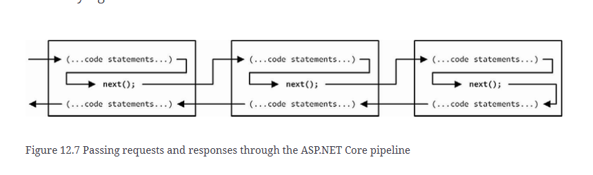

# 4 Using the Development Tools
## 4.1 Creating ASP.NET Core command line

|Problem|Solution|
|-|-|
|Creating a project|`dotnet new`|
|Building and running project|`dotnet build` `dotnet run`|
|Adding packages to a project|`dotnet add package`|
|Installing tool commands|`dotnet tool`|
|Managing client-side packages|`libman`|


```bash
dotnet new --list
# to list templates available for creating new items

dotnet new web
# minimum code and content required for ASP.NET Core development
dotnet new mvc
# minimum configured for mvc framework
dotnet new webapp
# Razor paged
dotnet new blazorserver
# Blazor server
dotnet new angular
dotnet new react
dotnet new reactredux
```
## Example of creating a web project
```bash
dotnet new globaljson --sdk-version 7.0.100 --output MySolution/MyProject
# create global.json file at MySolution/MyProject, to make sure everyone using the same sdk version when developing
dotnet new web --no-https --output MySolution/MyProject --framework net7.0
# create a minimum web project at MySolution/Myproject, using runtime 7.0, without https supports
dotnet new sln -o MySolution
# create a solution file 
dotnet sln MySolution add MySolution/MyProject 
```

Use VS Code:
Open Solution folder 

(Optional)
Use Visual Studio:
Open Solution file

Create `wwwroot` folder and add HTML file named `demo.html`, 
```bash
# MySolution\MyProject
dotnet build 
dotnet run 
```

## using the hot reload features
Instead of dotnet run, we use
```bash
dotnet watch
```
This will reflect static content only, but not code in the RT(I guess).

## 4.4 Managing Packages
```bash
# MySolution\MyProject
dotnet add package Microsoft.EntityFrameworkCore.SqlServer --version 7.0.0
```
`.csproject` is to track packages.

```bash
# use this to list packages
dotnet list package

# to remove package
dotnet remove package Microsoft.EntityframeworkCore.SqlServer

# to manage tool package
dotnet tool uninstall --global dotnet-ef
dotnet tool install --global dotnet-ef --version 7.0.0

dotnet tool install --global Microsoft.Web.LibraryManager.Cli --version 2.1.175
libman init -p cdnjs
libman install bootstrap@5.2.3 -d wwwroot/lib/bootstrap
```

```html
<!-- wwwroot\demo.html -->
<!DOCTYPE html>
<html>
<head>
    <meta charset="utf-8" />
    <title></title>
    <link href="/lib/bootstrap/css/bootstrap.min.css" rel="stylesheet" />
</head>
<body>
    <h3 class="bg-primary text-white text-center p-2">New Message</h3>
</body>
</html>
```

# 4.5 Debugging projects
[visual studio debugger documentation](https://docs.microsoft.com/en-us/visualstudio/debugger)
[visual studio code debugger documentation](https://code.visualstudio.com/docs/editor/debugging)

# 5 Essential C# Features
```C#
// to use anonymous type object property
var products = new []{
    new { Name = "Kayak", Price = 275M},
    new { Name = "Lifejacket", Price = 48.95M},
}

products.Select(p => p.GetType().Name);

// to use extension methods
public static class MyExtensionMethods{
    public static decimal TotalPrices(this ShoppingCart cart){
        decimal total = 0;
        if (cart.Products != null){
            foreach(Product? prod in cart.Products){
                total += prod?.Price ?? 0;
            }
        }
        return total;
    }
}

var shoppingCart = new ShoppingCart();
decimal total = shoppingCart.TotalPrices();
```

## 12 Understanding The ASP.NET Core Platform

### Preparing
```bash
dotnet new globaljson --sdk-version 7.0.410 --output Platform
dotnet new web --no-https --output Platform --framework net7.0
dotnet new sln -o Platform
dotnet sln Platform add Platform
```
### Understanding the ASP.NET Core Platform
`Program.cs` is the entry point of the ASP.NET Core project.

The "Kestrel" is the name of ASP.NET Core Server. It handles HttpRequest from the port. The request comes in and go through every middlewares that you setup in the `Program.cs` file. 
```cs
// logic to register servcie happened among here
var builder = WebApplication.CreateBuilder(args);
var app = builder.Build();
```


Each of these middleware will deal with different `content-type` request is asking, or perform as different logic, it's like a pipeline, after the pipeline ends, the server will send out the HTTPResponse which is a result from those pipelines. 

Service are also registered in `Program.cs` file, these are features that can be injected by those middlewares using Dependency Injection.

```cs
// logic to register custom middleware
app.Use(async (context, next) => {
    if (context.Request.Method == HttpMethods.Get
            && context.Request.Query["custom"] == "true") {
        context.Response.ContentType = "text/plain";
        await context.Response.WriteAsync("Custom Middleware \n");
    } 
    await next();
});

app.MapGet("/", () => "Hello World!");

app.Run();
```

Different project related files are performing different tasks, which listed below:
|file name|visual studio|visual studio code|notes|
|-|-|-|-|
|appsettings.json|X|X|Configure the application|
|appsettings.Development.json||X|configure settings are specific to development environment|
|bin||X|Folder, contains compiled application files|
|global.json|X|X|select a specific version of the .NET Core SDK|
|Properties/launchSettings.json|X|X|configure application when it starts|
|obj||X|Folder, contains intermediate output from compiler|
|Platform.csproj||X|Describe the project to .NET Core tools, MSBuild as example, including the package dependencies and build instructions|
|Platform.sln||X|Organize projects|
|Program.cs|X|X|Entry point|

After up running the project, use following to send out a request from PowerShell.
```bash
(Invoke-WebRequest http://localhost:5000).RawContent

# output
# HTTP/1.1 200 OK
# Transfer-Encoding: chunked
# Content-Type: text/plain; charset=utf-8
# Date: Wed, 14 Dec 2022 07:08:13 GMT
# Server: Kestrel
```

To add a package to the project.

```bash
dotnet add package Swashbuckle.AspNetCore --version 6.4.0
```

```xml
<Project Sdk="Microsoft.NET.Sdk.Web">

  <PropertyGroup>
    <TargetFramework>net7.0</TargetFramework>
    <Nullable>enable</Nullable>
    <ImplicitUsings>enable</ImplicitUsings>
  </PropertyGroup>
  
  <ItemGroup>
    <PackageReference Include="Swashbuckle.AspNetCore" Version="6.4.0" />
  </ItemGroup>
  
</Project>
```

### Creating custom middleware

We can see code for creating custom middleware above. The argument is `Microsoft.AspNetCore.Http.HttpContext` type.

Now we are trying to create a custom middleware using class
```cs
namespace Platform{
    public class QueryStringMiddleWare{
        private RequestDelegate next;

        public QueryStringMiddleWare(ReqeustDelegate nextDelegate){
            next = nextDelegate
        }

        public async Task Invoke(HttpContext context){
            if (context.Request.Method == HttpMehtods.Get && context.Request.Query["custom"] == "true"){
                if (!context.Response.HasStarted){
                    context.Response.ContentType = "text/plain";
                }
                await context.Response.WriteAsync("Class Middleware \n");
            }
            await next(context)
        }
    }
}

// Program.cs

var builder = WebApplication.CreateBuilder(args);
var app = builder.Build();

app.Use(async (context, next) => {
    await next();
    await context.Response
        .WriteAsync($"\nStatus Code: { context.Response.StatusCode}");
});

app.Use(async (context, next) => {
    if (context.Request.Method == HttpMethods.Get
            && context.Request.Query["custom"] == "true") {
        context.Response.ContentType = "text/plain";
        await context.Response.WriteAsync("Custom Middleware \n");
    }
    await next();
});

app.UseMiddleware<Platform.QueryStringMiddleWare>();

app.MapGet("/", () => "Hello World!");

app.Run();
```

For the full process please consider the picture below.


> NOTE: To avoid exception raised, You have to check `response.HasStarted` flag when you try to make some change to the response. Once it's fired, changing content will raise error.

There could be short-circuiting if you have code like this:
```cs
var builder = WebApplication.CreateBuilder(args);
var app = builder.Build();

app.Use(async (context, next) => {
    await next();
    await context.Response
        .WriteAsync($"\nStatus Code: { context.Response.StatusCode}");
});

app.Use(async (context, next) => {
    if (context.Request.Path == "/short") {
        await context.Response
            .WriteAsync($"Request Short Circuited");
        // there is no next(), short-circuiting!!!
    } else {
        await next();
    }
});

app.Use(async (context, next) => {
    if (context.Request.Method == HttpMethods.Get
            && context.Request.Query["custom"] == "true") {
        context.Response.ContentType = "text/plain";
        await context.Response.WriteAsync("Custom Middleware \n");
    }
    await next();
});

app.UseMiddleware<Platform.QueryStringMiddleWare>();

app.MapGet("/", () => "Hello World!");

app.Run();

// output
// Request Short Circuited
// Status Code: 200

```

We can also create Branch pipeline by:

```cs
var builder = WebApplication.CreateBuilder(args);
var app = builder.Build();

app.Map("/branch", branch => {

    branch.UseMiddleware<Platform.QueryStringMiddleWare>();
        
    branch.Use(async (HttpContext context, Func<Task> next) => {
        await context.Response.WriteAsync($"Branch Middleware");
    });
});

app.UseMiddleware<Platform.QueryStringMiddleWare>();

app.MapGet("/", () => "Hello World!");

app.Run();

// output: http://localhost:5000/branch?custom=true
// Class Middleware
// Branch Middleware

// output: http://localhost:5000/?custom=true
// Class Middleware
// Hello World!

// Alternative way
app.MapWhen(context => context.Request.Query.Keys.Contains("branch"), 
   branch => {
        // ...add middleware components here...
});
```

Terminal Pipeline Middleware, will never pass request to the next middleware:
```cs
var builder = WebApplication.CreateBuilder(args);
var app = builder.Build();

((IApplicationBuilder)app).Map("/branch", branch => {

    branch.UseMiddleware<Platform.QueryStringMiddleWare>();
        
    // Notice we have Run method instead of Use, and there is shortage of parameter of next delegate
    branch.Run(async (context) => {
        await context.Response.WriteAsync($"Branch Middleware");
    });
});

app.UseMiddleware<Platform.QueryStringMiddleWare>();

app.MapGet("/", () => "Hello World!");

app.Run();


var builder = WebApplication.CreateBuilder(args);
var app = builder.Build();

((IApplicationBuilder)app).Map("/branch", branch => {

    branch.UseMiddleware<Platform.QueryStringMiddleWare>();
        
    branch.Run(async (context) => {
        await context.Response.WriteAsync($"Branch Middleware");
    });
});

app.UseMiddleware<Platform.QueryStringMiddleWare>();

app.MapGet("/", () => "Hello World!");

app.Run();
```

We can create a middleware using class, to fit in terminal pipeline or regular one:
```cs
namespace Platform {

    public class QueryStringMiddleWare {
        private RequestDelegate? next;
                
        public QueryStringMiddleWare() {
            // do nothing
        }
                
        public QueryStringMiddleWare(RequestDelegate nextDelegate) {
            next = nextDelegate;
        }
                
        public async Task Invoke(HttpContext context) {
            if (context.Request.Method == HttpMethods.Get
                        && context.Request.Query["custom"] == "true") {
                if (!context.Response.HasStarted) {
                    context.Response.ContentType = "text/plain";
                }
                await context.Response.WriteAsync("Class Middleware\n");
            }
            if (next != null) {
                await next(context);
            }
        }
    }
}
```

## 13 Using URL Routing
#### 13.1.1 Understanding URL Routing

We can use custom middleware to go through consistent logic of checking path and handling the response subsequently. But this redundant logic of chekcing path is hard to maintain, when redirect, terminal, and short-circuit is adding up, also accumulated middleware as time goes along added up the maintainence difficulty.

we have two concept here, the logic of dealing with real business logic, these parts could be in a type of middleware called ***endpoints***. And checking the URL path and map them to the endpoints, could be in a type of middleware called ***routing***.

