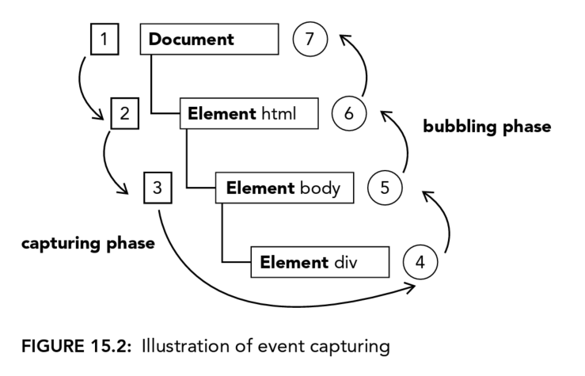
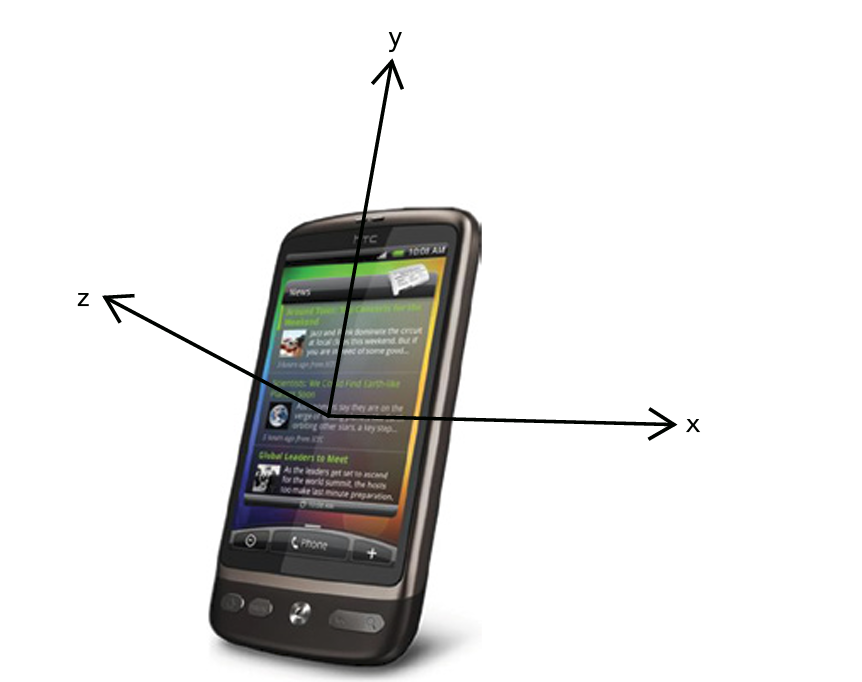

# 15 Events
JavaScript's interaction with HTML is handled through *events*, which can be subscribed to *listeners*(also called *handlers*) that executes only when event occurs. This is called *observer pattern* that allows a loose coupling between the behavior of a page.

Browsers have their own way to achieve events handling, until DOM level 2, which tries to standardize the DOM events API in a logical way.

For BOM, there are also events. Sometimes these events are very confused with DOM events, where HTML5 tries to clarify. Plus, augmentation of DOM events API by DOM level 3 makes it even harder to use.

But before everything is clarified, here are some important concepts to understand.

## EVENT FLOW
*Event Flow* describes the order and range in which events are reeived on the page.

But before this, let's see a interesting concept.
### Event Bubbling

It means the event will bubble up from the most specific node to the least specific node(the document).

### DOM Event Flow
The DOM Event Flow specified in DOM Level 2 Events has 3 phrases:
1. Capturing
2. At the target
3. Bubbling



## EVENT HANDLERS
Events are certain actions performed either by the user or by the browser itself. For example, click, load, and mouseover, there would be corresponding event handler as attribute for them, onclick, onload,and onmouseover.

### HTML Event Handlers
For DOM Level 0, there would be two way to assign event handler.
1. by inline attribute:
```html
<input type="button" value="Click Me" onclick="console.log('clicked!');"/>

<script>
    function showMessage(){
        console.log("Hello World!");
    }
</script>
<input type="button" value="Click Me" onclick="showMessage()"/>
```

Within event handler, it's possible to access `document` and `this` directly, where `this` refering the target element.

There could be 3rd property if the event handler function is assigned to element within form tag.
```html
<script>
    function(){
        with(document){
            with(this.form){
                with(this){

                }
            }
        }
    }
</script>

<form method="post">
    <input type="text" name="username" value="">
    <input type="button" value="Echo Username"
        onclick="console.log(username.value)">
</form>
```

2. By property:
```js
let btn = document.getElementById("myBtn");
btn.onclick = function(){
    console.log(this.id);// myBtn
}
btn.onclick = null;
```

### DOM Level 2 Event Handlers
```js
let btn = document.getElementById("myBtn");
btn.addEventListener("click", () =>{
    console.log(this.id);
}, false);
```
Only one thing need to pay attention: this is the only way to remove event listener.
```js
let btn = document.getElementById("myBtn");
let handler = function (){
    console.log(this.id);
}
btn.addEventListener("click", handler, false);

btn.removeEventListener("click", handler, false);
```

## THE EVENT OBJECT
When event is fired, related info will be wrapped in an object called `event`. Remember, all browsers support the event object, but not in the same way.

### The DOM Event Object
You can always access this object through DOM Level 0 or DOM level 2 event handler by `event` property.

```js
let btn = document.getElementById("myBtn");
btn.onclick = function(event){
    console.log(event.type);
}

btn.addEventListener("click", (event) => {
    console.log(event.type);
}, false) // use event bubble not captureing
```
```html
<input type="button" value="Click Me" onclick="console.log(event.type)">
```

Consider we clicked on a button:
```js
document.body.onclick = function(event){
    console.log(event.currentTarget === document.body);// true
    console.log(this === document.body);// true
    console.log(target === document.getElementById("myBtn")); // true, target is pointing to the real target
}
```

- All event objects would have following members:

|PROPERTY/METHOD|TYPE|READ/WRITE|DESCRIPTION|
|-|-|-|-|
|bubbles|Boolean|Read only|Indicates if the event bubbles|
|cancelable|Boolean|Read only|Indicates if the default behavior or the event can be canceled|
|currentTarget|Element|Read only|The element whose event handler is currently handling the event(see example code in previous section)|
|defaultPrevented|Boolean|Read only|When `true`, indicates that `preventDefault()` has been called(DOM3)|
|detail|Integer|Read only|Extra info related to the event|
|eventPhase|Integer|Read only|The phase during which the event handler is being called:1 for the capturing phase, 2 for "at target", 3 for bubbling|
|preventDefault()|Function|Read only|Cancels the default behaviro for the event. If cancelable is true this method can be used.|
|stopImmediatePropagation()|Function|Read only|Cancels any further event captureing or event bulbling and prevents any other event handlers from being called(DOM3)|
|stopPapergation()|Function|Read only|Cancels any further event capturing or event bubbling. If bubbles is true, this method can be used|
|target|Element|Read only|The target of the event|
|trusted|Boolean|Read only|When true, indicates if the event was generated by the browser.when false, indicates the event was created using JS by the developer(DOM3)|
|type|String|Read Only|The type of event that was fired|
|View|Abstract View|read ony|The abstract view associated with the event. This is equal to the window object|

- Remember, `this` object within event is always equal to `currentTarget`, where event is registered. 
- `target` is which element triggered the event.

## EVENT TYPES

Event type determines the info available about the event, DOM 3 Events are secified as following.

|Event group|Description|
|-|-|
|**User interface**|events are general browser events that may have some interaction with the BOM|
|**Focus events**|fired when an element gains or loses focus|
|**Mouse events**|fired when the mouse is used to perform an action|
|**Wheel events**|fired when a mouse wheel is used|
|**Text events**|fired when text is input into the document|
|**Keyboard events**|fired when keyboard is used|
|**Composition events**|fired when inputting characters for an Input Method Editor(IME)|

<sup>In addition to these categories, HTML5 has its own set, and also browser could have their own proprietary events</sup>

> IME, for example, is the panel for Chinese candidate characters

### UI Events
|Event type|Descriptions|
|-|-|
|load|fires on <ol><li>window</li><li>frameset</li><li>``</li><li>`<object>`</li></ol> when it's completely loaded|
|unload||
|abort|fires on `<object>` when user interupt load process|
|error|fires on window when JS error occurs|
|select|fires when user selects one or more characters in a text box|
|resize|fires on a window or frame when it is resized|
|scroll|fires on any element with a scrollbar when the user scrolls it|

<sup>`<object>` should NOT be used especially when its data attribute includes insecure request(url begins with `http`), because there's potential that the embeded scripts will manipulate parent context.</sup>

#### The *load* Event

- Window load event fires only if the page is loaded, including external resources, like js files, css files, and images.
- Images load event fires if image is loaded, but the image start downloading whenever `src` property is set. (Even it's not added to the DOM yet)
- `<script>` fires load event when script is downloaded. `<script>` starts downloading only if `src` property is set AND the element is added to the DOM.

#### The *unload* Event
- Fires when a document has completely unloaded
- Used for clean up references to avoid memo leaks
- Not all objects available when page is loaded still remains available when unload event is fired

#### The *resize* Event
- resize could be assigned to `<body>` element
- Avoid heavy computation on this event, and be noted that it also fires when minimize and miximize the window.

#### The *scroll* Event
```js
window.addEventListener("scroll", (event) =>{
  console.log(document.body.scrollTop);
})
```
- The above code snippet will show the vertical scroll position of the page.

### Focus Events
These events work with `document.hasFocus()` and `document.activeElement` properties.
|Event type|Descriptions|
|-|-|
|blur|fires when element lost focus, this event does not bubble|
|focus|fires when element received focus, does not bubble|
|focusin|fires when element received focus, Bubble version|
|focusout|fires when element lost focus, Generic version of the blur event|

When focus is moved from one element to another on the page, following happens:
1. focusout fires on the element losing focus.
2. focusin fires on the element receiving focus.
3. blur fires on the element losing focus
4. DOMFocusOut fires on the elemeent losing focus
5. focus fries on the element receiving focus.
6. DOMFocusin fires on the element receiving focus.

### Mouse and Wheel Events
9 mouse events in DOM 3:
|Event type|Descriptions|
|-|-|
|click|left button or enter key is pressed|
|dblclick|left button double clicked|
|mousedown|any mouse button, cannot be fired by keyboard|
|mouseenter|fires when first time enter the boundaries of element, does NOT bubble or fires on descendat element|
|mouseleave|fires when move outside of element, does NOT bubble or fires on descendants|
|mousemove|fires repeatedly as cursor being moved, cannot be fired by keyboards|
|mouseout|moves out an element and moves over to another element, cannot be fired by keyboards|
|mouseover|like mouseenter, bubble|
|mouseup|release mouse button, cannot be fired via keyboards|

All events bubble, but mouseenter and mouseleave events. All events can be canceled.

click event would fire after a mousedown and mouseup. If mouseup or mousedown is canceled, then click is not fired.
So if you double clicked:
1. mousedown
2. mouseup
3. click
4. mousedown
5. mouseup
6. click
7. dblclick

#### Coordinates
```js
let div = document.getElementById("myDiv");
div.addEventListener("click", (event) =>{
  console.log(`Client coordinates: ${event.clientX}, ${event.clientY}`);
});
```
> `clientX` and `clientY` does not take into account the scroll position
> `pageX` and `pageY` would take account of scroll position, which indicate the position of X and Y related to the page.
> `screenX` and `screenY` would be the position related to the display screen.

#### Modifier Keys
- `shiftKey`
- `ctrlKey`
- `altKey`
- `metaKey`

#### Related Elements
`relatedTarget` would be `null` for other events, but within `mouseover` and `mouseout` it's not `null`.
- `mouseover`, `relatedTarget` would be the element that losing the cursor
- `mouseout`, `relatedTarget` would be the element that gaining the cursor.

#### Buttons
for `mouseup` and `mousedown`, the `button` property indicates the type of button that was pressed and released.

#### Additional Event Information
- `click` event if fired if mouse stays the same location and `mousedown` and `mouseup` events are fired.
- `detail` property will count `click` event at the same location

#### The `mousewheel` Event
`mousewheel` will bubble to the window. `wheelDelta` property has positive value if wheels are scrolled to the front.

#### Touch Device Support
- `dblclick` event is not available, since touch device will zoom in by double clicked screen
- Tap on a clickable element will fire `mousemove` event, if there's no change of the screen, then `mousedown` `mouseup` and `click` events are fired in order.
- Tap on unclickable element, no event fires
- Clickable element defined as element has default action when clicked or element with `onclick` event assigned
- `mousewheel` and `scroll` events fires when two fingers are on the screen and the page is scrolled as the result of finger movement.

#### Accessibility Issues
- use `click` event at maximum since it is the only event that can triggered by mouse and keyboard
- `mouseover` `mousedown` `dblclick` should be banned

### Keyboard and Text Events
- `keydown` `keypress` `keyup`, and `textinput`
- when you press a character key:
 - before character display
  1. `keydown`
  2. `keypress`
 - after character display and release of the key
  1. `keyup`
- when you press a non-character key, `keypress`/`textinput` event is not fired. `textinput` is an alternate event for `keypress`

#### Key Codes
`keycode` property is wrapped in `keyup` and `keydown` events. `keycode` property is alphanumeric code to represent keyboard input. It follows ASCII value for lowercase letter or number. For example, 7 key has keyCode of 55, A key has a keyCode of 65.

```js
const textbox = document.getElementById("myText");
textbox.addEventListener("keyup", (event) =>{
  console.log(event.keyCode);
});
```

Because `keyup` event only fires after `keypress` event which fires right before character being inserted or removed on screen. So, this code snippet of `keyup` event will log manipulated characters' corresponding `keyCode`. If we want to know what actual character is being manipulated, we can use `String.fromCharCode()` method.

#### DOM Level 3 Changes
`charCode` property is not standard for DOM Level 3. Within standard, there are `key` and `char` properties.

`key` property is the actual character for character keys, and will be the name of keys for non-character keys. For example, "Shift" or "Down" for corresponding keys. and "k" or "M" etc.

`char` property will behave the same way as `key`, but would be value of `null` if non-character key is pressed.

DOM Level 3 Events also provide property called `location` to describe which part of keyboards is the location of the pressed key.
|`location` value|description|
|-|-|
|0|(traditional)default keyboard compared with other location|
|1|left location, for left shift left alt etc.|
|2|right location|
|3|numeric kepad|
|4|virtual keypad, especially for mobile|
|5|joystick|

<sup>Please check compatability before use `location` property for cross browser</sup>

`event.getModifierState` can check the modifier key state, it returns true, if the any modifier is pressed. It also accepts one argument among options of `["Shift", "Control", "Alt", "AltGraph", "Meta"]`, if you set this argument, it will reflect corresponding modifier state.

#### The `textInput` Event
DOM Leverl 3 introduced a event called `textInput` to fire when a character is input to an editable area. There are two differences between `keypress` and `textInput`:
1. `keypress` can be fired on any element that can have focus, where `textInput` can only be fired on editable areas.
2. `textInput` only fires when real character being inserted, where `keypress` fires any key that can affect text. For example, `keypress` fires when Backspace is pressed.

So `textIput` wraps a data property that shows exact characters that is input. For example, s key will result in "s", s key with shift will result in "S".

There is also another useful property called `inputMethod` that indicates which device is used for text input.
|`inputMethod` value|description|
|-|-|
|0|couldn't determine how input is entered|
|1|keyboard is used|
|2|pasted in|
|3|droped as part of drag operation|
|4|IME is used|
|5|input by selecting option in a form|
|6|handwriting|
|7|voice command|
|8|combination of methods|
|9|by script|

### Composition Events
So this is originally designed for IME. There are 3 events:
- `compositionstart`, fires when IME is opened.
- `compositionupdate`, fires when character is inserted into the input field.
- `compositionend`, fires when composition system is closed, and keyboard returns to normal.

So we have following code snippet to show how these 3 events work for Mandrin PINYIN.

```html
<!DOCTYPE html>
<html>
    <head>
    </head>
    <body>
      <input type="text" id="myText" />
      <script>
        const textBox = document.getElementById("myText");
        textBox.addEventListener("compositionstart", (event) => {
          console.log("compositionstart", event.data);
        });
        textBox.addEventListener("compositionupdate", (event) => {
          console.log("compositionupdate", event.data);
        })
        textBox.addEventListener("compositionend", (event) => {
          console.log("compositionend", event.data);
        })
      </script>
    </body>
</html>
```
- On the above page, we switch to PINYIN, when we type in the first character, for example, w:
```
compositionstart
compositionupdate w
```
- Then we type the rest of the PINYIN, ode, where the total input is "wode".
```
compositionupdate wo
compositionupdate wo'd
compositionupdate wo'de
```
- Then we choose the "我的" from IME, which will trigger the IME to be closed
```
compositionupdate 我的
compositionend 我的
```

### Mutation Events
See Chapter 13, Mutation Observer.

### HTML5 Events
HTML5 has an complete list of all events that should be supported by browser, but these might not be covered by DOM specification.

Rest of section is not complete of this list. (exhaustive means complete)

#### The `contextmenu` Event
This event is fired right before the default context menu is displayed. In Windows System, right click, In Mac, ctrl + click.

`contextmenu` bubbles, you can assign this to the document. This event is considered as MOUSE Event, so all features by MOUSE Event is inherited.

```html
<!DOCTYPE html>
<html>
  <head>
  </head>
  <body>
      <div id="myDiv"> Right click me / ctrl + click me to get a custom context menu. Click other places to get a default context menu.</div>
      <ul id="myMenu" style="position: absolute; visibility: hidden; background-color: silver;">
        <li><a href="http://www.mattfriz.com">Matt's site</a></li>
        <li><a href="http://www.wiley.com">Wiley site</a></li>
      </ul>
      <script>
        window.addEventListener("load", (event) => {
          let div = document.getElementById("myDiv");
          div.addEventListener("contextmenu", (event) => {
            event.preventDefault();

            let menu = document.getElementById("myMenu");
            menu.style.left = event.clientX + "px";
            menu.style.right = event.clientY + "px";
            menu.style.visibility = "visible";
          });

          document.addEventListener("click", (event) => {            
            document.getElementById("myMenu").style.visibility = "hidden";
          });
        });
      </script>
  </body>
</html>
```

#### The `beforeunload` Event
To triger a question to browser's user to confirm leaving the page. You need:
```js
window.onbeforeunload = () => "";
window.addEventListener("beforeunload", (event) => "");
```

#### The `DOMContentLoaded` Event

The `load` event fires whenever the page is completely loaded, where external resources, images, JS files, CSS files for example, are fully loaded.

The `DOMContentLoaded` triggers earlier than `load` event, where DOM tree is completely formed.

You need attach this event to document. Although it will bubble up to window.

```js
document.addEventListener("DOMContentLoaded", (event) => {
  console.log("content loaded");
})
```

There is a workaround for browser that does not support this event. Although the following snippet will not make sure the timming behaves the same as using `DOMContentLoaded`.

```js
setTimeout(() => {
  //Attach your DOMContentLoaded event handler here
}, 0);
```

#### The `readystatechange` Event
Internet Explorer

#### The `pageshow`and `pagehide` Events

These events must assign to the window.

`pageshow` right after `load` event, it has persisted set to true, if the page is restored from bfcache. It has persisted set to false, if the page is loaded freshly.

`pagehide` fires before `unload` event, it also has persisted to true.

> If you assign event handler to `unload` event, the bfcache will not store current page.

#### The `hashchange` Event

Require to assign to window

Fires whenever the hash part is updated in URL.

```js
window.addEventListener("hashchange", (event) => {
  console.log("OLD URL:", event.oldURL, " NEW URL:", event.newURL);

  console.log("Current Hash: ", location.hash);
});
```
### Device Events
Special type of events designed for smartphone and mobile devices.

#### The orientationchange Event
There is a `window.orientation` property that describe the mobile device's orientation.(landscape/portrait). It can contains 3 values:
1. 0 for portrait mode
2. 90 for landscape mode
3. -90 for landscape mode, bottom on the left.

Whenever the changes from one mode to another, `orientationchange` event fires.
```js
window.addEventListener("load", (event) => {
  let div = document.getElementById("myDiv");
  div.innerHTML = "current orientation is " + window.orientation;

  window.addEventListener("orientationchange", (event) => {
    div.innerHTML = "current orientation is " + window.orientation;
  });
});
```

#### The `deviceorientation` Event

It is fired if accelerometer info is available and changes. The following image demonstrates three axises for mobile device.
;

When the `deviceorientation` fires, the event would have 5 properties:
|property name|description|
|-|-|
|alpha|The difference in y-axis degrees as you rotate around the z-axis|
|beta|The difference in z-axis degrees as you rotate around the x-axis|
|gmma|The difference in x-axis degrees as you rotate around the y-axis|
|absolute|A boolean value indicating if the device is returning absolute values or not|
|compasCalibrated| A boolean value indicating if the device's compas is properly calibrated or not|

#### The `devicemotion` Event
Designed to inform that mobile device is moving.

When the devicemotion events fires, it has following properties:
- acceleration, an object has x, y , z to inform acceleration in each corresponding axis without considering gravity.
- accelerationIncludGravity, 
- interval, amount of time, in milliseconds, that will pass before another devicemotion if fired. This value should be the same from event to event
- rotationRate, an object has alpha, beta, gamma indicate orientation

> Please always check null before using any of these properties.

### Touch and Gesture Events
#### Touch Events
It fires with finger interactive actions with screen. Here are the list of Touch Events:
|Event name|description|
|-|-|
|touchstart|fires when a finger touches the screen even if another finger is already touching the screen|
|touchmove|fires continuously as a finger is moved across the screen. Calling `preventDefault` during this event prevents scrolling|
|touchend|fires when a finger is removed from the screen|
|touchcancel|fires when the system has stopped tracking the touch|

Each events bubbles and canbe canceled. And each event will provide properties that are also common to mouse event. For example, `bubbles`, `cancelable`, `view`, `clientX`, `clientY` etc.

Each events would have special properties as following:
- touches, an array of Touch objects that indicate the currently tracked touches.
- targetTouches, an array of Touch objects specific to the event's target
- changedTouches, an array of Touch objects that have been changed in the last user action.

##### Touch Object
- clientX, x coordinate of touch within the viewport
- clientY,
- identifier, a unique ID for the touch
- pageX, x coordinate of touch within the page
- pageY, 
- screenX, x coordinate of touch within the screen
- target, the DOM node target for the touch

The order of events when you tap on element:
1. touchstart
2. mouseover
3. mousemove
4. mousedown
5. mouseup
6. click
7. touchend

#### Gesture Events
It fires when finger touch the screen and make change in the scale of display or rotation.
- gesturestart, fires when a finger is already on screen and another finger is placed on screen
- gesturechange, fires when position of either finger on screen has changed
- gestureend, fires when one of the fingers has been removed from screen

These events bubble, so you can assign event handler to document.

Gesture event also contains common properties from mouse event,

There are 2 special properties wrapped in gesture event:
1. rotation, indicates degrees of rotation that fingers have changed, it begins with value of 0.
2. scale, indicates how much of a change in distance occurred between the fingers. It begins as 1 will increase or decrease.

### Event Reference
[list](https://developer.mozilla.org/en-US/docs/Web/Events#event_listing)

## MEMORY AND PERFORMANCE
If we add lots of event handler, they would eat up the momory and lower the performance of browser. There are two ways of avoiding this:
1. event delegation
2. removing unactive events

### Event Delegation
The concept is simple, reduce events handler by using concept of bubbling. To be more specific, we can assign event handler to the top level/ container level of the element, and use `target.id` to switch behavior among decendants.

And if we assign evnet handler to the document object, we can have following advance:
1. document object is immediately available and can have event assigned even before `DOMContentLoaded` event.
2. minimize the target element references
3. lower memo usage

> remember that the most suitable events to use event delegation are `click`, `mousedown`, `mouseup`, `keydown`, `keyup`, and `keypress` events.

### Remove Event Handlers
There are two conditions we need to be aware that will create dangling event handlers:
1. element is removed from `removeChild()` or `replaceChild()` 
2. `innerHTML` is updated

## SIMULATING EVENTS
Events could also be fired by JS code as well as being triggered by browser or user interactive action with browser.

### DOM Event Simulation
An event could be created at any time by using `createEvent()` method, which accept one string typed argument. That argument might be in form of following:
- `UIEvents`, mouse events and keyboard events all inherited from UI events, just put sting of `UIEvent` for DOM Level 3.
- `MouseEvents`, `MouseEvent` for DOM Level 3
- `HTMLEvents`, 

Once the event object is created, you need to initialize the event. Initializing method wrapped in newly created event object differs due to different event type you input with `createEvent()` method.

After initialization, we can use `dispatchEvent()` to fire our own created event.

#### Simulating Mouse Event
We use `initMouseEvent` to initialize mouse event typed event object.

Following properties are the accepted arguments by `initMouseEvent` method:
- type(string), eg. "click"
- bubbles(Boolean), indicates if the event should bubble, should be true
- cancelable(Boolean), indicates if event can be canceled, should be true
- view(AbstractView), should be `document.defaultView`
- detail(integer), set to 0
- screenX(integer), 
- screenY
- clientX
- clientY
- ctrlKey(Boolean), default is false
- altKey(Boolean)
- shiftKey(Boolean)
- metaKey(Boolean)
- button(integer), default is 0
- relatedTarget(Object), for `mouseover` and `mouseout` event types

```js
let btn = document.getElementById("myBtn");

let event = document.createEvent("MouseEvents");

event.initMouseEvent("click", true, true, document.defaultView, 0, 0, 0, 0, 0, false, false, false, false, 0, null);

btn.dispatchEvent(event);
```

#### Simulating Keyboard Events
Arguments for initialization method `initKeyboardEvent()`:
- type
- bubbles
- cancelable
- view
- key(string), string code for the key that was pressed
- location(integer), location of keyboard, 0 for default keyboard, 1 for left location etc.
- modifiers(string), space seperated list of modifiers, eg. "Shift Control"
- repeat(integer), number of times this key has been pressed in a row

Fire fox uses `KeyEvents` as argument for `initKeyEvent` to create keyboard event

Sometimes we need to create generic event for browser that does not support this.
```js
let textbox = document.getElementById("myTextbox");

let event = document.createEvent("Events");

event.initEvent(type, bubbles, cancelable);
event.view = document.defaultView;
event.altKey = false;
event.ctrlKey = false;
event.shiftKey = false;
event.metaKey = false;
event.keyCode = 65;
event.charCode = 65;

textbox.dispatchEvent(event);
```

#### Simulating Other Events
```js
let event = document.createEvent("HTMLEvents");
event.initEvent("focus", true, false);
target.dispatchEvent(event);
```

### Custom DOM Events
```js
let div = document.getElementById("myDiv"), event;

div.addEventListener("myevent", (event) => {
  console.log("DIV " + event.detail);
});

if(document.implementation.hasFeature("CustomEvents", "3.0");){
  event = document.createEvent("CustomEvents");
  event.initCustomEvent("myevent", true, false, "Hello World!");
  div.dispatchEvent(event);
}
```