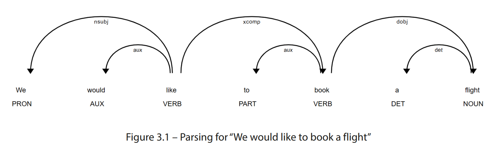

# 1 Natural Language Understanding, Related Tchnologies, and Natuaral Language Applications

## Understanding the basics of natural language

## Global considerations - languages, encodings, and translations

## The relationship between conversational AI and NLP

- Conversational artificial intelligence
  - speech recognition: speech-to-text, automatic speech recognition
  - NLP: input with speech-to-text/direct written language, it produces structured representation that can be processed by a computer, where structured means to express a user's intent/purpose
  - dialog management: input with NLP and determine the next move. eg. provide info, play media, or ask question to get more info to address user's intent
  - natural language generation: create text info that express the dialog managment's feedback
  - text-to-speech generation

## Exploring interactive applications - chatbots and voice assistants

We can also categorize NLP into 2 categories:

1. interactive
2. non-interactive, analysis based on document or set of documents only.

### Interactive ones' pattern

1. response within few seconds
2. inputs are limited words(very short conversation)

### Intent recognition concept

Understanding intent from user is crutial, that's the core meaning of user's speaking(utterance).

#### Entities

Pieces of additional info that system needs to address user's intent.

For example, "I want to book a flight from Boston to Philadelphia."

- The intent of user: make a flight reservation
- The entities of user's intent:
  1. departure and destination
  2. dates and time

So, computer get the departure and destination as entities from user's speech, and it can also expect dates and time also should be included into the entities. So, computer will ask these mising entities. Asking additional required info is called **slot filling**.

Also, after analyze the inputs, computer will get the intent, that intent is kinda abstract from the speech. But the entities is resolved directly from the speech.

### Generic voice assitants

eg. Apple Siri
Only shallow understanding of conversation, such as catching up the entities for limited intent recoginition, and process simple commands in response. Not able to extend a complex conversation.

Framework such as Mycroft.

### Enterprise assistants

Good at enterprise's fields of knowledge. Framworks lik Alexa Skills Kit, Microsoft LUIS, Google Dialogflow, or Nuance Mix. RASA(open source)

### Translations

### Education

## Exploring non-interactive applications

# 2 Identifying Practical Natural Language Understanding Problems

Questions that are "too hard" to "the state of art"

### Applications that require the system to use judgement or common sense

1. advice that depends on many, often complex, considerations. eg. should I get a COVID vaccine?
2. subjective opinion. eg. what is the best movie of all time?

### Applications that require dealing with hypotheticals, possibilities, and counterfactuals

### Applications that require combining information from a language with information from various sensors

### Applications that integrate road general or expert knowledge

# 3 Approaches to Natural Language Understanding - Rule-Based Systems, Machine Learning, and Deep Learning

## Rule-based approaches

Just like human learn foreign language, we study the rule of words:

1. meaning of word
2. order of word in sentence
3. how prefix and suffix change the meaning of word

This approach is implemented from 1950s to 1990s

Following parts are the rules and data that relevant to this approach.

### Words and lexicons

Lexicon is set of information that describe a word.

### Part-of-speech tagging

We can also assign word's role when analyzing a sentence. For example, we can categorize words into verb and noun and preposition. But part-of-speech tagging(POS tagging) is more complicated in form of categories.

Eg. "We would like to book a flight from Boston to London"

| Word   | Part of speech | Meaning of part of speech label |
| ------ | -------------- | ------------------------------- |
| we     | PRP            | Personal pronoun                |
| would  | MD             | Modal verb                      |
| like   | VB             | verb, base form                 |
| to     | TO             | To                              |
| book   | VB             | Verb, base form                 |
| a      | DT             | Determiner                      |
| flight | NN             | Singular noun                   |
| from   | IN             | Preposition                     |
| Boston | NNP            | Proper noun                     |
| to     | TO             | To                              |
| London | NNP            | Proper noun                     |

### Grammer

Grammer rules, famous framework that includes Grammer Rules already. Eg. NLTK(Natural Language Toolkit) and spaCy.

### Parsing

### Semantic analysis
