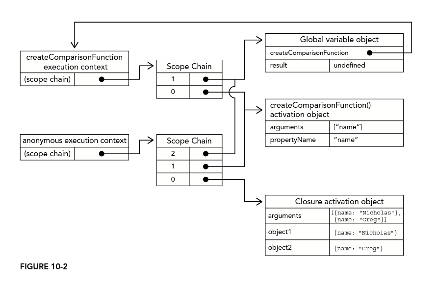

# 10 Functions

Each function is an instance of the `Function` type. And that instance is also a object.

```js
function sum(num1, num2){
    return num1 + num2;
}
```
What happens here:
- This is a *function-declaration* syntax
- variable sum is defined and initialized to be a function.

1. Function-declaration syntax:

    ```js
    function sum(num1, num2) {
    return num1 + num2;
    }
    ```

2. Function expression syntax:

    ```js
    let sum = function (num1, num2) {
    return num1 + num2;
    };
    ```

3. Another way to create function:

    ```js
    let sum = new Function("num1", "num2", "return num1 + num2");
    ```
    This is not recommended due to the performance, but it's a good way to comprehend that function is an object and function name is just a pointer.

## Arrow Functions

Anywhere a *function-expression* is valid to be used, an arrow function is also valid.

```js
let arrowSum = (a, b) =>{
    return a + b;
}

let functionExpressionSum = function(a, b){
    return a + b;
}

console.log(arrowSum(5, 8));
console.log(functionExpressionSum(5, 8));
```

Valid syntax:

```js
let double = (x) => {
  return 2 * x;
};
let triple = x => {
  return 3 * x;
};
let getRandom = () => {return Math.random();};

let sum = (a, b) => {return a + b;};

let inline = (x) => 3 * x;

let value = {};
let setName = (x) => x.name = "Matt";
setName(value);
console.log(value.name); //Matt

//Invalid syntax
//let multiply = a, b => {return a * b;};
```

- Curly braces is not required in arrow function. 
- Using curly braces is called the *block body* syntax and behaves in the same way as a normal function expression. 
- If curly braces is omitted, it's called *concise body* syntax. And this syntax only allows single line of code. 
- Arrow function does not allow the use of `arguments` `super` or `new.target`, cannot be used as constructor, and does not have a `prototype`.

## Function Names

- Function name is a pointer that points to the function object. So function can have multiple names.
```js
function sum(num1, num2){
    return num1 + num2;
}

console.log(sum(10, 10)); //20

let anotherSum = sum;
console.log(anotherSum(10, 10)); //20

sum = null;
console.log(anotherSum(10, 10)); //20
```

- ECMAScript 6 expose a read-only `name` property that describes the function. This is just identifier or stringified variable name that reference the function. If a function is unnamed, `name` property will be "anonymous"

- If a function is unnamed, then `name` returns a empty string
- If a function is created using the function constructor, it will be identified as "anonymous"

```js
function foo() {}
let bar = function () {};
let baz = () => {};

console.log(foo.name); // foo
console.log(bar.name); // bar
console.log(baz.name); // baz
console.log(new Function().name); // anonymous
```

- There would be prefix of `name` property, if the function initiated with bind or is a getter or setter.

```js
funciton foo(){}

console.log(foo.bind(null).name);// bound foo

let dog = {
  years: 1,
  get age(){
    return this.years;
  }
  set age(newAge){
    this.years = newAge;
  }
}

let propertyDescriptor = Object.getOwnPropertyDescriptor(dog, "age");
console.log(propertyDescriptor.get.name); //get age
console.log(propertyDescriptor.set.name); //set age
```

## Understanding Arguments

- Arguments concept is loosely defined in ECMAScript function. If you define a function with 2 arguments, you can pass in one or three or none number of arguments and interpreter won't complain.

- The arguments itself will be represented as array in function, if you use `function` keyword to define function, which means it's not a arrow function, you can access a `arguments` object to retrieve such array.

- The `arguments` object acts like an array, but it's not an instance of Array type.
    
    ```js
    function sayHi(name, message){
        console.log("Hello" + name + ", " + message);
    }
    //Could be re-written into
    function sayHi(){
        console.log("Hello" + arguments[0] + ", " + arguments[1]);
    }
    ```
- *Named arguments*, like the name and message arguments within syntax`function sayHi(name, message){}`, is not required. And *named arguments* does not create a function signature.

- `arguments` object also has `length` property.
    ```js
    function howManyArgs(){
        console.log(arguments.length);
    }

    howManyArgs("string", 45); //2
    howManyArgs(); //0
    howManyArgs(12); //1
    ```
    ```js
    function doAdd(){
        if(arguments.length === 1){
            return arguments[0] + 10;
        }
        else if(arguments.length === 2){
            return arguments[0] + arguments[1]
        }
    }

    console.log(doAdd(10)); // 20
    console.log(doAdd(30, 20)); // 50
    ```
- `arguments` property can work with *named arguments*
    ```js
    function doAdd(num1, num2){
        if(arguments.length === 1){
            return num1 + 10;
        }
        else if(arguments.length === 2){
            return arguments[0] + num2;
        }
    }

    console.log(doAdd(10)); // 20
    console.log(doAdd(30, 20)); // 50
    ```

    ```js
    function doAdd(num1, num2) {
    arguments[1] = 10;
    console.log(num1 + arguments[1]);
    }

    doAdd(); //NaN
    doAdd(1); // 11
    doAdd(10, 2); // 20
    ```

- `arguments` object always sync with the values of the corresponding named parameters.
    ```js
    function doAdd(num1, num2){
        arguments[1] = 10;
        console.log(arguments[0] + num2);
    }
    ```
- The last point does not mean `arguments[1]` and `num2` both have same memory space. It just means that they are in sync.

- And the effect of syncing only goes in one-way(only sync when you update `arguments` object)

- `use strict` will change the behavior of syncing `arguments` to *named arguments*
    ```js
    function toAdd(num1, num2){
        arguments[1] = 10;
        console.log(num2);
        console.log(arguments[0] + num2);
    }

    toAdd(20, 50);
    // 10
    // 30
    ```
    ```js
    function toAdd(num1, num2){
        arguments[1] = 10;
        console.log(num2);
        console.log(arguments[0] + num2);
    }

    toAdd(20);
    // undefined
    // NaN
    ```
    ```js
    "use strict"
    function toAdd(num1, num2){
        arguments[1] = 10;
        console.log(num2);
        console.log(arguments[0] + num2);
    }

    toAdd(20);
    // undefined
    // NaN
    ```
    ```js
    "use strict"
    function toAdd(num1, num2){
        arguments[1] = 10;
        console.log(num2);
        console.log(arguments[0] + num2);
    }

    toAdd(20, 50);
    // 50
    // 70
    ```


### Arguments in Arrow Functions

_arguments_ property is not allowed in arrow function, and be careful of the scope.

```js
function foo() {
  let bar = () => {
    console.log(arguments[0]);
  }; // arguemnts is the funciton foo's arguments
  bar();
}

foo(5); // 5
```

## No Overloading

Because there's no signatures differentiation, it is impossible to do overloading in ECMAScript. If there were two functions with the same identifier, the latter would win.
```js
function addSomeNumber(num){
    return num + 100;
}

function addSomeNumber(num){
    return num + 200;
}

addSomeNumber(100); //300
```
And to comprehend this, the following two snippet is identical.

```js
function addSomeNumber(num) {
  return num + 100;
}

function addSomeNumber(num) {
  return num + 200;
}
```

```js
let addSomeNumber = function (num) {
  return num + 100;
};
addSomeNumber = function (num) {
  return num + 200;
};
```

## Default Parameter Values

Good samples about `arguments` property and default parameter

```js
function makeKing(name = "Henry"){
    return `King ${name} VIII`;
}

console.log(makeKing("Louis"));//King Louis VIII
console.log(makeKing());//King Henry VIII
```
```js
function makeKing(name = "Henry", numerals = "VIII"){
    return `King ${name} ${numerals}`;
}

console.log(makeKing());//King Henry VIII
console.log(makeKing("Louis"));//King Louis VIII
console.log(makeKing(undefined, "VI"));//King Henry VI
```

- `arguments` property preserves the values as arguments were passed when the function is invoked.
    ```js
    function makeKing(name = "Henry"){
        name = "Lei";
        return `King ${arguments[0]}`;
    }

    console.log(makeKing()); //King Henry
    console.log(makeKing("Louis"));//King Louis
    ```
- Several Interesting snippet
    ```js
    function makeKing(name){
        arguments[0] = "Lei";
        return `King ${name}`;
    }

    console.log(makeKing());
    console.log(makeKing("Louis"));
    //King undefined
    //King Lei
    ```

    ```js
    function makeKing(name = "Henry"){
        arguments[0] = "Lei";
        return `King ${name}`;
    }

    console.log(makeKing());
    console.log(makeKing("Louis"));
    //King Henry
    //King Louis
    ```

    ```js
    "use strict"
    function makeKing(name = "Henry"){
        arguments[0] = "Lei";
        return `King ${name}`;
    }

    console.log(makeKing());
    console.log(makeKing("Louis"));
    //King Henry
    //King Louis
    ```

    ```js
    "use strict"
    function makeKing(name){
        arguments[0] = "Lei";
        return `King ${name}`;
    }

    console.log(makeKing());
    console.log(makeKing("Louis"));
    //King undefined
    //King Louis
    ```
- Default parameter could be calculated before invoking the function.

    ```js
    let romanNumerals = ["I", "II", "III", "IV", "V", "VI"];
    let ordinality = 0;

    function getNumerals() {
        return romanNumerals[ordinality++];
    }

    function makeKing(name="Henry", numerals=getNumerals()){
        return `King ${name} ${numerals}`;
    }

    makeKing(); // King Henry I
    makeKing("Louis", "XVI"); // King Louis XVI
    makeKing(); // King Henry II
    makeKing(); // King Henry III
    ```
The calculated default parameter is only invoked when function itself is invoked without argument is not provided.

### Default Prameter Scope and Temporal Dead Zone

- The following snippets are identical
    ```js
    function makeKing(name="Henry", numerals="VIII"){
        return `King ${name} ${numerals}`;
    }

    console.log(makeKing());//King Henry VIII
    ```
    ```js
    function makeKing(){
        let name = "Henry";
        let numerals = "VIII";

        return `King ${name} ${numerals}`;
    }
    ```
- The later parameter can reference the earlier parameter, and cannot reference the laterer, and cannot reference the variable in body of the function.
    ```js
    function makeKing (name = "Henry", numeral = name){

    }
    //ERROR
    function makeKing1 (name = numeral , numeral = "V"){

    }
    //ERROR
    function makeKing2( name = "Henry", numeral = v){
        let v = "VII":
    }
    ```

## Spread Arguments and Rest Parameters

Spread Argument Sample

```js
let values = [1, 2, 3, 4];
function getSum() {
  let sum = 0;
  for (var i = 0; i < arguments.length; i++) {
    sum += arguments[i];
  }
  return sum;
}

console.log(getSum(...values)); // 10
console.log(getSum.apply(null, values)); // 10
console.log(getSum(-1, ...values)); // 9
console.log(getSum(...values, 5)); // 15
console.log(getSum(-1, ...values, 5)); // 14
console.log(getSum(...values, ...[5, 6, 7])); // 28
```

Rest Parameter Sample

Rest Parameter is different from arguments

```js
function getSum(...values) {
  console.log(values); // [1,2,3]
  console.log(arguments); // [1,2,3]
}

getSum(1, 2, 3);
```

## Function Declarations versus Function Expressions

Hoisting behavior is different

```js
console.log(f); // content of f()
console.log(express); // ERROR
const express = function () {
  return 20;
};
function f() {
  return 30;
}
```

## Function as Values

Sample of function returns a function

```js
function createComparisonFunction(propertyName) {
  return function (object1, object2) {
    let value1 = object1[propertyName];
    let value2 = object2[propertyName];

    if (value1 < value2) {
      return -1;
    } else if (value1 > value2) {
      return 1;
    } else {
      return 0;
    }
  };
}

let data = [
  { name: "Zeck", age: 28 },
  { name: "Lei", age: 36 },
];

data.sort(createComparisonFunction("name"));
console.log(data[0].name); // Lei
data.sort(createComparisonFunction("age"));
console.log(data[0].name); // Zeck
```

## Function Internals

In ECMAScript 5 `arguments` and `this` are special objects that exists inside a function. For ECMAScript 6, `new.target` is also introduced.

### arguments

when declares function through `function` keyword, we can use `arguments` property. There's a property called `callee` on arguments points back to the function itself. So when we implement a recursive function, we can decouple it with `callee`.

```js
function factorial(num) {
  if (num <= 1) {
    return 1;
  } else {
    return num * arguments.callee(num - 1);
  }
}

let trueFactorial = factorial;
factorial = function () {
  return 0;
};

console.log(trueFactorial(5)); // 120
console.log(factorial(5)); // 0
```

### this

Good sample of this scope

```js
window.color = "red";
let o = {
  color: "blue",
};

function sayColor() {
  console.log(this.color);
}

sayColor(); // red

o.say = sayColor;
o.say(); // blue

o.sayArrow = () => {
  console.log(this.color);
};
o.sayArrow(); // red
```

Good sample of this to differentiat situation between function and arrow function

```js
function MyKing() {
  this.RoyalName = "Henry";
  setTimeout(function () {
    console.log(this.RoyalName);
  }, 1000);
}

function MyQueen() {
  this.RoyalName = "Mary";
  setTimeout(() => {
    console.log(this.RoyalName);
  }, 1000);
}

new MyKing(); // undefined
new MyQueen(); // Mary
```

### caller

Following sample throw error when running under `"use strict";` (strict mode).

```js
function outer() {
  inner();
}

function inner() {
  console.log(arguments.callee.caller);
}

outer();

console.log(inner);
```

### new.target

If function are executed with `new` keyword new.target will be the intance of function itself.

```js
function King() {
  console.dir(new.target);
}
new King(); // f King
```

## Function Properties and Methods

1. length - num of named arguments
2. prototype - place for shared methods

### apply vs. call

`apply` will allow you to pass an arguments object / array of arguments and `this` value, where `call` will only allow to pass `this` value and spread arguments.

```js
function sum(num1, num2) {
  return num1 + num2;
}
console.log(sum.length); // 2

function applySum(num1, num2) {
  return sum.apply(this, arguments);
}

function callSum(num1, num2) {
  return sum.call(this, num1, num2);
}
```

### bind

bind `this` to a function and return that binded function as a new function.

```js
let o = {
  color: "blue",
};

function sayColor() {
  console.log(this.color);
}

let objectSayColor = sayColor.bind(o);
objectSayColor(); // blue
```

`toLocaleString()` and `toString()` methods inherited from Object will show unstable contents due to different browsers. Try use `valueOf()`, which returns function itself.

## Function Expressions

*function declaration* is hoisted, and *function expression* is not.

```js
sayHi();
function sayHi(){
    console.log("Hi!");
}

sayHello();
let sayHello = function(){
    console.log("Hi!");
}
```

```js
let sayHi;
if(condition){
    sayHi = function (){
        console.log("Hi!");
    }
}else{
    sayHi = function(){
        console.log("Yo!");
    }
}
```

## Recursion

Remember `arguments.callee` is only available under unstrict mode? Here is the snippet that will work in both unstrict mode and strict mode.

```js
const factorial = (function f(num){
    if(num <= 1){
        return 1;
    }else{
        return num * f(num - 1);
    }
});
```

This is called *named function expression*. `f()` is created and assigned to the variable `factorial`. and f remains the same.

## Tail Call Optimization

What is *tail call*?
```js
function outerFunction()[
    return innerFunction();
]
```

So when outer function is returning result of a inner function, it is called *tail call*.

Prior to the ES6, these are the steps:
1. Execution reaches `outerFunction` body, first stack frame is pushed onto stack
2. Body of `outerFunction` executes, return statement is reached. To evaluate the return statement, `innerFunction` must be evaluated.
3. Execution reaches `innerFunction` body, second stack frame is pushed onto stack.
4. Body of `innerFunction` executes, and its returned value is evaluated.
5. Return value is passed back to `outerFunction` which inturn can return that value.
6. Stack frames poped off the stack.

With ES6, steps are:
1. Execution reaches `outerFunction` body, first stack frame is pushed onto stack
2. Body of `outerFunction` executes, return statement is reached. To evaluate the return statement, `innerFunction` must be evaluated.
3. Engine recognizes that first stack frame can safely be poped off the stack since the return value of `innerFunction` is also the return value of `outerFunction`.
4. `outerFunction` stack frame is popped off the stack.
5. Execution reaches `innerFunction` body, stack frame is pushed onto the stack.
6. Body of `innerFunction` executes, and its returned value is evaluated.
7. `innerFunction` stack frame is popped off the stack.

### Tail Call Optimization Requirements
So how does the "engine recognizes that first stack frame can safely be popped off"?

- The code is executing in strict mode.
- The return value of the outer function is the invoked tail call function
- There is no further execution required after the tail call function returns.
- The tail call funciton is not a closure that refers to variables in outer function's scope.

Here are the snippet that violates the rules.
```js
"use strict";

// tail call is not returned
function outerFunction(){
    innerFunction();
}

// tail call is not directly returned
function outerFunction(){
    let innerFunctionResult = innerFunction();
    return innerFunctionResult;
}

// further execution after tail call returns
function outerFunction(){
    return innerFunction().toString();
}

// tail call is a closure
function outerFunction()[
    let foo = "bar";
    function innerFunction (){return foo;}
    return innerFunction();
]
```

Optimized snippets:
```js
"use strict";

function outerFunction(a, b){
    return innerFunciton(a, b);
}

function outerFunction(a, b){
    if(a > b){
        return a;
    }
    return innerFunction(a + b);
}

function outerFunction(condition){
    return condition ? innerFunctionA(): innerFunctionB();
}
```

Try this snippet carefully, it will swamp your browser.
```js
function fib(){
    if(n < 2){
        return n;
    }
    return fib(n-1) + fib(n-2);
}

fib(1000);
```
This will not meet optimization requirements. So, what we can do is:
```js
"use strict";

function fib(n){
    return fibImpl(0, 1, n);
}

function fibImpl(a, b, n){
    if(n === 0){
        return a;
    }
    return fibImpl(b, a + b, n - 1);
}
```
## Closures

*closures* means function that have access to variables from another function's scope. Usually, this is achieved by creating funciton inside another funciton.

```js
funciton createComparisonFunction(propertyName){
    return function(object1, object2){
        let value1 = object1[propertyName]; //highlighted
        let value2 = object2[propertyName]; //highlighted

        if(value1 < value2){
            return -1;
        }else if(value1 > value2){
            return 1;
        }else{
            return 0;
        }
    }
}

let compare = createComparisonFunction("name");
let result = compare({name: "Nicholas"}, {name: "Matt"});
```

The highlighted lines are referencing `propertyName` which comes from outer function's scope. Even the innerFunction is returned and is used ealswhere, it still catch the reference of outer function's variable. There fore its scope chain includes the scope of outer function.

Try to review Chapter 4: Variables, Scope and Memory.



Therefore the snippet above will not release the `createComparisonFunction`'s activation object because the returned anonymous function's execution context's scope chain referencing it.

We can do this
```js
funciton createComparisonFunction(propertyName){
    return function(object1, object2){
        let value1 = object1[propertyName]; //highlighted
        let value2 = object2[propertyName]; //highlighted

        if(value1 < value2){
            return -1;
        }else if(value1 > value2){
            return 1;
        }else{
            return 0;
        }
    }
}

let compareNames = createComparisonFunction("name");
let result = compareNames({name: "Nicholas"}, {name: "Matt"});
compareNames = null; //memory reclaimed.
```

## The `this` Object

Remember that when function is called `this` and `arguments` are available within the function. But if you want the closure to reference them, you need to first store them in a accessible variable. Or the inner function cannot access to these special objects after being returned.

```js
window.identity = "The Window";

let object = {
    identity: "My Object",
    getIdentityFunc(){
        return function(){
            return this.identity;
        }
    }
}

console.log(object.getIdentityFunc()());// The Window
```

```js
window.identity = "The Window";

let object = {
    identity: "My Object",
    getIdentityFunc(){
        let that = this;
        return function(){
            return that.identity;
        }
    }
}

console.log(object.getIdentityFunc()());// My Object
```

Before going further, this snippet must be noted.
```js
let f;

console.log((f = 1 + 2));//3
```

So when we slightly changed the syntax, the result would be totally different.
```js
window.identity = "The Window";
let object = {
    identity: "My Object",
    getIdentity(){
        return this.identity;
    }
}

object.getIdentity(); // My Object
(object.getIdentity)(); // My Object
(object.getIdentity = object.getIdentity)(); // The Window
```

### Memory Leaks
Consider the snippet below:
```js
function assignHandler(){
    let element = document.getElementById('someElement');
    element.onclick = () => console.log(element.id);
}
```
There are 2 issues with this snippet:
1. closure is created because the anonymous arrow function is referencing `element` within assignHandler.
2. circular reference, element. (Please see Chapter 13 for Events)

How to fix it:
```js
function assignHandler(){
    let element = document.getElementById('someElement');
    let id = element.id;

    element.onclick = () => console.log(id);

    element = null;
}
```

## Immediately Invoked Function Expressions
It's shorthanded name is IIFE. 
```js
(function(){})();
```
It is used for block scope variable when needed. Because the anonymous function is wrapped in parentheses, so it's interpreted as function expression. Then it's called immediately and released in memory. Therefore, even we use `var` keyword within IIFE, it's interpreted as block scoped variable.

Samples of block scope variable.
```js
{
    let i;
    for(i = 0; i < count; i++){
        console.log(i);
    }
}
console.log(i); // throw error.
```
```js
for(let i = 0; i < count; i++){
    console.log(i);
}

console.log(i); // throw error.
```

Usage scenario:
```js
let divs = document.querySelectorAll('div');

for(var i = 0; i < divs.length; ++i){
    divs[i].addEventListener('click', function(){
        console.log(i);
    });
}
```
The result of above snippet will be printing `div.length` for every div. Because the `var i` still available outside the `for` loop, and for sure, after `for` loop execution, that `i` is nothing but `div.length`.

Before ES6, here is the solution.
```js
let divs = document.querySelectorAll('div');

for(var i = 0; i < divs.length; ++i){
    divs[i].addEventListener('click', (function(frozenCounter){
       return function(){
            console.log(frozenCounter);
       } 
    })(i));
}
```

So in current version,

```js
let divs = document.querySelectorAll('div');
for(let i = 0; i < divs.length; ++i){
    divs[i].addEventListener('click', function(){
        console.log(i);
    })
}
```

This is not working, be awared:
```js
let divs = document.querySelectorAll('div');
let i;
for(i = 0; i < divs.length; ++i){
    divs[i].addEventListener('click', function(){
        console.log(i);
    })
}
```

## Private Variables
*Private variables* include function `arguments`, local variables, and functions defined inside other function.

*Privileged method* is a public method that can access to *private variables*. It is a *closure*.

For example:
```js
function MyObject(){
    //private variables and private functions
    let privateVariable = 10;
    function privateFunction(){
        return false;
    }

    //privileged methods
    this.publicMethod = function(){
        privateVariable++;
        return privateFunction();
    }
}
```

```js
function Person(name){
    this.getName = function(){
        return name;
    }
    this.setName = function(value){
        name = value;
    }
}

let person = new Person('Nicholas');
console.log(person.getName());// Nicholas
person.setName('Greg');
console.log(person.getName());// Greg
```

### Static Private Variables
The flaw of last snippet is that the methods are defined on instance. So if we try to define methods on `prototype`, we can do this:
```js
(function(){
    let privateVariable = 0;

    function privateFunction(){
        return false;
    }

    MyObject = function(){}

    MyObject.prototype.publicMethod = function(){
        privateVariables++;
        return privateFunction();
    }
})();
```

Remember that `MyObject`, without declaration, is a global variable.

```js
(function(){
  let name = '';
  Person = function(value){
    name = value;
    this.getName = function(){
      return name;
    }
    this.setName = function(value){
      name = value;
    }
  }
})();

let person1 = new Person('Nicholas');
console.log(person1.getName());
let person2 = new Person('Matt');
console.log(person2.getName()); // Matt
console.log(person1.getName()); // Matt
```
```js
(function(){
  let name = '';
  Person = function(value){
    name = value;
  }
  Person.prototype.getName = function(){
    return name;
  }
  Person.prototype.setName = function(value){
    name = value;
  }
})();

let person1 = new Person('Nicholas');
console.log(person1.getName());
let person2 = new Person('Matt');
console.log(person2.getName()); // Matt
console.log(person1.getName()); // Matt
```

### The Module Pattern
It uses singletons and mix that concept with private variables and privileged methods.

Singleton snippet
```js
let singleton = {
    name: value,
    method(){

    }
}
```

A module pattern:
```js
let singleton = function(){
    let privateVariable = 10;
    function privateFunction(){
        return false;
    }

    return {
        publicProperty = true,
        publicMethod(){
            privateVariable++;
            return privateFunction();
        }
    };
}();
```
A more practical sample for module pattern:
```js
let application = function(){
    let components = new Array();

    components.push(new BaseComponent());

    return{
        getComponentsCount(){
            return components.length;
        }
        registerComponent(component){
            if(typeof component == 'object'){
                component.push(component);
            }
        }
    }
}();
```

### The Module-Augmentation Pattern
```js
let application = function(){
    let components = new Array();
    components.push(new BaseComponent());

    let app = new BaseComponent();
    
    app.getComponentCount = function(){
        return components.length
    }
    app.registerComponent = function(component){
        if(typeof component == 'object'){
            components.push(component);
        }
    }

    return app;
}();
```