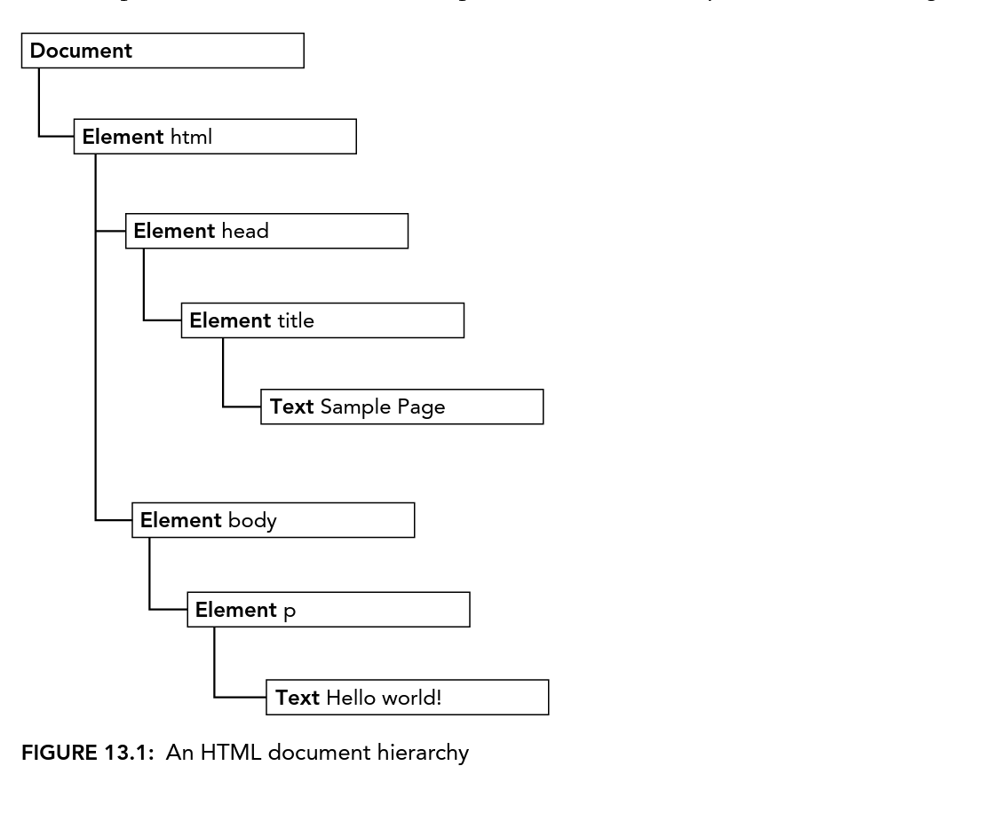

# 13 The Document Object Model
The Document Object Model(DOM) is an application programming interface(API) for:
1. HTML
2. XML

It represents as a document which has hierarchical tree form of nodes, allowing developer to Add, Remove, and Modify them.

There are several stages for DOM:
1. DOM level 0: DOM is implemented distinctly by Microsoft and Netscape
2. DOM level 1: October 1998, DOM became a W3C recommendation, and providing unified interfaces for basic document structure and querying.
3. DOM level 2+: All under W3C standards, and features are extended.

## HIERARCHY OF NODES
HTML and XML can be represented as a hierarchy tree. In this tree, there are different node types, which has different property and methods can be used. Different nodes will have relationship among them, allowing this tree is rooted by a single node.

For example, this is HTML structure:
```html
<html>
    <head>
        <title>Sample Page</title>
    </head>
    <body>
        <p>Hello World!</p>
    </body>
</html>
```


- A document node is the root, it has only child of `documentElement` wihch is the `<html>` element. There can be only one `documentElement`/`<html>` in HTML. 
- In XML, any element could be the document element.
- In HTML, elements (tags) are represented by *element type node*, attributes are represented by *attribute type node*, comments are represented by *comment type node*, document types are represented by *document type node*.
- There are 12 node types.

### The Node Type
DOM has a type of interface called `Node`, each node type could be represented by `Node`'s  numeric constant. And each instance of `Node` has a `nodeType` property.

These are the numeric constants:
- Node.ELEMENT_NODE (1)
- Node.ATTRIBUTE_NODE (2)
- Node.TEXT_NODE (3)
- Node.CDATA_SECTION_NODE (4)
- Node.ENTITY_REFERENCE_NODE (5)
- Node.ENTITY_NODE (6)
- Node.PROCESSING_INSTRUCTION_NODE (7)
- Node.COMMENT_NODE (8)
- Node.DOCUMENT_NODE (9)
- Node.DOCUMENT_TYPE_NODE (10)
- Node.DOCUMENT_FRAGMENT_NODE (11)
- Node.NOTATION_NODE (12)

You can test the type of node by:
```js
if(someNode.nodeType == Node.ELEMENT_NODE){
    alert("Node is an element.");
}
```

#### The `nodeName` and `nodeValue` Properties
It is always recommended to check `nodeType` before using these properties.
```js
if(someNode.nodeType == 1){
    value = someNode.nodeName;
}
```
For different types of nodes, these properties' values are different. For element type nodes, the `nodeName` is always the tag name, and `nodeValue` is always `null`.

#### Node Relationships
So how to describe the relationship among nodes?
1. parent, direct parent node
2. child, direct child node
3. sibling, share same parent node with other siblings

- Each `Node` has `childNodes` property, which contains a `NodeList` type instance.
    - `NodeList` behave like Array instance, but it is not
    - `childNodes` property is not a snapshot of the owner's children, it is synced whenever the children were updated
- How to use `NodeList` type instance:
```js
let firstChild = someNode.childNodes[0];
let secondChild = someNode.childNodes.item(1);
let count = someNode.childNodes.length;
```
- How to convert `NodeList` type into Array
```js
let arrayOfNodes = Array.prototype.slice.call(someNode.childNodes, 0);
```

- Each node has a `parentNode` property that points to its parent in the document tree.
- Each node in the same `childNodes` property share the same `parentNode`
- Using `nextSibling` and `previousSibling` properties in `Node` instance.
```js
if(someNode.nextSibling === null){
    alert("Last node in the parent's childNode list.");
}else if(someNode.previousSibling === null){
    alert("First node in the parent's childNode list.");
}
```
- `childNodes`'s `firstChild` property always points to the `childNodes[0]`, and `lastChild` property always points to `someNode.childNodes[someNode.childNodes.length -1]`
- If `firstChild` and `lastChild` points to the same node, there must be only one node in the list.
- If no children `firstChild` and `lastChild` are both `null`
- Don't forget to use `hasChildNodes()` method to check for the `Node`
- `ownerDocument` property always points to the Document node(Not `documentElement`).

#### Manipulating Nodes
Properties mentioned above are all READ-ONLY.

Now we begin to manipulate the relationship.

- `appendChild()` method, will move the node to the end of the `childNodes` list, and returns the newly added nodes. The relationship pointers properties related to this newly added node and other effected nodes are automatically updated.

```js
let returnedNode = someNode.appendChild(newNode);
alert(returnedNode == newNode); // true
alert(someNode.lastChild == newNode); // true

let returnedNode = someNode.appendChild(someNode.firstChild);
alert(returnedNode == someNode.firstChild); // false
alert(retunredNode == someNode.lastChild); // true
```
- `insertBefore()` accepts two arguments, the inserted node and the referenced node.
- if the referenced node is `null`, then it behaves the same as `appendChild()`

```js
returnedNode = someNode.insertBefore(newNode, null);
alert(newNode == someNode.lastNode); // true

returnedNode = someNode.insertBefore(newNode, someNode.firstNode);
alert(returnedNode == newNode); // true
alert(newNode == someNode.firstNode) // true

returnedNode = someNode.insertBefore(newNode, someNode.lastChild);
alert(newNode == someNode.childNodes[someNode.childNodes.length -2]);
```

- `replaceChild()` accepts: inserted node, and removed node. It returns the removed node.
- the removed node is still owned by document, but has no position.
```js
let returnedNode = someNode.replaceChild(newNode, someNode.firstChild);
returnedNode = someNode.replacechild(newNode, someNOde.lastChild);
```
- `removeChild()` method, returns the removed node.
```js
let formerFirstChild = someNode.removeChild(someNode.firstChild);
let formerLastChild = someNode.removeChild(someNode.lastChild);
```

#### Other Methods
- `cloneNode()`
```html
<!DOCTYPE>
<html>
    <body>
        <ul>
            <li>Item 1</li>
            <li>Item 2</li>
            <li>Item 3</li>
        </ul>
        <script>
            let myList = document.getElementsByTagName("ul")[0];
            let deepList = myList.cloneNode(true);
            alert(deepList.childNodes.length); // 7 because ul and li must has a text node
            
            let shallowList = myList.cloneNode(false);
            alert(shallowList.childNodes.length); // 0
        </script>
    </body>
</html>
```
- `cloneNode()` does not copy event handlers, but copies attributes. It copies childNodes only if deep copy.

- `normalize()` deal with fragment text node.

### The Document Type

For HTML, `window` has a property named `document`, this object is `HTMLDocument` type which inherited from `Document` type.

This `document` object has following characteristics:
- `nodeType` is 9
- `nodeName` is "#document"
- `nodeValue` is `null`
- `parentNode` is `null`
- `ownerDocument` is `null`
- Its child nodes may be `DocumentType` type(MAX of 1), `Element` Type(MAX of 1), `ProcessingInstruction`, or `Comment`

#### Document Children
- The first child nodes of `document` object is `documentElement` property, which represents `<html>` element.

How to access?
```js
let html = document.documentElement;
alert(html === document.childNodes[0]);
alert(html === document.firstChild);
```

- As a instance of `HTMLDocument` type object, `document` object also can have a `body` property, which represnets `<body>` element.

- Another possible child node of a `Document` type is `DocumentType` type object, `document.doctype`.

- Comments that are outside `<html>` element, `documentElement`, can also be childNodes of `document` object.

#### Document Information
`title`, `domain`, `url`, `referer` properties also available.

- Updating `title` property will update the title bar of the browser, but `title` property will not be synced to the `<title>` element.

- `domain`, `url`, `referer` properties are included in HTTP request, and can be accessible by JavaScript through these properties.

- If a page includes a frame or iframe, and if you set the sub pages' `document.domain` property into same value. Then the sub pages could communicate with each other.

- If you set the `domain` property into "wrox.com", you cannot set the `domain` property into "p2p.wrox.om" later. Because it's tightening the property, and it's not allowed.

#### Locating Elements
To locate a specific element, DOM provides two methods in the `document` object to perform such task.
They are `document.getElementById()` and `document.getElementsByTagName()`.

- `document.getElementById()` accepts one argument, and will return the element which id is exactly match up with the argument. Otherwise, this method will return `null`.
- If there are multiple matchup cases, this method will return the first one.
```js
<div id="myDIv">Some Text</div>

let div = document.getElementById("myDiv");
let div = document.getElementById("mydiv"); //null
```

- `document.getElementsByTagName()` will return all elements that match up the tag name. The result is returned as `NodeList` type instance. In HTML, this result returns as `HTMLCollection` type object, which is similar to `NodeList`, it is a live collection.

```js
let images = document.getElementsByTagName("img");
alert(images.length); // 
alert(images[0].src); // output of first image's src attribute
alert(iamges.item(0).src)// output of first image's src attribute

//Suppose we have one of the images element defined by following comment
//

let myImage = images.namedItemn("myImage");
let myImage = images["myImage"];

// This namedItem probably is specific to  element
```

> `document.getElmentsByTagName()` is case-insensitive for HTML and case-sensitive for XML and XHTML, although it is defined only case-senstive in specification.

- `document.getElementsByName()` is the third method for locating element. It is a special one for `HTMLDocument` type only.

```html
<fieldset>
    <legend>Which color do you prefer?</legend>
    <ul>
        <li>
            <input type="radio" value="red" name="color" id="colorRed">
            <label for="colorRed">Red</label>
        </li>
        <li>
            <input type="radio" value="green" name="color" id="colorGreen">
            <label for="colorGreen">Green</label>
        </li>
        <li>
            <input type="radio" value="blue" name="color" id="colorBlue">
            <label for="colorBlue">Blue</label>
        </li>
    </ul>
</fieldset>
```
- Different `id` attributes can let `<label>` element target corresponding `<input>` elements.

```js
// this line of code retrieve all elements which name attributes equals to color
let radios = document.getElementsByName("color");
```

#### Special Collections
`document` has special collections that can easily access special element collection in the page.
- `document.anchors`: contains all `<a>` elements with a `name` attribute
- `document.forms`: same as `document.getElementsByTagName("form")`
- `document.images`: smae as `document.getElementsByTagName("img")`
- `document.links`: contains all `<a>` elements with a `href` attibute

#### Document Writing
