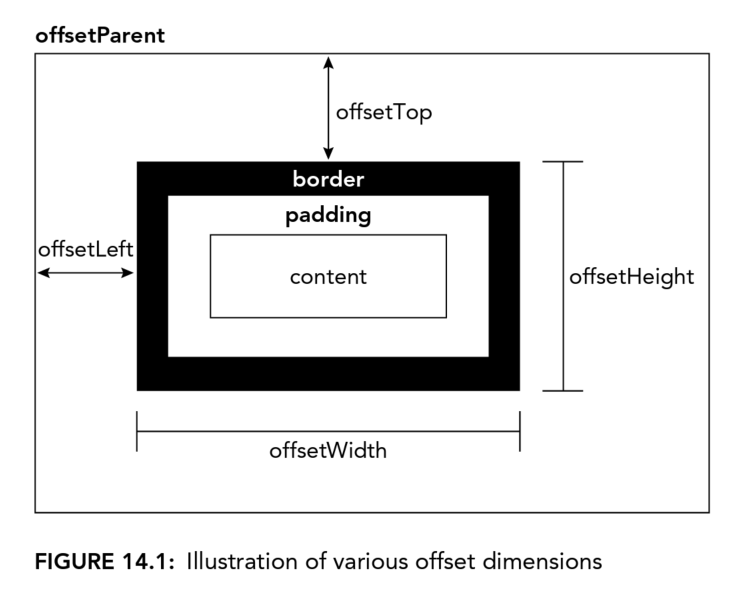
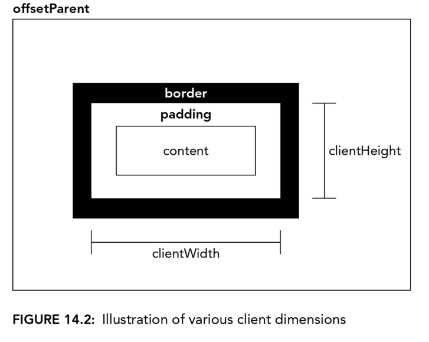

# 14 DOM Extensions
## STYLES
### Accessing Element Styles
`style` property is used to access styles defined within `style` attribute.

### Working with Style Sheets
`document.styesheets` can access applied style sheets collection of current document.
The object has folowing properties and methods:
- diabled, read/write property
- href
- media
- ownerNode
- parentStyleSheet, when a style sheet is included via `@import`, this is a pointer to the style sheet that imported it
- title
- type, for css, "text/css"

For every `styleSheets` collection object, you can access the defined rules within.
```css
div.box{
    background-color: blue;
    width: 100px;
    height: 200px;
}
```

```js
let sheet = document.styleSheets[0];
let rules = sheet.cssRules || sheet.rules; // get rule list
let rule = rules[0];
rule.style.backgroundColor = "red";
```

#### Creating Rules
```js
sheet.insertRule("body { background-color: silver }", 0); // DOM method
```

#### Deleting Rules
```js
sheet.deleteRule(0);
```

### Element Dimensions
#### Offset Dimensions



To calculate how much offset the current elelment from the root container(the outermost container);
```js
function getElementLeft(element){
    let actualLeft = element.offsetLeft;
    let current = element.offsetParent;

    while(current !== null){
        actualLeft += current.offsetLeft;
        curretn = current.offsetParent;
    }

    return actualLeft;
}

function getElementTop(element){
    let actualTop = element.offsetTop;
    let current = element.offsetParent;

    while(current !== null){
        actualTop += current.offsetTop;
        curretn = current.offsetParent;
    }

    return actualTop;
}
```

#### Client Dimensions


To calculate the total size of the viewport:
```js
let docHeight = Math.max(document.documentElement.scrollHeight, document.documentElement.clientHeight);
let docWidth = Math.max(document.documentElement.scrollWidth, document.documentElement.clientWidth);
```

## TRAVERSALS
### `createNodeIterator()`
There are 4 arguments available for this method.
- root, the root node
- whatToShow, pass in a pre-set numerical code
- filter, additional/optional filter
- entityReferenceExpansion, HTML, always false

`whatToShow` could be these values:
- NodeFilter.SHOW_ALL, show all types
- NodeFilter.SHOW_ELEMENT, show element nodes only
- NodeFilter.SHOW_ATTRIBUTE
- NodeFilter.SHOW_TEXT
- NodeFilter.SHOW_CDATA_SECTION
- NodeFilter.SHOW_ENTITY_REFERENCE
- NodeFilter.SHOW_ENTITY
- NodeFilter.SHOW_PROCESSING_INSTRUCTION
- NodeFilter.SHOW_COMMENT
- NodeFilter.SHOW_DOCUMENT
- NodeFilter.SHOW_DOCUMENT_TYPE
- NodeFilter.SHOW_DOCUMENT_FRAGMENT
- NodeFilter.SHOW_NOTATION

Sample:
```js
let filter = function(node){
    return node.tagName.toLowerCase() == "p"?
    NodeFilter.FILTER_ACEPT:
    NodeFilter.FILTER_SKIP;
}

let iterator = document.reateNodeIterator(root, NodeFilter.SHOW_ELEMENT, filter, false);

let node = iterator.nextNode();
while(node !== null){
    console.log(node.tagName);
    node = iterator.nextNode();
}
```

### TreeWalker
Work the same as previous one, but has following method:
- parentNode()
- firstChild()
- lastChild()
- nextSibling()
- previousSibling()

Sample:
```js
let div = document.getElementById("div1");
let filter = function(node){
    return node.tagName.toLowerCase() == "li" ?
    NodeFilter.FILTER_ACCEPT:
    NodeFIlter.FILTER_SKIP;
}

let walker = document.createTreeWalker(div, NodeFilter.SHOW_ELEMENT, filter, false);
walker.firstChild();
walker.nextSibling();

let node = walker.firstChild();
while(node != null){
    console.log(node.tagName);
    node = walker.nextSibling();
}
```

## RANGES