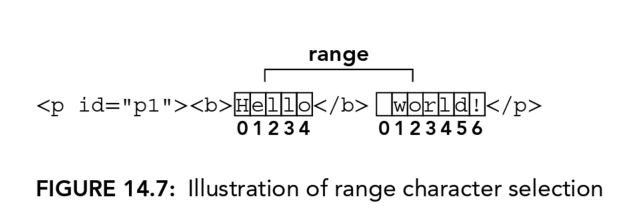

# 14 DOM Extensions
## STYLES
### Accessing Element Styles
`style` property is used to access styles defined within `style` attribute.

### Working with Style Sheets
`document.styesheets` can access applied style sheets collection of current document.
The object has folowing properties and methods:
- diabled, read/write property
- href
- media
- ownerNode
- parentStyleSheet, when a style sheet is included via `@import`, this is a pointer to the style sheet that imported it
- title
- type, for css, "text/css"

For every `styleSheets` collection object, you can access the defined rules within.
```css
div.box{
    background-color: blue;
    width: 100px;
    height: 200px;
}
```

```js
let sheet = document.styleSheets[0];
let rules = sheet.cssRules || sheet.rules; // get rule list
let rule = rules[0];
rule.style.backgroundColor = "red";
```

#### Creating Rules
```js
sheet.insertRule("body { background-color: silver }", 0); // DOM method
```

#### Deleting Rules
```js
sheet.deleteRule(0);
```

### Element Dimensions
#### Offset Dimensions


To calculate how much offset the current elelment from the root container(the outermost container);
```js
function getElementLeft(element){
    let actualLeft = element.offsetLeft;
    let current = element.offsetParent;

    while(current !== null){
        actualLeft += current.offsetLeft;
        curretn = current.offsetParent;
    }

    return actualLeft;
}

function getElementTop(element){
    let actualTop = element.offsetTop;
    let current = element.offsetParent;

    while(current !== null){
        actualTop += current.offsetTop;
        curretn = current.offsetParent;
    }

    return actualTop;
}
```

#### Client Dimensions


To calculate the total size of the viewport:
```js
let docHeight = Math.max(document.documentElement.scrollHeight, document.documentElement.clientHeight);
let docWidth = Math.max(document.documentElement.scrollWidth, document.documentElement.clientWidth);
```

## TRAVERSALS
### `createNodeIterator()`
There are 4 arguments available for this method.
- root, the root node
- whatToShow, pass in a pre-set numerical code
- filter, additional/optional filter
- entityReferenceExpansion, HTML, always false

`whatToShow` could be these values:
- NodeFilter.SHOW_ALL, show all types
- NodeFilter.SHOW_ELEMENT, show element nodes only
- NodeFilter.SHOW_ATTRIBUTE
- NodeFilter.SHOW_TEXT
- NodeFilter.SHOW_CDATA_SECTION
- NodeFilter.SHOW_ENTITY_REFERENCE
- NodeFilter.SHOW_ENTITY
- NodeFilter.SHOW_PROCESSING_INSTRUCTION
- NodeFilter.SHOW_COMMENT
- NodeFilter.SHOW_DOCUMENT
- NodeFilter.SHOW_DOCUMENT_TYPE
- NodeFilter.SHOW_DOCUMENT_FRAGMENT
- NodeFilter.SHOW_NOTATION

Sample:
```js
let filter = function(node){
    return node.tagName.toLowerCase() == "p"?
    NodeFilter.FILTER_ACEPT:
    NodeFilter.FILTER_SKIP;
}

let iterator = document.reateNodeIterator(root, NodeFilter.SHOW_ELEMENT, filter, false);

let node = iterator.nextNode();
while(node !== null){
    console.log(node.tagName);
    node = iterator.nextNode();
}
```

### TreeWalker
Work the same as previous one, but has following method:
- parentNode()
- firstChild()
- lastChild()
- nextSibling()
- previousSibling()

Sample:
```js
let div = document.getElementById("div1");
let filter = function(node){
    return node.tagName.toLowerCase() == "li" ?
    NodeFilter.FILTER_ACCEPT:
    NodeFIlter.FILTER_SKIP;
}

let walker = document.createTreeWalker(div, NodeFilter.SHOW_ELEMENT, filter, false);
walker.firstChild();
walker.nextSibling();

let node = walker.firstChild();
while(node != null){
    console.log(node.tagName);
    node = walker.nextSibling();
}
```

## RANGES
Allow javasript to interact with part of the HTML document fragment. That fragment could be composite of parts of single or multiple elements.

Each range has following properties:
- startContainer
- startOffset, if the startContainer is a text node, comment node, or CDATA node, the startOffset is the number of the characters skipped. Otherwise, the offset is the index of the first child node in the range.
- endContainer
- endOffset
- commonAncestorContainer, the deepest node has both startContainer and endContainer as desendants.

### Simple Selection in DOM Ranges
```html
<!DOCTYPE html>
<html>
<body>
    <p id="p1"><b>Hello</b> world!</p>
</body>
</html>
```
```js
let range1 = document.createRange();
let range2 = document.createRange();
let p = document.getElementById("p1");
range1.selectNode(p);
range2.selectNodeContent(p);
```


Also there are other methods to set range:
- setStartBefore(refNode), startContainer is the parent node of the refNode, and startOffset is set to the index of refNode
- setStartAfter
- setEndBefore
- setEndAfter

### Complex Selection in DOM Ranges
```js
let range1 = document.createRange();
let range2 = document.createRange();
let p1 = document.getElementById("p1");
let p1Index = -1;
for(let i = 0, len = p.parentNode.childNodes.length; i < len; i++){
    if(p1.parentNode.childeNodes[i] === p1){
        p1Index = i;
        break;
    }
}
range1.setStart(p1.parentNode, p1Index);
range1.setEnd(p1.parentNode, p1Index + 1);
range2.setStart(p1, 0);
range2.setEnd(p1, p1.childNodes.length);
```

Another sample:
```js
let range = document.createRange();
let p1 = document.getElementById("p1");
let helloNode = p1.firstChild.firstChild;
let worldNode = p1.lastChild;
range.setStart(helloNode, 2);
range.setEnd(worldNode, 3);
```


### Interacting with DOM Range Content
```js
let range = document.createRange();
let p1 = document.getElementById("p1");
let helloNode = p1.firstChild.firstChild;
let worldNode = p1.lastChild;
range.setStart(helloNode, 2);
range.setEnd(worldNode, 3);

range.deleteContents();
```
```html
<p id="p1"><b>He</b>rld!</p>
```

Another method:
```js
let range = document.createRange();
let p1 = document.getElementById("p1");
let helloNode = p1.firstChild.firstChild;
let worldNode = p1.lastChild;
range.setStart(helloNode, 2);
range.setEnd(worldNode, 3);

let fragment = range.extratContents();
p1.parentNode.appendChild(fragment);
```
```html
<p id="p1"><b>He</b>rld!</p>
<b>llo</b> wo
```

Another method:
```js
let range = document.createRange();
let p1 = document.getElementById("p1");
let helloNode = p1.firstChild.firstChild;
let worldNode = p1.lastChild;
range.setStart(helloNode, 2);
range.setEnd(worldNode, 3);

let fragment = range.cloneContents();
p1.parentNode.appendChild(fragment);
```
```html
<p id="p1"><b>Hello</b> world!</p>
<b>llo</b> wo
```

### Inserting DOM Range Content
`insertNode`, `surroundContents`
### Collapsing a DOM Range
```js
range.collapse(true); // collapse to the starting point
console.log(range.collapsed);//true
```
### Comparing DOM Ranges
```js
let p1 = document.getElementById("p1");
range1.selectNodeContents(p1);
range2.selectNodeContents(p1);
range2.setEndBefore(p1.lastChild);

console.log(range1.compareBoundaryPoints(Range.START_TO_START, range2));//0
console.log(range1.compareBoundaryPoints(Range.END_TO_END,range2)); //1
```
### Cloning DOM Ranges
```js
range.cloneRaneg();
```
### Clean up
```js
range.detach();
range = null;
```

## OBSERVER APIS

Observer behaves like a guard, you need to tell who you want to spy on and what to do when target is active.

There are three pre-defined observers:
1. The Mutation Observer API
2. Resize Observer API
3. The Intersection Observer API

### Observer API Methods
```js
let fakeCallback = (fakeEventContext, observer) => console.log("Fake event happened");
let fakeObserver = new FakeObserver(fakeCallback);

fakeObserver.observer(document.body);

fakeObserver.unobserver(document.body);
fakeObserver.disconnect();
```

#### Async allbacks and the Record Queue

There will be a *record* for each observer instane and represents an in-order record of each event.

Each time a record is added to the record queue, the observer callback is scheduled to microtask queue only if there are no other task in that queue.

#### The `takeRecords()` method

You can manually handle those events registered into the *record* but not yet send to the microtask.

```js
console.log(fakeObserver.takeRecords());
//[FakeObserverRecord, ....]
```

#### Observer References
Observer has weak reference to the target node, so that will not prevent target node being garbage collected.

Target node has a strong referene to its observer, which means the node is removed from the DOM and subsequently garbage collected, the observer is also garbage collected.

### Resize Observers
```js
let observer = new ResizeObserver(() => console.log("<body> was resized"));

observer.observe(document.body);

setTimeout(()=>{
    document.body.style.width = "100px";
    observer.unobserver(document.body);
},1000);

// will log nothing
```

For More details 'bout each Observer, need to check the documentation online.

## OBSERVER PERFORMANCE

1. Debouncing:
```js
let timeoutId = null;
let observer = new ResizeObserver(() =>{
    clearTimeout(timeoutId);
    timeoutId = setTimeout(() => console.log("body is changed"), 1000);
});

observer.observer(document.body);
```
2. ResizeObserver prefers async function.