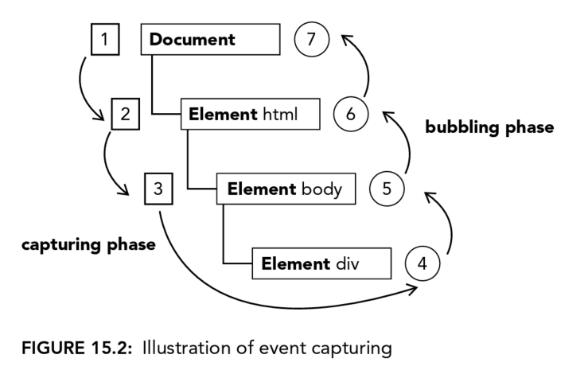

# 15 Events
JavaScript's interaction with HTML is handled through *events*, which can be subscribed to *listeners*(also called *handlers*) that executes only when event occurs. This is called *observer pattern* that allows a loose coupling between the behavior of a page.

Browsers have their own way to achieve events handling, until DOM level 2, which tries to standardize the DOM events API in a logical way.

For BOM, there are also events. Sometimes these events are very confused with DOM events, where HTML5 tries to clarify. Plus, augmentation of DOM events API by DOM level 3 makes it even harder to use.

But before everything is clarified, here are some important concepts to understand.

## EVENT FLOW
*Event Flow* describes the order and range in which events are reeived on the page.

But before this, let's see a interesting concept.
### Event Bubbling

It means the event will bubble up from the most specific node to the least specific node(the document).

### DOM Event Flow
The DOM Event Flow specified in DOM Level 2 Events has 3 phrases:
1. Capturing
2. At the target
3. Bubbling



## EVENT HANDLERS
Events are certain actions performed either by the user or by the browser itself. For example, click, load, and mouseover, there would be corresponding event handler as attribute for them, onclick, onload,and onmouseover.

### HTML Event Handlers
For DOM Level 0, there would be two way to assign event handler.
1. by inline attribute:
```html
<input type="button" value="Click Me" onclick="console.log('clicked!');"/>

<script>
    function showMessage(){
        console.log("Hello World!");
    }
</script>
<input type="button" value="Click Me" onclick="showMessage()"/>
```

Within event handler, it's possible to access `document` and `this` directly, where `this` refering the target element.

There could be 3rd property if the event handler function is assigned to element within form tag.
```html
<script>
    function(){
        with(document){
            with(this.form){
                with(this){

                }
            }
        }
    }
</script>

<form method="post">
    <input type="text" name="username" value="">
    <input type="button" value="Echo Username"
        onclick="console.log(username.value)">
</form>
```

2. By property:
```js
let btn = document.getElementById("myBtn");
btn.onclick = function(){
    console.log(this.id);// myBtn
}
btn.onclick = null;
```

### DOM Level 2 Event Handlers
```js
let btn = document.getElementById("myBtn");
btn.addEventListener("click", () =>{
    console.log(this.id);
}, false);
```
Only one thing need to pay attention: this is the only way to remove event listener.
```js
let btn = document.getElementById("myBtn");
let handler = function (){
    console.log(this.id);
}
btn.addEventListener("click", handler, false);

btn.removeEventListener("click", handler, false);
```

## THE EVENT OBJECT
When event is fired, related info will be wrapped in an object called `event`. Remember, all browsers support the event object, but not in the same way.

### The DOM Event Object
You can always access this object through DOM Level 0 or DOM level 2 event handler by `event` property.

```js
let btn = document.getElementById("myBtn");
btn.onclick = function(event){
    console.log(event.type);
}

btn.addEventListener("click", (event) => {
    console.log(event.type);
}, false) // use event bubble not captureing
```
```html
<input type="button" value="Click Me" onclick="console.log(event.type)">
```

Consider we clicked on a button:
```js
document.body.onclick = function(event){
    console.log(event.currentTarget === document.body);// true
    console.log(this === document.body);// true
    console.log(target === document.getElementById("myBtn")); // true, target is pointing to the real target
}
```