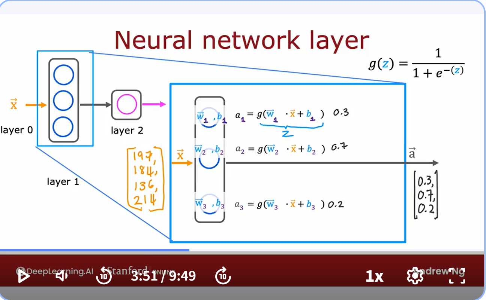

- Brief about Neural Network (Deep Learning)
    - start at 1950s trying  to mimic human brain(biological brain)
    - gain traction at 1980s to 1990s for the handwritten recognition, post code, cheque numbers
    - 2005 rebranded as Deep Learning, huge impact on speech recognition and computer vision
    - 2012, ImageNet made huge influence for computer vision, Fei Fei Li and her research works
        - computer vision stands for using sensor and program to identify object, including object classification, facial recognition 
    - then, texts and natural language processing.

- Biological Brain
    - Neuron has cell body, and cell body's core is nucleus, and the branch like stuff is dendrites(突触), where the input coming from, and after the neuron got input, they do some computation, and send out the output through a long tail, called axon, that axon will connect to other neuron, and output becomes input for those other neurons.

- Neural Network (computer world)
    - have some input,like number 2, and do computation, then output number 0.7, and then 0.7 becomes input for other neuron.
    - why deep learning?
        - traditional model like logistic regression and linear regression's performance can't scale much as data accumulates, they already met their limit.
        - Very complicated neural network design can benefit from big data, and perform much better than the traditional one, also need to consume large quantity of power and GPU.

- To demo, let's consider a simple example, we are selling t-shirt, and we want to predict if this t-shirt gonna be the top seller.
    - input is price
    - output is yes/no
    - and using logistic regression, we know that predict value is sigmoid function of $-(wx+b)$, and we call this activation. 
        - why calling activation? 'cause this word is also used in neural science to express how strong the output is passed to the next neuron, here since the prediction is between 0 and 1, it's more likely a probability to express yes. Just as strength to say yes.
    - this logistic regression model could be a single neuron in the network.

- To demo for simplified neural network, we re-visit this problem with new design:
    - there are 4 features to decide if this t-shirt gonna be a top seller:
        1. price
        2. shipping cost
        3. marketing
        4. material
    - these 4 features, or numbers are grouped as input layer.
    - then we classified 3 elements that will affect this t-shirt being top-seller:
        1. affordability, where decided by price and shipping cost
        2. awareness, by marketing
        3. perceived quality, byprice and materials
    - these three elements are called activation, and these middle layer is called hidden layer.

    - so we actually have 3 neuron, each for one element, these 3 neuron groups together and form a *layer*
    - and their output will be input for another final neuron that decide what are the probability of being top seller, which is another single neuroned layer, and also output layer.
    - so deep learning, the middle layer/hidden layer 's feature is not decided manually, but refined/ polished by machine itself.
    - in total, this is also called multiple perceptron.

