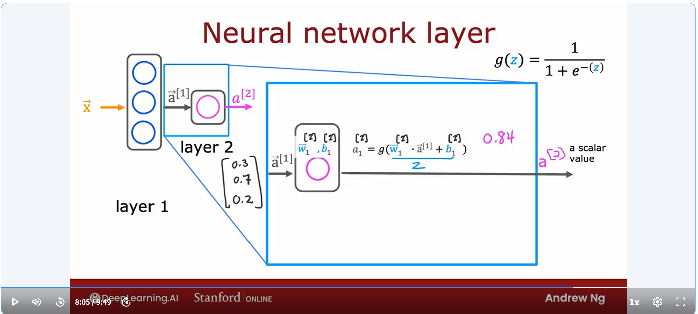
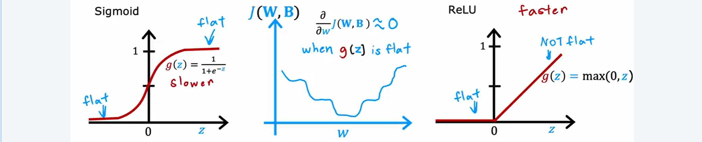

# Neural Networks

- Brief about Neural Network (Deep Learning)
    - start at 1950s trying  to mimic human brain(biological brain)
    - gain traction at 1980s to 1990s for the handwritten recognition, post code, cheque numbers
    - 2005 rebranded as Deep Learning, huge impact on speech recognition and computer vision
    - 2012, ImageNet made huge influence for computer vision, Fei Fei Li and her research works
        - computer vision stands for using sensor and program to identify object, including object classification, facial recognition 
    - then, texts and natural language processing.

- Biological Brain
    - Neuron has cell body, and cell body's core is nucleus, and the branch like stuff is dendrites(突触), where the input coming from, and after the neuron got input, they do some computation, and send out the output through a long tail, called axon, that axon will connect to other neuron, and output becomes input for those other neurons.


- Neural Network (computer world)
    - have some input,like number 2, and do computation, then output number 0.7, and then 0.7 becomes input for other neuron.
    - why deep learning?
        - traditional model like logistic regression and linear regression's performance can't scale much as data accumulates, they already met their limit.
        - Very complicated neural network design can benefit from big data, and perform much better than the traditional one, also need to consume large quantity of power and GPU.

- To demo, let's consider a simple example, we are selling t-shirt, and we want to predict if this t-shirt gonna be the top seller.
    - input is price
    - output is yes/no
    - and using logistic regression, we know that predict value is sigmoid function of $(wx+b)$, and we call this activation. 
        - why calling activation? 'cause this word is also used in neural science to express how strong the output is passed to the next neuron, here since the prediction is between 0 and 1, it's more likely a probability to express yes. Just as strength to say yes.
    - this logistic regression model could be a single neuron in the network.

- To demo for simplified neural network, we re-visit this problem with new design:
    - there are 4 features to decide if this t-shirt gonna be a top seller:
        1. price
        2. shipping cost
        3. marketing
        4. material
    - these 4 features, or numbers are grouped as input layer.
    - then we classified 3 elements that will affect this t-shirt being top-seller:
        1. affordability, where decided by price and shipping cost
        2. awareness, by marketing
        3. perceived quality, byprice and materials
    - these three elements are called activation, and these middle layer is called hidden layer.

    - so we actually have 3 neuron, each for one element, these 3 neuron groups together and form a *layer*
    - and their output will be input for another final neuron that decide what are the probability of being top seller, which is another single neuroned layer, and also output layer.
    - so deep learning, the middle layer/hidden layer 's feature is not decided manually, but refined/ polished by machine itself.
    - in total, this is also called multiple perceptron.


## Linear and logistics regression in neural networks
- For linear regression or logistics and sigmoid activation



- Activation value of layer l
$$
a_j^{[l]} = g(\vec{w}_j^{[l]}\cdot\vec{a}^{[l-1]}+b_j^{[l]})
$$
where j is number of neuron at layer l
$$
\vec{a} = [a_1, a_2, ..., a_j]
$$
$$
\vec{x} = \vec{a}^{[0]}
$$
$$
g(z), where\ g = \frac{1} {1+e^{-z}}
$$

- For logistic regression and ReLu activation
$$
g(z) = max(0, z)
$$

## Multiclass classification using softmax activation function
- activation
$$
\begin{gather}
    z_1 = \vec{w_1} \cdot \vec{x} + b_1,\ where\ a_1 = \frac {e^{z_1}} {e^{z_1} + e^{z_2} + e^{z_3} + e^{z_4}}\\
    z_2 = \vec{w_2} \cdot \vec{x} + b_2,\ where\ a_2 = \frac {e^{z_2}} {e^{z_1} + e^{z_2} + e^{z_3} + e^{z_4}}\\
    z_3 = \vec{w_3} \cdot \vec{x} + b_3,\ where\ a_3 = \frac {e^{z_3}} {e^{z_1} + e^{z_2} + e^{z_3} + e^{z_4}}\\
    z_4 = \vec{w_4} \cdot \vec{x} + b_4,\ where\ a_4 = \frac {e^{z_4}} {e^{z_1} + e^{z_2} + e^{z_3} + e^{z_4}}\\
    where\ a_1 + a_2 + a_3 + a_4 = 1
\end{gather}
$$

- loss
$$
loss(a_1,...,a_N) = \begin{cases}
 -loga_1, \\
 -loga_2, \\
 ... \\
 -loga_N
\end{cases}
$$

## Code in Python for Neural Networks
```python
# logistic regression
model = Sequential([Dense(units=25, activation="relu"),
                    Dense(units=15, activation="relu"),
                    Dense(units=1, activation="linear"),])
model.compile(loss=BinaryCrossEntropy(from_logits=True))
# softmax regression
model = Sequential([Dense(units=25, activation="relu"),
                    Dense(units=15, activation="relu"),
                    Dense(units=1, activation="linear"),])
model.compile(loss=SparseCategoricalCrossEntropy(from_logits=True))
# fit
model.fit(X,Y, epochs=100)
# predict
logits = model(X)
f_x = tf.nn.softmax(logits)
```

- Cross Validation set
    - Usually there must be train set and test set data when training models. 
    - Cross Validation set is another set independent from these two set, so the original entire data set is splitted into 3 parts. 
        1. Use train set to build your models
        2. Different built models will test and compare based on the Cross Validation set data, means each model will measure bias and variance seperately on the same cvs data.
        3. choose one of the best model and test is on final test set data.

- Bias vs. Variance
    - bias means our error between prediction and tain data, is very high, means the prediction is not accurate
    - variance means our error between train data and prediction, is very low, and error between new data and prediction is high. Means model only works for Known data(train data), but lost accuracy in new data prediction.

    - bias is caused by limit of ML model, for example, linear regression model is lack of ability to predict polynomial pattern data. This is underfitting condition.
    - variance is caused by overfitting condition, usually we need to decrease degree of features and number of features.

    - when we have low bias but high variance model, when we increase data size, it will decrease the error of new data and prediction, and decrease variance resulting low biase variance model.
    - when we have high biased model, where increasing training size does not help, we must make our model more complex, by increase degree or number of features.

    - regularization will limit the effect of overfitting parameters, since lambda goes up, parameters is pursuing to the value of 0. (become linear with constant b)

    - when judging if the model is high biased, we also need to consider the base level of error, like how human's accuracy on this task, or how other competitive models on this task. 
