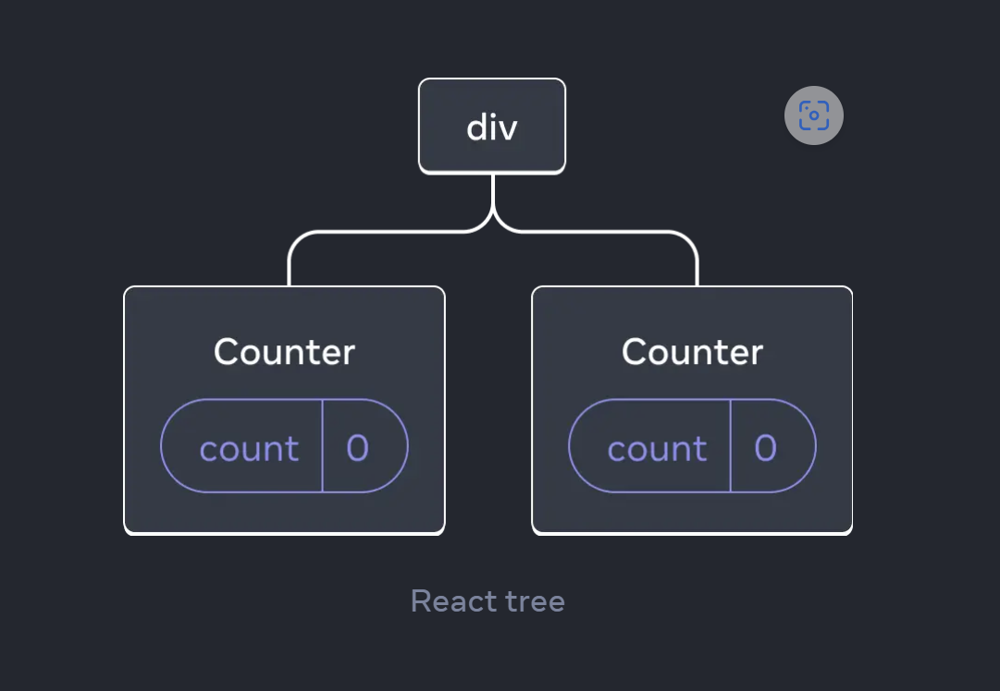
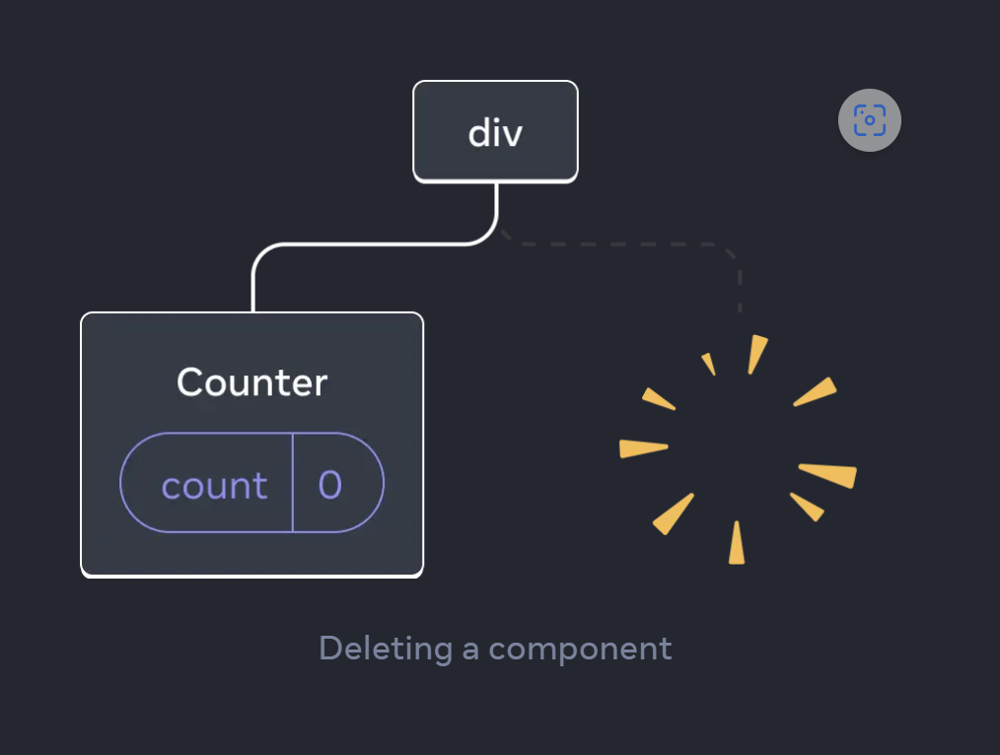
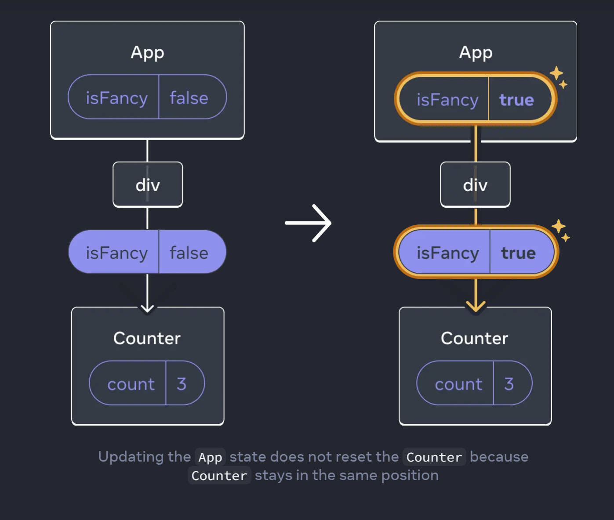

# GET STARTED
## Quick Start
### Creating and nesting components
For React apps, pages are built by components, they could be small as a button or could be entire page. Each component has its own logic and appearance.

An example of a compoenent:

```jsx
function MyButton(){
    return (
        <button>I'm a button</button>
    );
}
```

When you build a small component, you can composites many of them into a nested component(larger one).

```jsx
export default function MyApp(){
    return (
        <div>
            <h1>Welcome to my app</h1>
            <MyButton />
        </div>
    );
}
```

NOTE: React component always starts with Capital letters.

JSX allows you to embed HTML syntax in to Javascript. And you can embed logic expression within JSX using curly braces. For example, you can do this:
```jsx
return (
  <h1>
    {user.name}
  </h1>
);
```
And you can also do this:
```jsx
return (
  
);
```

You can do even more complex things like:

```jsx
const user = {
  name: 'Hedy Lamarr',
  imageUrl: 'https://i.imgur.com/yXOvdOSs.jpg',
  imageSize: 90,
};

export default function Profile() {
  return (
    <>
      <h1>{user.name}</h1>
      
    </>
  );
}
```

### Conditional rendering
To add logic to achieve conditional rendering, you can do something like:

```jsx
let content;
if (isLoggedIn) {
  content = <AdminPanel />;
} else {
  content = <LoginForm />;
}
return (
  <div>
    {content}
  </div>
);

// or with a more compact way
<div>
  {isLoggedIn ? (
    <AdminPanel />
  ) : (
    <LoginForm />
  )}
</div>

// and more extreme way, where AdminPanel always exists in React UI Structure no matter the condition of isLoggedIn.

<div>
  {isLoggedIn && <AdminPanel />} 
</div>
```

### Rendering lists

You can apply `for` loop and `Array.map()` function to render iterate list.

For example:
```jsx
const products = [
  { title: 'Cabbage', id: 1 },
  { title: 'Garlic', id: 2 },
  { title: 'Apple', id: 3 },
];

const listItems = products.map(product =>
  <li key={product.id}>
    {product.title}
  </li>
);

return (
  <ul>{listItems}</ul>
);
```

When redering lists, `key` property is required, you can use id in database to fill this property, this allow react to work when you do insert delete and update to your list items.

### Responding to events
When you assign event handler, you can assign function name to the corresponding property, but do not add `()` to it. 
```jsx
function MyButton() {
  function handleClick() {
    alert('You clicked me!');
  }

  return (
    <button onClick={handleClick}>
      Click me
    </button>
  );
}
```

### Updating the screen
If you want a memory among refreshed pages and different components, you need to use `useState`. That memo is isolated to the current component. For example:

if we have `MyButton` like:
```jsx
import { useState } from 'react';
function MyButton() {
  const [count, setCount] = useState(0);

  function handleClick() {
    setCount(count + 1);
  }

  return (
    <button onClick={handleClick}>
      Clicked {count} times
    </button>
  );
}
```
Then we have `MyApp` like:
```jsx
export default function MyApp() {
  return (
    <div>
      <h1>Counters that update separately</h1>
      <MyButton />
      <MyButton />
    </div>
  );
}
```

Then each `MyButton` component has a its own state, each click will cause corresponding button to display its own `count` state.

### Using Hooks

Functions starting with `use` are called *Hooks*, they are buit-in functions, and very restrictive functions. You can build your own hooks on the top of other hooks. And it is required that you put hooks on the top of your components. If you want to use hooks in a condition or a loop, you need to extract a new component and put it there.


#### `useState` vs. `useReducer`
||`useState`|`useReducer`|
|-|-|-|
|Code size|coder will have less boilerplate code| with `useReducer`, coder can have state modified by different type of events|
|Readability|code is more centralized and easy to read, but when logic got complex, it's hard to scan| code is "categorized" corresponding to the type|
|Debugging|difficult to debug|scan each action, if no clue, then must be reducer|
|Testing||require pure function, and isolated, so easy to test|

### Sharing data between componets

`useState` usually located at the beginning of a component(template) and it's isolated among component's instances.

If you want to control multiple components using a same state. You need to lift up the state into their shared parent component. Please see example below:
```jsx
export default function MyApp() {
  const [count, setCount] = useState(0);

  function handleClick() {
    setCount(count + 1);
  }

  return (
    <div>
      <h1>Counters that update together</h1>
      <MyButton count={count} onClick={handleClick} />
      <MyButton count={count} onClick={handleClick} />
    </div>
  );
}
```

## Installation
# LEARN REACT
## Describing the UI
## Adding Interactivity
`useState` and `useReducer` all act like a memory or snapshot of the current rendering page. When the state changes, by calling setState or dispatch, it triggers the page to re-render.

Local variable is different from the state. When you use something like `setState([Primitive Value])` it changes the state, but this does not affect the local variable at current rendering round, but the local variable related will be updated when re-rendering is done. This change happens immediately through triggered event, and will cause the re-rendering if there's no further state manipulation.

If you want to persist the updates in a sequence of changing state, you need to use *updater* function.

Please see following example:
```jsx
import { useState } from 'react';
function MyButton() {
  const [count, setCount] = useState(0);

  function handleClick() {
    console.log("first time, "count);
    setCount(count + 1);
    console.log("second time, "count);
  }

  return (
    <button onClick={handleClick}>
      Clicked {count} times
    </button>
  );
}

```

In the previous example, both `console.log` will output [0, 0]at the initial rendering, and [1, 1], [2, 2], in the following re-rendering.

Now let's see if this happens in a sequence.

```jsx
import { useState } from 'react';
function MyButton() {
  const [count, setCount] = useState(0);

  function handleClick() {
    console.log("first time, "count);
    setCount(count + 1);
    setCount(count + 1);
    console.log("second time, "count);
  }

  return (
    <button onClick={handleClick}>
      Clicked {count} times
    </button>
  );
}
```

In previous example, the output should be the same, [0,0], [1,1],[2,2].

Now if we want to persist value an do it in a sequence:
```jsx
import { useState } from 'react';
function MyButton() {
  const [count, setCount] = useState(0);

  function handleClick() {
    console.log("first time, "count);
    setCount(count => count + 1);// updater function
    console.log("second time, "count);
    setCount(count => count + 1);
    
  }

  return (
    <button onClick={handleClick}>
      Clicked {count} times
    </button>
  );
}
```

The output would be [0, 0], [2, 2], [4, 4], because each time we call `setCount` the count will be persisted to the next calling. It's like a queue.

Let's see a more tricky example:
```jsx
import { useState } from 'react';
function MyButton() {
  const [count, setCount] = useState(0);

  function handleClick() {
    console.log("first time, "count);
    setCount(count => count + 1);// updater function
    console.log("second time, "count);
    setTimeout(()=> {
        setCount(count + 1);
    }, 5000)
    setCount(count => count + 1);
    
  }

  return (
    <button onClick={handleClick}>
      Clicked {count} times
    </button>
  );
}
```
This example output will be [0, 0] [1, 1] and [2, 2].

That's because the async operation will final trigger a rendering with **count = 0 and count + 1**, 

But observe the text on the button, it first appear as 2, because 2 updater function was executed in a sequence. And 5 senconds later, the text on button will become 1. 

## Managing State
### Reacting to Input with State
Declarative vs. Imperative UI Design

- Imperative UI Design, you have to give command to every detail operations, step by step, this would be hard to debug or read through when UI gets complex and nested.

- Declarative UI Design, you need to do several things:
1. **Identify** different state of your UI
2. **Determine** what triggers those state changes, events?
3. **Represent** the state in memory using `useState`
4. **Remove** any non-essential state variables
5. **Connect** the event handlers to change state

#### Identify
For a submit function form, there might be states like:
1. Empty
2. Typing
3. Submitting
4. Success
5. Error

```jsx
export default function Form({
  // Try 'submitting', 'error', 'success':
  status = 'empty'
}) {
  if (status === 'success') {
    return <h1>That's right!</h1>
  }
  return (
    <>
      <h2>City quiz</h2>
      <p>
        In which city is there a billboard that turns air into drinkable water?
      </p>
      <form>
        <textarea disabled={
          status === 'submitting'
        } />
        <br />
        <button disabled={
          status === 'empty' ||
          status === 'submitting'
        }>
          Submit
        </button>
        {status === 'error' &&
          <p className="Error">
            Good guess but a wrong answer. Try again!
          </p>
        }
      </form>
      </>
  );
}
```
Also, you can be benefit from mocking the status, to see if each states work. Easy to test and read.

#### Determine
For form, there might be 2 events, which will trigger the state changes, that you need to consider:
1. Human inputs, like clicking buttong, typing in a field, etc.
2. Computer inputs, like network response arrives, timeouts, image loading, etc.

#### Represent
When trying to represent your visual states using `useState`.

Remembert that the principal is you want to put in only what is neccessary. And duplicate or complex states lead to bugs.

But as initial process, we can put whatever we have for visual states now, and in the next step, we will refactor and remove the redundant ones.

#### Remove(Refactor)
At the end of this step, we must have the least states that is only necessary to perform the functionality.

#### Connect the event handlers to set state
Build up events to change corresponding state.

#### Complete example
Finished example:
```jsx
import { useState } from 'react';

export default function Form() {
  const [answer, setAnswer] = useState('');
  const [error, setError] = useState(null);
  const [status, setStatus] = useState('typing');

  if (status === 'success') {
    return <h1>That's right!</h1>
  }

  async function handleSubmit(e) {
    e.preventDefault();
    setStatus('submitting');
    try {
      await submitForm(answer);
      setStatus('success');
    } catch (err) {
      setStatus('typing');
      setError(err);
    }
  }

  function handleTextareaChange(e) {
    setAnswer(e.target.value);
  }

  return (
    <>
      <h2>City quiz</h2>
      <p>
        In which city is there a billboard that turns air into drinkable water?
      </p>
      <form onSubmit={handleSubmit}>
        <textarea
          value={answer}
          onChange={handleTextareaChange}
          disabled={status === 'submitting'}
        />
        <br />
        <button disabled={
          answer.length === 0 ||
          status === 'submitting'
        }>
          Submit
        </button>
        {error !== null &&
          <p className="Error">
            {error.message}
          </p>
        }
      </form>
    </>
  );
}

function submitForm(answer) {
  // Pretend it's hitting the network.
  return new Promise((resolve, reject) => {
    setTimeout(() => {
      let shouldError = answer.toLowerCase() !== 'lima'
      if (shouldError) {
        reject(new Error('Good guess but a wrong answer. Try again!'));
      } else {
        resolve();
      }
    }, 1500);
  });
}
```

### Choosing the State Structure

#### Principles for structuring state
1. Group related states:
this example shows to combine x index and y index into one object state.
```jsx
import { useState } from 'react';

export default function MovingDot() {
  const [position, setPosition] = useState({
    x: 0,
    y: 0
  });
  return (
    <div
      onPointerMove={e => {
        setPosition({
          x: e.clientX,
          y: e.clientY
        });
      }}
      style={{
        position: 'relative',
        width: '100vw',
        height: '100vh',
      }}>
      <div style={{
        position: 'absolute',
        backgroundColor: 'red',
        borderRadius: '50%',
        transform: `translate(${position.x}px, ${position.y}px)`,
        left: -10,
        top: -10,
        width: 20,
        height: 20,
      }} />
    </div>
  )
}
```

2. Avoid contradictons in state
Because `isSending` and `isSent` never happened at the same time, we can use `status` as one state to represent "typing", "submitting", "sent"
```jsx
import { useState } from 'react';

export default function FeedbackForm() {
  const [text, setText] = useState('');
  const [status, setStatus] = useState('typing');

  async function handleSubmit(e) {
    e.preventDefault();
    setStatus('sending');
    await sendMessage(text);
    setStatus('sent');
  }

  const isSending = status === 'sending';
  const isSent = status === 'sent';

```

3. Avoid redundant state
You can substitute state like `fullName` which depends on other two states: `firstName` and `lastNmae` into a local variable:
```jsx
import { useState } from 'react';

const initialItems = [
  { title: 'pretzels', id: 0 },
  { title: 'crispy seaweed', id: 1 },
  { title: 'granola bar', id: 2 },
];

export default function Menu() {
  const [items, setItems] = useState(initialItems);
  const [selectedItem, setSelectedItem] = useState(
    items[0]
  );

  return (
    <>
      <h2>What's your travel snack?</h2>
      <ul>
        {items.map(item => (
          <li key={item.id}>
            {item.title}
            {' '}
            <button onClick={() => {
              setSelectedItem(item);
            }}>Choose</button>
          </li>
        ))}
      </ul>
      <p>You picked {selectedItem.title}.</p>
    </>
  );
}

```

5. Avoid deeply nested state
For example, if you have items and selectedItem, you can change to items and selectedItemId

6. Avoid deeply nested state
When you have hierchy in the list data, you'd better express them in 'flat' version:
```js
export const initialTravelPlan = {
  0: {
    id: 0,
    title: '(Root)',
    childIds: [1, 42, 46],
  },
  1: {
    id: 1,
    title: 'Earth',
    childIds: [2, 10, 19, 26, 34]
  },
  2: {
    id: 2,
    title: 'Africa',
    childIds: [3, 4, 5, 6 , 7, 8, 9]
  }, 
  3: {
    id: 3,
    title: 'Botswana',
    childIds: []
  },
  4: {
    id: 4,
    title: 'Egypt',
    childIds: []
  },
  5: {
    id: 5,
    title: 'Kenya',
    childIds: []
  },
  6: {
    id: 6,
    title: 'Madagascar',
    childIds: []
  }, 
  7: {
    id: 7,
    title: 'Morocco',
    childIds: []
  },
  8: {
    id: 8,
    title: 'Nigeria',
    childIds: []
  },
  9: {
    id: 9,
    title: 'South Africa',
    childIds: []
  },
  10: {
    id: 10,
    title: 'Americas',
    childIds: [11, 12, 13, 14, 15, 16, 17, 18],   
  },
  11: {
    id: 11,
    title: 'Argentina',
    childIds: []
  },
  12: {
    id: 12,
    title: 'Brazil',
    childIds: []
  },
  13: {
    id: 13,
    title: 'Barbados',
    childIds: []
  }, 
  14: {
    id: 14,
    title: 'Canada',
    childIds: []
  },
  15: {
    id: 15,
    title: 'Jamaica',
    childIds: []
  },
  16: {
    id: 16,
    title: 'Mexico',
    childIds: []
  },
  17: {
    id: 17,
    title: 'Trinidad and Tobago',
    childIds: []
  },
  18: {
    id: 18,
    title: 'Venezuela',
    childIds: []
  },
  19: {
    id: 19,
    title: 'Asia',
    childIds: [20, 21, 22, 23, 24, 25],   
  },
  20: {
    id: 20,
    title: 'China',
    childIds: []
  },
  21: {
    id: 21,
    title: 'India',
    childIds: []
  },
  22: {
    id: 22,
    title: 'Singapore',
    childIds: []
  },
  23: {
    id: 23,
    title: 'South Korea',
    childIds: []
  },
  24: {
    id: 24,
    title: 'Thailand',
    childIds: []
  },
  25: {
    id: 25,
    title: 'Vietnam',
    childIds: []
  },
  26: {
    id: 26,
    title: 'Europe',
    childIds: [27, 28, 29, 30, 31, 32, 33],   
  },
  27: {
    id: 27,
    title: 'Croatia',
    childIds: []
  },
  28: {
    id: 28,
    title: 'France',
    childIds: []
  },
  29: {
    id: 29,
    title: 'Germany',
    childIds: []
  },
  30: {
    id: 30,
    title: 'Italy',
    childIds: []
  },
  31: {
    id: 31,
    title: 'Portugal',
    childIds: []
  },
  32: {
    id: 32,
    title: 'Spain',
    childIds: []
  },
  33: {
    id: 33,
    title: 'Turkey',
    childIds: []
  },
  34: {
    id: 34,
    title: 'Oceania',
    childIds: [35, 36, 37, 38, 39, 40, 41],   
  },
  35: {
    id: 35,
    title: 'Australia',
    childIds: []
  },
  36: {
    id: 36,
    title: 'Bora Bora (French Polynesia)',
    childIds: []
  },
  37: {
    id: 37,
    title: 'Easter Island (Chile)',
    childIds: []
  },
  38: {
    id: 38,
    title: 'Fiji',
    childIds: []
  },
  39: {
    id: 40,
    title: 'Hawaii (the USA)',
    childIds: []
  },
  40: {
    id: 40,
    title: 'New Zealand',
    childIds: []
  },
  41: {
    id: 41,
    title: 'Vanuatu',
    childIds: []
  },
  42: {
    id: 42,
    title: 'Moon',
    childIds: [43, 44, 45]
  },
  43: {
    id: 43,
    title: 'Rheita',
    childIds: []
  },
  44: {
    id: 44,
    title: 'Piccolomini',
    childIds: []
  },
  45: {
    id: 45,
    title: 'Tycho',
    childIds: []
  },
  46: {
    id: 46,
    title: 'Mars',
    childIds: [47, 48]
  },
  47: {
    id: 47,
    title: 'Corn Town',
    childIds: []
  },
  48: {
    id: 48,
    title: 'Green Hill',
    childIds: []
  }
};
```

You can use childIds to check if this is higher level item.

### Sharing State Between Components
Just remember to lift up the child compoent's state to common parents when you want to change the state among child components simultaneously.


### Preserving and Resetting State
So there is a concept called *UI tree*, this is important to know. React keeps track of which state belongs to which component based on their place in the UI tree.

Beside of that there is also a *Dependency tree* which depicts module imports operations from dependency modules.

- State does not lives in component and isolated by compoents themselves. States actually are stored in React, and React "remember" states to corresponding component by the position of *UI tree*.

To demonstrate this concept, please see following example:
```jsx
import { useState } from 'react';

export default function App() {
  const counter = <Counter />;
  return (
    <div>
      {counter}
      {counter}
    </div>
  );
}

function Counter() {
  const [score, setScore] = useState(0);
  const [hover, setHover] = useState(false);

  let className = 'counter';
  if (hover) {
    className += ' hover';
  }

  return (
    <div
      className={className}
      onPointerEnter={() => setHover(true)}
      onPointerLeave={() => setHover(false)}
    >
      <h1>{score}</h1>
      <button onClick={() => setScore(score + 1)}>
        Add one
      </button>
    </div>
  );
}
```
In above example, two counters have seperated `score` and `hover` properties. That's because if you see the position in *UI tree*, it will be like:




So two counters have different positions, and they will have different states.

- When you try to make a conditional rendering, and when component is stoped rendered, its state will be removed also. So remove a component, destroy a state. Please see example:

```jsx
import { useState } from 'react';

export default function App() {
  const [showB, setShowB] = useState(true);
  return (
    <div>
      <Counter />
      <!-- Conditional Rendering HERE!!! -->    
      {showB && <Counter />} 
      <label>
        <input
          type="checkbox"
          checked={showB}
          onChange={e => {
            setShowB(e.target.checked)
          }}
        />
        Render the second counter
      </label>
    </div>
  );
}

function Counter() {
  const [score, setScore] = useState(0);
  const [hover, setHover] = useState(false);

  let className = 'counter';
  if (hover) {
    className += ' hover';
  }

  return (
    <div
      className={className}
      onPointerEnter={() => setHover(true)}
      onPointerLeave={() => setHover(false)}
    >
      <h1>{score}</h1>
      <button onClick={() => setScore(score + 1)}>
        Add one
      </button>
    </div>
  );
}
```

Above example will have *UI tree* like:



When the Second counter is added back, the state will be initialized from scratch.

- Now, if we have different components(same type) at the same position, it will share the same state. TO demo this, please see:

```jsx
import { useState } from 'react';

export default function App() {
  const [isFancy, setIsFancy] = useState(false);
  return (
    <div>
      {isFancy ? (
        <Counter isFancy={true} /> 
      ) : (
        <Counter isFancy={false} /> 
      )}
      <label>
        <input
          type="checkbox"
          checked={isFancy}
          onChange={e => {
            setIsFancy(e.target.checked)
          }}
        />
        Use fancy styling
      </label>
    </div>
  );
}

function Counter({ isFancy }) {
  const [score, setScore] = useState(0);
  const [hover, setHover] = useState(false);

  let className = 'counter';
  if (hover) {
    className += ' hover';
  }
  if (isFancy) {
    className += ' fancy';
  }

  return (
    <div
      className={className}
      onPointerEnter={() => setHover(true)}
      onPointerLeave={() => setHover(false)}
    >
      <h1>{score}</h1>
      <button onClick={() => setScore(score + 1)}>
        Add one
      </button>
    </div>
  );
}

```

This will be resolved as:



So React discards the `isFancy` props value, and treat both Counter as same state.

- If you have different type of component appearing at the same position, React will remove the previous one and destroy the state, and add the later and intiate from scratch.

#### Resetting state at the same position
The defualt behavior is to render same type but different components at the same postion with same state.

If you want to reset, you have 2 options:
1. render at different position for these 2 same typed components
2. give them different identity by using `key` property.


##### Demo 1
```jsx
import { useState } from 'react';

export default function Scoreboard() {
  const [isPlayerA, setIsPlayerA] = useState(true);
  return (
    <div>
      <!-- these && operators will make counter available at different position -->
      {isPlayerA &&
        <Counter person="Taylor" />
      }
      {!isPlayerA &&
        <Counter person="Sarah" />
      }
      <button onClick={() => {
        setIsPlayerA(!isPlayerA);
      }}>
        Next player!
      </button>
    </div>
  );
}

function Counter({ person }) {
  const [score, setScore] = useState(0);
  const [hover, setHover] = useState(false);

  let className = 'counter';
  if (hover) {
    className += ' hover';
  }

  return (
    <div
      className={className}
      onPointerEnter={() => setHover(true)}
      onPointerLeave={() => setHover(false)}
    >
      <h1>{person}'s score: {score}</h1>
      <button onClick={() => setScore(score + 1)}>
        Add one
      </button>
    </div>
  );
}

```

##### Demo 2
```jsx
import { useState } from 'react';

export default function Scoreboard() {
  const [isPlayerA, setIsPlayerA] = useState(true);
  return (
    <div>
      <!-- There is a key property for each counter -->
      {isPlayerA ? (
        <Counter key="Taylor" person="Taylor" />
      ) : (
        <Counter key="Sarah" person="Sarah" />
      )}
      <button onClick={() => {
        setIsPlayerA(!isPlayerA);
      }}>
        Next player!
      </button>
    </div>
  );
}

function Counter({ person }) {
  const [score, setScore] = useState(0);
  const [hover, setHover] = useState(false);

  let className = 'counter';
  if (hover) {
    className += ' hover';
  }

  return (
    <div
      className={className}
      onPointerEnter={() => setHover(true)}
      onPointerLeave={() => setHover(false)}
    >
      <h1>{person}'s score: {score}</h1>
      <button onClick={() => setScore(score + 1)}>
        Add one
      </button>
    </div>
  );
}

```

So `different keys === different positions`.

### Extracting State Logic into a Reducer
Complete Example of Reducer:

```jsx
//App.js
import { useReducer } from 'react';
import AddTask from './AddTask.js';
import TaskList from './TaskList.js';
import tasksReducer from './tasksReducer.js';

export default function TaskApp() {
  const [tasks, dispatch] = useReducer(tasksReducer, initialTasks);

  function handleAddTask(text) {
    dispatch({
      type: 'added',
      id: nextId++,
      text: text,
    });
  }

  function handleChangeTask(task) {
    dispatch({
      type: 'changed',
      task: task,
    });
  }

  function handleDeleteTask(taskId) {
    dispatch({
      type: 'deleted',
      id: taskId,
    });
  }

  return (
    <>
      <h1>Prague itinerary</h1>
      <AddTask onAddTask={handleAddTask} />
      <TaskList
        tasks={tasks}
        onChangeTask={handleChangeTask}
        onDeleteTask={handleDeleteTask}
      />
    </>
  );
}

let nextId = 3;
const initialTasks = [
  {id: 0, text: 'Visit Kafka Museum', done: true},
  {id: 1, text: 'Watch a puppet show', done: false},
  {id: 2, text: 'Lennon Wall pic', done: false},
];

//tasksReducer.js
export default function tasksReducer(tasks, action) {
  switch (action.type) {
    case 'added': {
      return [
        ...tasks,
        {
          id: action.id,
          text: action.text,
          done: false,
        },
      ];
    }
    case 'changed': {
      return tasks.map((t) => {
        if (t.id === action.task.id) {
          return action.task;
        } else {
          return t;
        }
      });
    }
    case 'deleted': {
      return tasks.filter((t) => t.id !== action.id);
    }
    default: {
      throw Error('Unknown action: ' + action.type);
    }
  }
}
```

### Passing Data Deeply with Context
Complete example of using Context:

```jsx
//App.js
import Heading from './Heading.js';
import Section from './Section.js';

export default function Page() {
  return (
    <Section>
      <Heading>Title</Heading>
      <Section>
        <Heading>Heading</Heading>
        <Heading>Heading</Heading>
        <Heading>Heading</Heading>
        <Section>
          <Heading>Sub-heading</Heading>
          <Heading>Sub-heading</Heading>
          <Heading>Sub-heading</Heading>
          <Section>
            <Heading>Sub-sub-heading</Heading>
            <Heading>Sub-sub-heading</Heading>
            <Heading>Sub-sub-heading</Heading>
          </Section>
        </Section>
      </Section>
    </Section>
  );
}

//Section.js IMPORTANT
import { useContext } from 'react';
import { LevelContext } from './LevelContext.js';

export default function Section({ children }) {
  const level = useContext(LevelContext);
  return (
    <section className="section">
      <LevelContext.Provider value={level + 1}>
        {children}
      </LevelContext.Provider>
    </section>
  );
}

//Heading.js
import { useContext } from 'react';
import { LevelContext } from './LevelContext.js';

export default function Heading({ children }) {
  const level = useContext(LevelContext);
  switch (level) {
    case 0:
      throw Error('Heading must be inside a Section!');
    case 1:
      return <h1>{children}</h1>;
    case 2:
      return <h2>{children}</h2>;
    case 3:
      return <h3>{children}</h3>;
    case 4:
      return <h4>{children}</h4>;
    case 5:
      return <h5>{children}</h5>;
    case 6:
      return <h6>{children}</h6>;
    default:
      throw Error('Unknown level: ' + level);
  }
}

//LevelContext.js
import { createContext } from 'react';

export const LevelContext = createContext(0);


```

- Remember that different context are isolated and independent to each other.

#### Use cases for context
1. Theming
2. Current account
3. Routing
4. Managing state

- But before use context, please remember don't overuse it.

1. Start by passing `props`
2. Extract components and pass JSX as `children` which is a special `props`