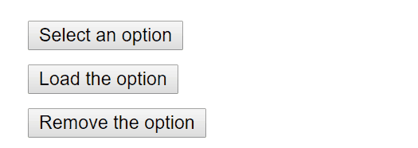

# Main Concepts
## Introducing JSX
### Why JSX
JSX allows user to write UI and logic in the same Javascript file.
### Embedding Expressions in JSX
For example, you can write javascript variable and wrap it in curly braces in UI expression like example below.
```jsx
import ReactDOM from "react-dom";

const name = "Josh Perez";
const element = <h1>Hello, {name}</h1>

ReactDOM.render(element, document.getElementById("root"));
```
You can also write javascript expression into curly braces.
```jsx
function formatName(user){
    return user.firstName + " " + user.lastName;
}

const user = {
    firstName: "Harper",
    lastName: "Perez"
}

const element = (
    <h1>
        Hello, {formatName(user)}
    </h1>
);

ReactDOM.render(
    element,
    document.getElmeentById("root");
);
```

You can treat JSX as an expression.
```jsx
function getGreeting(user){
    if(user){
        return <h1>Hello, {formatName(user)}</h1>
    }
    return <h1>Hello, stranger</h1>
}
```

**JSX prevents injection attacks**
Everything is converted to a string and do escapes before being rendered.
This can prevent XSS(cross-site-scripting)

### JSX Represents Objects
Example of following is identical
```jsx
const element = (
    <h1 className="greeting">
        Hello, world!
    </h1>
);

const element = React.createElement(
    "h1",
    {className: "greeting"},
    "Hello, world"
);

//The object structure of React.createElement is
const element= {
    type: "h1",
    props:{
        className: "greeting",
        children: "Hello, world!"
    }
}
```

## Rendering Elements
### Rendering an Element into the DOM
Use ReactDom.render() to render a jsx element to the target DOM element which specified in the second parameter.

```jsx
const element = <h1>Hello, world</h1>
ReactDOM.render(element, document.getElementById("root"));
```

### Updating the Rendered Element
React elements are immutable. Once created it's like the UI at certain point in time. So if you wants to update React element, the only way is to call ReactDOM.render() again.

```jsx
function tick(){
    const element = (
        <div>
            <h1>Hello, world</h1>
            <h2>It is {new Date().toLocaleTimeToString()}</h2>
        </div>
    );

    ReactDOM.render(element, document.getElementById("root"));
}

setInterval(tick, 1000);
```
### React Only Updates What's Necessary
If you open the browser and inspect on the DOM element corresponding to the JSX before, although we called ReactDOM.render() for several times, you will see only changed part(dates part) is updated. However, the rest of the DOM is remained same.

## Components and Props
### Function and Class Components
The simplest way is to write function component
```jsx
function Welcome(props){
    return <h1>Hello, {props.name}</h1>
}
```
We can also use ES6 class to define a component, we can use props as ```this.props``` directly.
```jsx
class Welcome extends Reat.Component{
    render(){
        return <h1>Hello, {this.props.name}</h1>;
    }
}
```
### Rendering a Component
When JSX sees a user defined component, it passes props by declaring attributes in the user defined component element. And pass a object as props to the component.
```jsx
function Welcome(props){
    return <h1>Hello, {props.name}</h1>
}
const element = <Welcome name="Sara"/>;
ReactDOM.render(element, document.getElementById("root"));
```
What happens in example above?
1. Call ReactDOM.render()
2. call Component Welcome with object {name: "Sara"} as the props
3. Welcome return a h1 element as result
4. ReactDOM compares the previous one and current one, and updates the DOM efficiently.

### Props are Read-Only
Props are Read-Only, so do not try to change props directly.
```jsx
function withdraw(account, amount){
    account.total -= amount;
}
```
## State and Lifecycle
Following code demonstrate a sample with a time ticker who works with the page. ComponentDidMount trigger every time Compoenent is updated to DOM.
```jsx
class Clock extends React.Component{
    constructor(){
        super();
        this.state = {
            date: new Date().
        }
    }

    tick() {
      this.setState({
        date: new Date()
      });
    }

    componentDidMount(){
        this.timerId = setInterval(() => this.tick(), 1000);
    }
    componentWillMount(){
        clearInterval(this.timerId);
    }
    render(){
        return(
            <div>
                <h1>Hello, world!</h1>
                <h2>It is {this.state.date.toLocaleTimeString()}</h2>
            </div>
        );
    }
}
const root = ReactDOM.createRoot(document.getElementById('root'));
root.render(<Clock />);
```

1. When <Clock /> is passed to root.render(), React calls the constructor of the Clock component. Since Clock needs to display the current time, it initializes this.state with an object including the current time. We will later update this state.
2. React then calls the Clock component’s render() method. This is how React learns what should be displayed on the screen. React then updates the DOM to match the Clock’s render output.
3. When the Clock output is inserted in the DOM, React calls the componentDidMount() lifecycle method. Inside it, the Clock component asks the browser to set up a timer to call the component’s tick() method once a second.
4. Every second the browser calls the tick() method. Inside it, the Clock component schedules a UI update by calling setState() with an object containing the current time. Thanks to the setState() call, React knows the state has changed, and calls the render() method again to learn what should be on the screen. This time, this.state.date in the render() method will be different, and so the render output will include the updated time. React updates the DOM accordingly.
5. If the Clock component is ever removed from the DOM, React calls the componentWillUnmount() lifecycle method so the timer is stopped.

### Using State Correctly
#### Do Not Modify State Directly
You cannot do this:
```jsx
this.state.comment = "Hello";
```
Instead, we can use this:
```jsx
this.setState({Comment: "Hello"});
```

#### State Updates May Be Asynchronous
We can't do this:
```jsx
this.setState({
    counter: this.state.counter + this.props.increment
});
```
We should do this:
```jsx
this.setState((state, props)=>({
    counter: state.counter + props.increment
}));
```
Here, we receive state as previous state and props as the props at the time this update is applied.


#### State Updates are Merged
```jsx
constructor(props){
    super(props);
    this.state = {
        posts: [],
        comments: []
    }
}

componentDidMount(){
    fetchPosts().then(response => {
        this.setState({
            posts: response.posts
        });
    });
    fetchComments().then(response => {
        this.setState({
            comments: response.comments
        });
    });
}
```
These two setState() method will updates the State completely, although they are called seperately.

### The Data Flows Down
State only can be fully controlled by the component itself, it cannot be shared. However it can be passed to child component as props.
```jsx
<FormattedDate dae={this.state.date} />
function FormattedDate(props){
    return <h2>It is {props.date.toLocaleTimeString()}</h2>
}
```
Each component's state is isolated.
```jsx
funciton App(){
    return(
        <div>
            <Clock />
            <Clock />
            <Clock />
        </div>
    );
}

ReactDOM.render(
    <App />,
    document.getElementById("root");
);
```
```jsx
//THIS WILL JAM THE BROWSER :D
function multipleClock() {
    const children = []
    for (let i = 0; i < 1000; i++){
        children.push(<Clock key={ i}/>);
    }
    return children;
}
const element = (<div>{ multipleClock()}</div>);
ReactDOM.render(element, document.getElementById("root"));
```

## Handling Events
* React events are named using camelCase, rather than lowercase
* With JSX you pass a function as the event handler, rather than a string
For example:
```html
<!-- onClick in DOM API -->
<button onclick="activateLazers()">
    Activate Lasers
</button>
```
```jsx
//onClick rather than onclick in DOM api
function Button(){
  return (<button onClick={activateLasers}>
    Activate Lasers
</button>);
}
```

* You can't return false to prevent default behavior in React

```html
<form onsubmit="console.log('You clicked submit.'); return false">
  <button type="submit">Submit</button>
</form>
```
```jsx
function Form() {
  function handleSubmit(e) {
    e.preventDefault();
    console.log('You clicked submit.');
  }

  return (
    <form onSubmit={handleSubmit}>
      <button type="submit">Submit</button>
    </form>
  );
}
```
Create event using ES6 Class
```jsx
class Toggle extends React.Component{
    constructor(props){
        super(props)
        this.state = {isToggleOn: true};
        this.handleClick = this.handleClick.bind(this);
    }

    handleClick(){
        this.setState(state => {
            isToggleOn: !state.isToggleOn
        });
    }

    render(){
        return(
            <button onClick={this.handleClick}>
                {this.state.isToggleOn?"ON":"OFF"}
            </button>
        );
    }
}

ReactDOM.render(<Toggle/>, document.getElementById("root"));
```
Watch out for this in event handler. If you don't use bind, this in handleclick will be *undefined*. This is because, handleClick is called as function declaration.

You can get arround with this by two ways, and both ways are related to arrow function.
```jsx
//Option 1:
handleClick = () =>{
    console.log(this);
}
//Option 2:
handleClick1 (){
    console.log(this);
}
<button onClick={() => this.handleClick1}>
    Click ME!
</button>
```

### Passing Arguments to Event Handlers
```jsx
<button onClick={(e)=>this.deleteRow(id, e)}>Delete Row</button>
<button onClick={this.deleteRow.bind(this, id)}>Delete Row</button>
```

## Conditional Rendering
Example of Conditional Rendering
```jsx
function UserGreeting(props){
    return <h1>Welcome back!</h1>
}

function GuestGreeting(props){
    return <h1>Please sign up</h1>
}

function Greeting(props){
    const isLoggedIn = props.isLoggedIn;
    if(isLoggedIn){
        return <UserGreeting />
    }
    return <GuestGreeting />
}
```

### Element Variables
We can use variable to store a element according to the condition. 

```jsx
class LoginControl extends React.Component {
  constructor(props) {
    super(props);
    this.handleLoginClick = this.handleLoginClick.bind(this);
    this.handleLogoutClick = this.handleLogoutClick.bind(this);
    this.state = {isLoggedIn: false};
  }

  handleLoginClick() {
    this.setState({isLoggedIn: true});
  }

  handleLogoutClick() {
    this.setState({isLoggedIn: false});
  }

  render() {
    const isLoggedIn = this.state.isLoggedIn;
    let button;
    if (isLoggedIn) {
      button = <LogoutButton onClick={this.handleLogoutClick} />;
    } else {
      button = <LoginButton onClick={this.handleLoginClick} />;
    }

    return (
      <div>
        <Greeting isLoggedIn={isLoggedIn} />
        {button}
      </div>
    );
  }
}

ReactDOM.render(
  <LoginControl />,
  document.getElementById('root')
);
```

### Inline If with Logical && Operator
If you want to avoid condition *if*, you can also use Logical Operator to perform inline JSX. Please see ```Mailbox``` method's return value.
```jsx
function Mailbox(props) {
  const unreadMessages = props.unreadMessages;
  return (
    <div>
      <h1>Hello!</h1>
      {unreadMessages.length > 0 &&
        <h2>
          You have {unreadMessages.length} unread messages.
        </h2>
      }
    </div>
  );
}

const messages = ['React', 'Re: React', 'Re:Re: React'];
ReactDOM.render(
  <Mailbox unreadMessages={messages} />,
  document.getElementById('root')
);

```

### Preventing Component from Rendering
If we render a function component and returns null, this component won't be rendered. See ```WarningBanner``` method's return value.
```jsx
function WarningBanner(props) {
  if (!props.warn) {
    return null;
  }

  return (
    <div className="warning">
      Warning!
    </div>
  );
}

class Page extends React.Component {
  constructor(props) {
    super(props);
    this.state = {showWarning: true};
    this.handleToggleClick = this.handleToggleClick.bind(this);
  }

  handleToggleClick() {
    this.setState(state => ({
      showWarning: !state.showWarning
    }));
  }

  render() {
    return (
      <div>
        <WarningBanner warn={this.state.showWarning} />
        <button onClick={this.handleToggleClick}>
          {this.state.showWarning ? 'Hide' : 'Show'}
        </button>
      </div>
    );
  }
}

ReactDOM.render(
  <Page />,
  document.getElementById('root')
);
```
## Lists and Keys
### Rendering Multiple Components
You can use Array function and return list of components, and put this list into JSX curly braces to render multiple components.
```jsx
const numbers = [1, 2, 3, 4, 5];
const listItems = numbers.map((number)=><li>{number}</li>);

ReactDOM.render(<ul>{listItems}</ul>, document.getElementById("root"));
```

### Keys
* The best way to set keys in a list of components is to use ids of string.
* It is not recommanded to use array index to be the keys.
* keys must be maitained unique among siblings
```jsx
const todoItems = todos.map((todo, index) =>
  // Only do this if items have no stable IDs
  <li key={index}>
    {todo.text}
  </li>
);
```

### Extracting Components with Keys
Correct key usage
```jsx
function ListItem(props) {
  // Correct! There is no need to specify the key here:
  return <li>{props.value}</li>;
}

function NumberList(props) {
  const numbers = props.numbers;
  const listItems = numbers.map((number) =>
    // Correct! Key should be specified inside the array.
    <ListItem key={number.toString()} value={number} />
  );
  return (
    <ul>
      {listItems}
    </ul>
  );
}

const numbers = [1, 2, 3, 4, 5];
ReactDOM.render(
  <NumberList numbers={numbers} />,
  document.getElementById('root')
);
```
Incorrect Key Usage
```jsx
function ListItem(props) {
  const value = props.value;
  return (
    // Wrong! There is no need to specify the key here:
    <li key={value.toString()}>
      {value}
    </li>
  );
}

function NumberList(props) {
  const numbers = props.numbers;
  const listItems = numbers.map((number) =>
    // Wrong! The key should have been specified here:
    <ListItem value={number} />
  );
  return (
    <ul>
      {listItems}
    </ul>
  );
}

const numbers = [1, 2, 3, 4, 5];
ReactDOM.render(
  <NumberList numbers={numbers} />,
  document.getElementById('root')
);
```

## Forms
**Why using controlled component**
HTML form in React works, but it is convinient to use Javascript function that handles the submission of the form and has access to the data that the user entered into the form. 
The standard way to achieve this is called "controlled component".

### Controlled Components
An input form element whose value is controlled by React in this way is called a “controlled component”.

The element's value attribute is always `this.state.value`. Once element is changed, it will trigger `this.handleChange` method. That method will update state, so as element's value attribute.
```jsx
class NameForm extends Ract.Component{
  constructor(props){
    super(props);
    this.state = {value: ""};
    this.handleChange = this.handleChange.bind(this);
    this.handleSubmit = this.handleSubmit.bind(this);
  }
  
  handleChange(event){
    this.setState({value: event.target.value});
  }

  handleSubmit(event){
    alert("A name was submitted: " + this.state.value);
    event.preventDefault();
  }

  render(){
    return(
      <form onSubmit = {this.handleSubmit}>
        <label>
          Name:
          <input type="text" value={this.state.value} onChange={this.handleChange}/>
        </label>
        <input type="submit" value="Submit"/>
      </form>
    );
  }
}
```
When user change input, this will trigger onChange method which is handled by handleChange. this.handleChange can change the state of component, which will reflect to the input's value.

### The file input Tag
```<input type="file" />"``` is little bit special, it should be used in **uncontrolled component**.

### Handling Multiple Inputs
When handling multiple inputs, you can add *name* attribute to each element based on handler function's event.target.name property.

**`setState` will merge the partial state into the current state.**
```jsx
class Reservation extends React.Component{
  constructor(props){
    super(props);
    this.state={
      isGoing: true,
      numberOfGuests: 2
    }
    this.handleInputChange = this.handleInputChange.bind(this);
  }

  handleInputChange(event){
    const target = event.target;
    const value = target.type === "checkbox" ? target.checked: target.value;
    const name = target.name;

    this.setState({
      [name]:value
    });
  }

  render(){
    return(
      <form>
        <label>
          Is going:
          <input name="isGoing" 
                type="checkbox"
                checked={this.state.isGoing}
                onChange={this.handleInputChange}/>
        </label>
        <br/>
        <label>
          Number of guests:
          <input
            name="numberOfGuests"
            type="number"
            value={this.state.numberOfGuests}
            onChange={this.handleInputChange}
          />
        </label>
      </form>
    );
  }
}
```

### Controlled Input Null Value
You can set a input with specific value, which will make the input not editable. But you can set the input with *null* or *undefined* value later to make it editable again.

```jsx
ReatDOM.render(<input value="hi" />, mountNode)
setTime(function(){
  ReactDOM.render(<input value={null} />, mountNode);
}, 1000);
```

## Lifting State Up
```jsx
function BoilingVerdict(props) {
  if (props.celsius >= 100) {
    return <p>The water would boil.</p>;
  }
  return <p>The water would not boil.</p>;
}

class TemperatureInput extends React.Component {
  constructor(props) {
    super(props);
    this.handleChange = this.handleChange.bind(this);
  }

  handleChange(e) {
    this.props.onTemperatureChange(e.target.value);
  }

  render() {
    const temperature = this.props.temperature;
    const scale = this.props.scale;
    return (
      <fieldset>
        <legend>Enter temperature in {scaleNames[scale]}:</legend>
        <input value={temperature}
               onChange={this.handleChange} />
      </fieldset>
    );
  }
}

function toCelsius(fahrenheit) {
  return (fahrenheit - 32) * 5 / 9;
}

function toFahrenheit(celsius) {
  return (celsius * 9 / 5) + 32;
}

function tryConvert(temperature, convert) {
  const input = parseFloat(temperature);
  if (Number.isNaN(input)) {
    return '';
  }
  const output = convert(input);
  const rounded = Math.round(output * 1000) / 1000;
  return rounded.toString();
}

class Calculator extends React.Component {
  constructor(props) {
    super(props);
    this.handleCelsiusChange = this.handleCelsiusChange.bind(this);
    this.handleFahrenheitChange = this.handleFahrenheitChange.bind(this);
    this.state = {temperature: '', scale: 'c'};
  }

  handleCelsiusChange(temperature) {
    this.setState({scale: 'c', temperature});
  }

  handleFahrenheitChange(temperature) {
    this.setState({scale: 'f', temperature});
  }

  render() {
    const scale = this.state.scale;
    const temperature = this.state.temperature;
    const celsius = scale === 'f' ? tryConvert(temperature, toCelsius) : temperature;
    const fahrenheit = scale === 'c' ? tryConvert(temperature, toFahrenheit) : temperature;

    return (
      <div>
        <TemperatureInput
          scale="c"
          temperature={celsius}
          onTemperatureChange={this.handleCelsiusChange} />
        <TemperatureInput
          scale="f"
          temperature={fahrenheit}
          onTemperatureChange={this.handleFahrenheitChange} />
        <BoilingVerdict
          celsius={parseFloat(celsius)} />
      </div>
    );
  }
}
```
## Composition vs Inheritance


# Advanced Guides
## Accessibility
  `aria-*` HTML attributes are fully supported
### Semantic HTML
Use Fragment to group together multiple elements

```jsx
import React, {Fragment} from 'react';

function ListItem({ item }) {
  return (
    <Fragment>
      <dt>{item.term}</dt>
      <dd>{item.description}</dd>
    </Fragment>
  );
}

function Glossary(props) {
  return (
    <dl>
      {props.items.map(item => (
        <ListItem item={item} key={item.id} />
      ))}
    </dl>
  );
}
```

### Focus Control

Use CSS `outline: 0` to customize default outline behavior.

Use refs to customize default focus behavior.
```jsx
function CustomTextInput(props) {
  return (
    <div>
      <input ref={props.inputRef} />
    </div>
  );
}

class Parent extends React.Component {
  constructor(props) {
    super(props);
    this.inputElement = React.createRef();
  }
  render() {
    return (
      <CustomTextInput inputRef={this.inputElement} />
    );
  }
}

// Now you can set focus when required.
this.inputElement.current.focus();

```


Use focus and blur event listener at parent level instead of listenning click events at Window level to achieve closing popover.



Bad implementation
```jsx
class OuterClickExample extends React.Component {
  constructor(props) {
    super(props);

    this.state = { isOpen: false };
    this.toggleContainer = React.createRef();

    this.onClickHandler = this.onClickHandler.bind(this);
    this.onClickOutsideHandler = this.onClickOutsideHandler.bind(this);
  }

  componentDidMount() {
    window.addEventListener('click', this.onClickOutsideHandler);
  }

  componentWillUnmount() {
    window.removeEventListener('click', this.onClickOutsideHandler);
  }

  onClickHandler() {
    this.setState(currentState => ({
      isOpen: !currentState.isOpen
    }));
  }

  onClickOutsideHandler(event) {
    if (this.state.isOpen && !this.toggleContainer.current.contains(event.target)) {
      this.setState({ isOpen: false });
    }
  }

  render() {
    return (
      <div ref={this.toggleContainer}>
        <button onClick={this.onClickHandler}>Select an option</button>
        {this.state.isOpen && (
          <ul>
            <li>Option 1</li>
            <li>Option 2</li>
            <li>Option 3</li>
          </ul>
        )}
      </div>
    );
  }
}
```

Good sample

```jsx
class BlurExample extends React.Component {
  constructor(props) {
    super(props);

    this.state = { isOpen: false };
    this.timeOutId = null;

    this.onClickHandler = this.onClickHandler.bind(this);
    this.onBlurHandler = this.onBlurHandler.bind(this);
    this.onFocusHandler = this.onFocusHandler.bind(this);
  }

  onClickHandler() {
    this.setState(currentState => ({
      isOpen: !currentState.isOpen
    }));
  }

  // We close the popover on the next tick by using setTimeout.
  // This is necessary because we need to first check if
  // another child of the element has received focus as
  // the blur event fires prior to the new focus event.
  onBlurHandler() {
    this.timeOutId = setTimeout(() => {
      this.setState({
        isOpen: false
      });
    });
  }

  // If a child receives focus, do not close the popover.
  onFocusHandler() {
    clearTimeout(this.timeOutId);
  }

  render() {
    // React assists us by bubbling the blur and
    // focus events to the parent.
    return (
      <div onBlur={this.onBlurHandler}
           onFocus={this.onFocusHandler}>
        <button onClick={this.onClickHandler}
                aria-haspopup="true"
                aria-expanded={this.state.isOpen}>
          Select an option
        </button>
        {this.state.isOpen && (
          <ul>
            <li>Option 1</li>
            <li>Option 2</li>
            <li>Option 3</li>
          </ul>
        )}
      </div>
    );
  }
}
```

## Code-Splitting
Please see notes on YouTube_TraversyMedia_WebpackCrashCourse.md
### React.lazy
We can achieve code splitting by using `import()` and `then`.
```jsx
//Instead of doing
import {add} from './math';
console.log(add(12,56));

//We can do
import('./math').then(math => {
  console.log(math.add(12, 56));
})
```

To render a component whenever is needed
```jsx
//instead of doing
import OtherComponent from './OtherComponent';

//we can do
const OtherComponent = React.lazy(() => import('./OtherComponent'));
```

By using Suspense, we can show something while we are loading the components

```jsx
import React, { Suspense } from 'react';
import Tabs from './Tabs';
import Glimmer from './Glimmer';

const Comments = React.lazy(() => import('./Comments'));
const Photos = React.lazy(() => import('./Photos'));

function MyComponent() {
  const [tab, setTab] = React.useState('photos');
  
  function handleTabSelect(tab) {
    setTab(tab);
  };

  return (
    <div>
      <Tabs onTabSelect={handleTabSelect} />
      <Suspense fallback={<Glimmer />}>
        {tab === 'photos' ? <Photos /> : <Comments />}
      </Suspense>
    </div>
  );
}
```

### Route-based code splitting
```jsx
import React, { Suspense, lazy } from 'react';
import { BrowserRouter as Router, Routes, Route } from 'react-router-dom';

const Home = lazy(() => import('./routes/Home'));
const About = lazy(() => import('./routes/About'));

const App = () => (
  <Router>
    <Suspense fallback={<div>Loading...</div>}>
      <Routes>
        <Route path="/" element={<Home />} />
        <Route path="/about" element={<About />} />
      </Routes>
    </Suspense>
  </Router>
);
```

## Context
Context is primarily used when some data needs to be accessible by many components at different nesting levels. Apply it sparingly because it makes component reuse more difficult.

### Before You Use Context