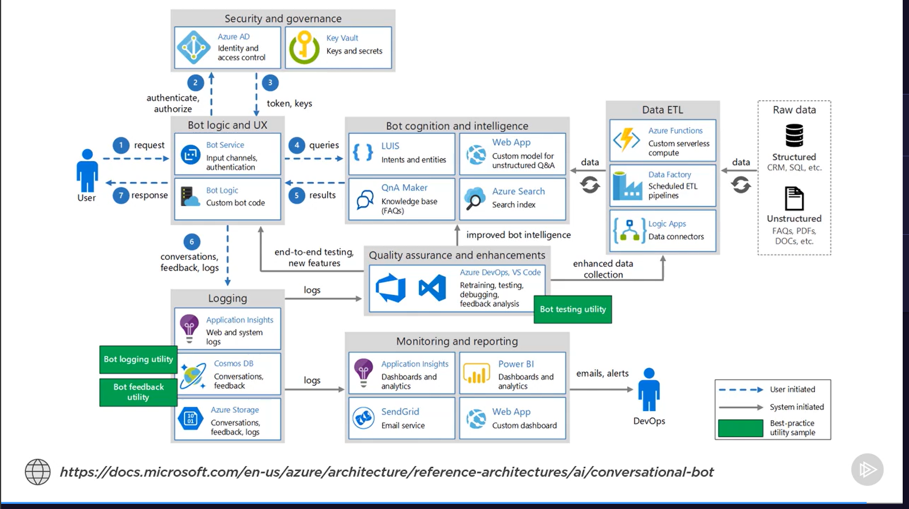
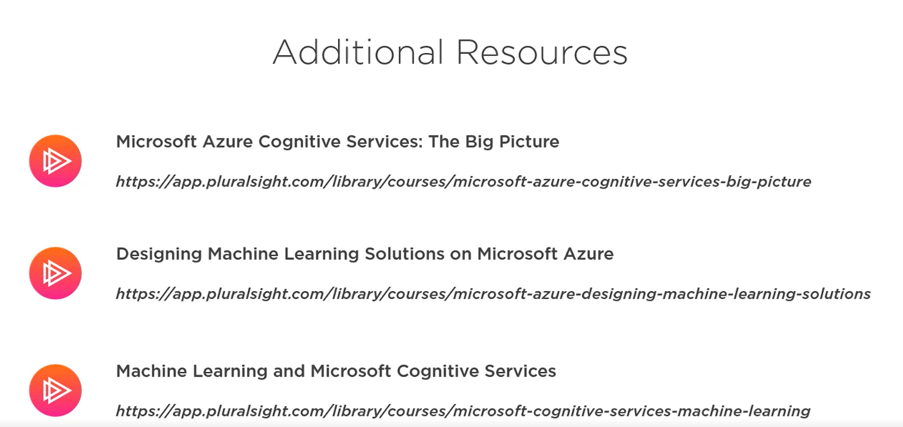
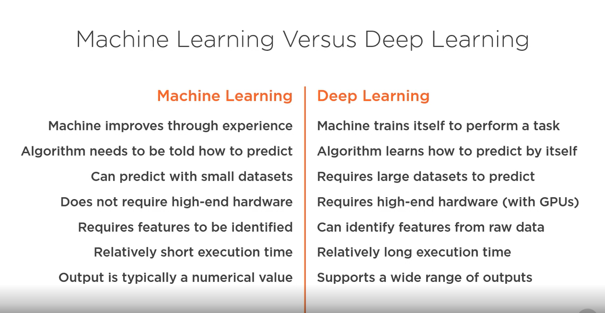
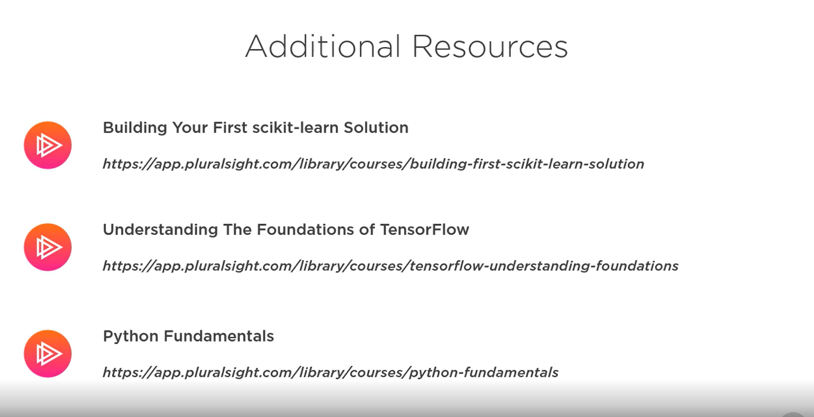
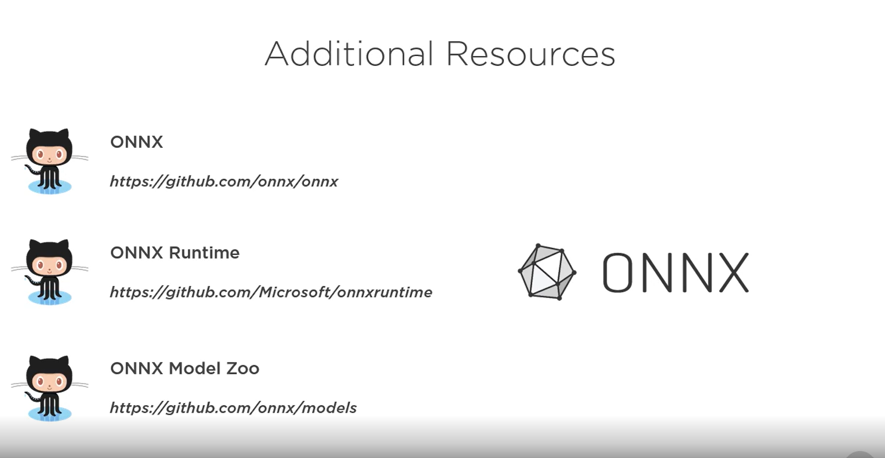
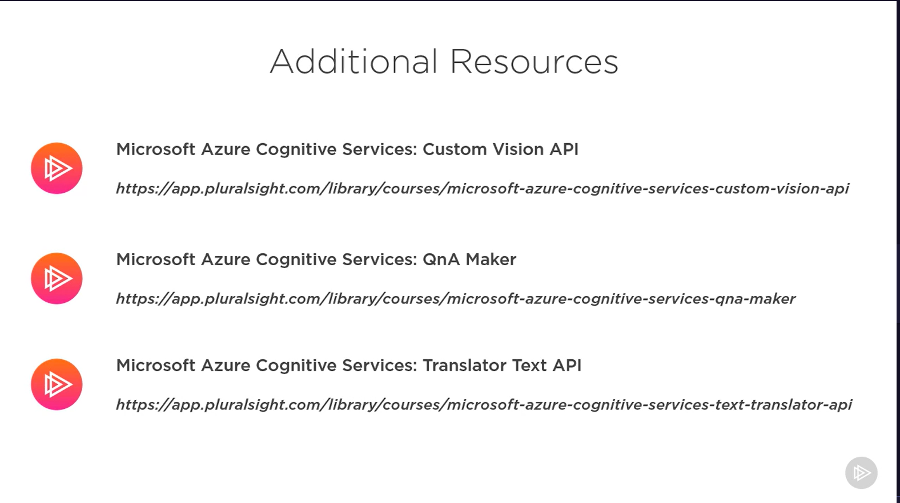
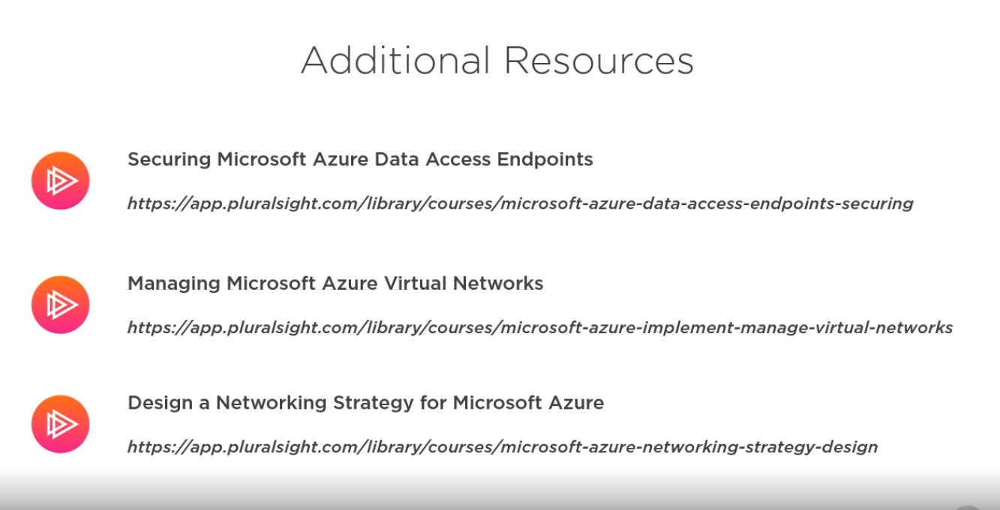

# Choosing Appropriate Microsoft Azure AI Services
## Understanding Storage for Azure AI Solutions
### Different Types of Storage due to purposes
- Short-term storage
  - Mainly for unprocessed data and incomming data stream to stay
- Medium-term storage
  - Where raw data get filtered and transformed
- Long-term storage
  - Store result of processed data
  - Need to be accessed fast
- Archival Storage  

### Understanding Processing in Azure AI Solutions
#### Azure Cognitive Services and Azure Machine Learning

So the processing means the intelligence part of the whole project.

In this picture, it's the LUIS and QnA Maker, this part could be subsittute into other services.

#### Choosing an Azure AI Processing Methodology
Choose Cognitive Services if that general functionality already satisfy your need. It provides pre-built APIs, pre-trained model, and pre-defined algorithm, if you need customized APIs,  customized training input for model, and your own algorithm, go for ML. 

[Microsoft Azure Cognitive Services: Big picture](#microsoft-cognitive-services-big-picture)

##### about short-term storage
Why we need Short-term storage, where raw data is being cleaned?

It's because we need source data maintain untouched. So we need a temporary place to ingest source data and clean them.

### Understanding Azure AI Services and Models(ML understanding)

Online hunting for project named `zooniverse`

In summary, Machine Learning is more like classification using numerical expression, and it's more light weighted. The result more likely a numerical value, comparing to Deep Learning producding strings and other types of result.

### Exploring Machine Learning Frameworks

#### Why ML frameworks

1. It wraps up the complicated and professional process of Data Science related process, such as building a model, into a user-friendly interface. So everyone can be the "Data-Scientist".
2. Cross-platform
3. Capability of containerization, eg. docker

##### frameworks
- scikit-learn: NumPy and SciPy
- tensorFlow: DL in python
- PyTorch: scale scikit to DL
- Keras: APIs run top of others
- `https://docs.microsoft.com/en-us/python/api/overview/azure/ml/intro`

#### Understanding ONNX
- ONNX, Open Neural Network Exchange

It plays as an adaptor/convertor to integrate models built by different frameworks.

#### Azure Cognitive Services: Decision and Language

##### The first category service of Cognitive Services: Decision Services

- Apply a decision matrix to user interaction that can **handle different situiations.**
- Content Moderator: filtering offensive or inappropriate content
- Personalizer: user-specific recognition, response corresponding to differnt user.

#### Second category: Language Services
- Language understanding(LUIS): Enable apps to understand what people say.
- QnA Maker: Conversational Interactivity from backedn data
- Text Analytics: Detect **sentiment** and key phrase in text, social media message to analyze positive or negative
- Translator, multi-language supports

##### Speech services
- Cotana, speak to bot, bot speak back.

##### Vision services
- Visual inputs

##### Search services
- Typing suggestion
- **Entity Search**, Need more investigation
- Spell check

##### Azure NetWorking

# Microsoft Cognitive Services: Big Picture
## Cognitive Services Concepts
### The Difference Between AI, ML, DL and ANN
AI, and Machine Learning are concepts defined way back to the 1950s. It's a general concept.

DL and ANN(artificial neural network) could count as technique to achieve that.

DL - multiple layers to handle data to find pattern
ANN - artificial human brain like working system to find pattern in data

There are other Techniques/Algorithm to achieve ML, eg. Bayesian Networks and Clustering

### How ML Works
- We have our data, which should have some pattern in it, like which data count as regular, which is count as irregular.
- We use algorithm to analyze these data, like Deep Learning/ Clustering, these algorithm can find patterns as a result...
- As result, Algorithm build ML model.
- And application can input new data into model, to see if model can recognize patterns.

Prerequisites for ML to behave as expected:
- Preparation of Data
  - provide enough volume
  - include enough diversity and edge cases
- Test algorithm
- Test model

### Why Cognitive Services
It's an endpoint expose ML features to public applications. Under the hood, there are prepared data, algorithm and the output of algorithm, which are models all stored within Azure Cloud.

So prepared data is made by Microsoft, and the cognitive service also provides Algorithm as service.

But customized data and self-created algorithm can be implement with ML Services with tools. Cognitive Services only provides pre-defined service.

## Different Services Cognitive Service Provides
### catalog
|vision| speech| language |knowledge| Search|
|-|-|-|-|-|
|custom vision|custom speech|**Language understanding(Luis)**|custom decision(based on your input data, to make better decision)|custom search|
|computer vision(identify types of cloud)|Translator|Bing Spell check|Recommendation api|autosuggest|
|content moderator(identify offensive content)|Bing apeech(identify speacker's intent)|Web language Model(predict next word, hint typing)Knowledge exploration|**Entity Search**|
|face(identify face)|Speacker regonizer|text analytics(analyze intent)|**Entity linking intelligence**||
|emotion detector||Translator|Academic knowledge||
|video indexer(extract text speech/figure from video)||Linguistic Analysis(extract structure of sentence)|QnA Maker(create Q A from text)||
