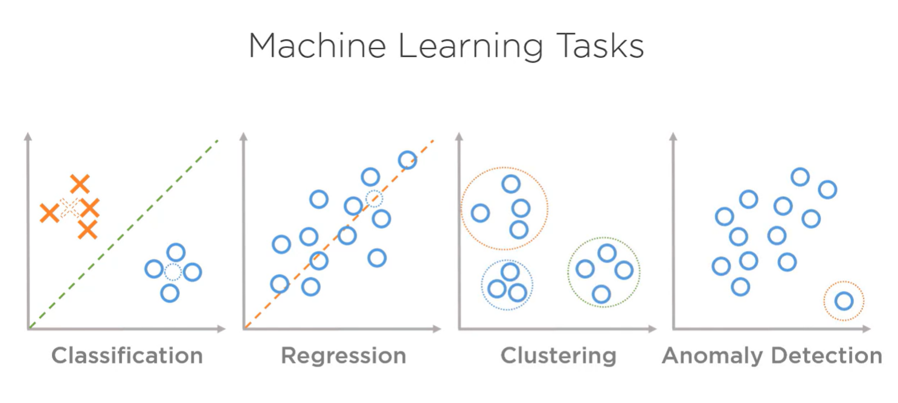
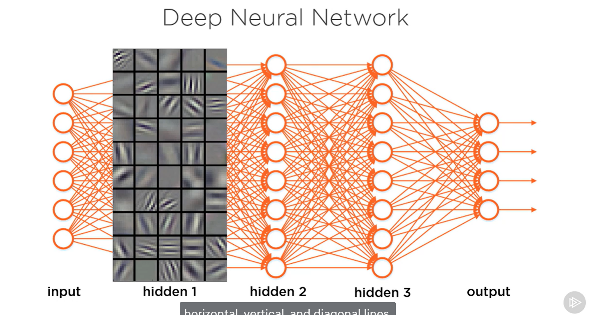

# Artificial Intelligence

## Intelligence

| Category of Intelligence | Description                                                | Agent | Everonment   | Goal                 | Perception       | Action                 |
| ------------------------ | ---------------------------------------------------------- | ----- | ------------ | -------------------- | ---------------- | ---------------------- |
| Human Intelligence       | Solving math to pass exam                                  | Human | Exam         | To pass exam         | Read questions   | Solve questions        |
| Animal Intelligence      | mouse memorize path to pass maze to get cheese             | Mouse | Maze         | To get cheese        | see the path     | navigate and pass maze |
| Collective Intelligence  | Ants cooperate to defend their queen from invading insects | Ants  | Ants' colony | protect their colony | smell the insect | attack the insect      |

## Intelligence

> The ability of an agent to perceive an environment and to choose actions that increase its chances of achieving a goal by _learning_, _knowledge_, _reasoning_, _planning_, etc.

## Artificial Intelligence

> The ability of a machine to replicate natural intelligence

> The ability of a machine to perceive an environment and to choose actions that maximize the expected likelihood of achieving a goal

## Components of AI

| Name       |                                                                                        |
| ---------- | -------------------------------------------------------------------------------------- |
| Perception | Deduce state from sensors; Recognize patterns;Detect features;                         |
| Learning   | Extract knowledge; Data in, prediction/action out; Maps state of environment to action |
| Knowledge  | Represent learning; Collection of information; Various representations                 |
| Reasoning  | Infer conclusions; Deduction; Induction                                                |
| Planning   | Set and achieve goals;Visualize future states; Predict actions                         |

# History of AI

1950 - 1980: Symbolic AI, translation

1988 - 2000: Knowledge based AI, input knowledge and if/then statement

now: Data-driven AI

# Modern AI

## Machine learning

It's a subset topic of AI based on statistics.

We have existing data and use algorithm to create a model. When we input new data, we can use the model we created and predict the result of new data.

Model is similar to a function, new data is the input, and prediction is the output.

For example, we have apples and bananas on belt waiting for being seperated. We have sensor to mesure height and length. Then, We can use large amount of data for apple and bananas to create a model, so that machine knows apple's height and length is similar, and banana's lenght is over height. And then we can give a new data(height and length) and machine will use the model to separate them.

We have classification (apples and bananas), Regression, clusters, detection.

## Deep Learning

We use inputs and hidden layers and output process.

First we input faces and second layer study how to identify the horizontal/vertical/diagnoses lines, third layer is based on second layer, we identify eyes/nose/mouth, fourth layer is based on last two layers to identify face corresponding owner.

## Reinforcement Learning

Solve multiple step task like Drive home.

Perceive envrionment, make an action then perceive the modified environment, get reward signal(doing right or wrong). Then to learn which way is the most efficient way.

# AI and IT

Training Models by

- Training via Data set
- Training via Simulation
- Training via demonstration

## Building AI Apps

use pre-built AI modules and integrate with your business logic to achieve new goal.
