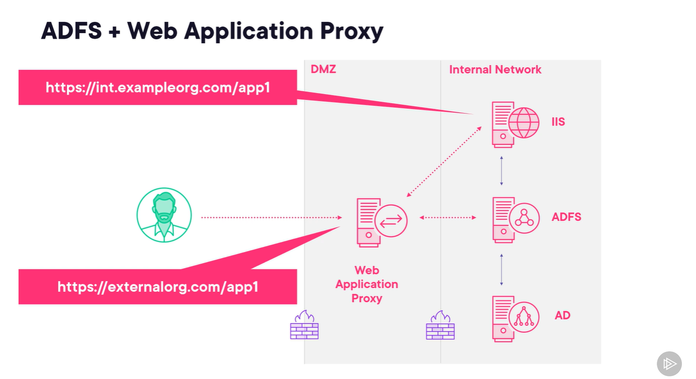

# Understanding Active Directory and Azure Active Directory
## Identification, Authentication and Authorization

Why using Active Directory?

User wants to access file system, devices(printer, computer), program(App, website), or server. How to manage who can access these resources, and the "User" is not limited to a person, "User" also could be a program.

In order to do access control, there are 3 layers we need to know:
1. identity, something can identify who the user is, or what it is, the id must be unique to that user so that we can differentiate them. Usually, this identity is stored in a Directory.

2. authentication, something can prove of whom the user claimed. By password, or by smart card, face scan, finger print, token etc. each of these is a factor of authentication. If multi-factor authentication is required, that means user needs to prove who they claimed to be by multiple ways.

3. Scope of access

### Active Directory vs. Azure Active Directory
ad is hosted on-premises/standalone server. and AAD is hosted on Azure. You can only us ad , or aad, or both. So as user sign-in, they are Ok to everywhere.

## Microsft Entra ID
Microsoft Entra ID = Azure Active Directory

### Microsoft Entra Prodcut Family
- Microsoft Entra ID
- Microsoft Entra External ID, AAD external Identities, b to b, b to c
- Microsoft Entra ID Governance, managing lifecycle of identity
- Microsoft Verified ID, AAD verified credentials, digital id
- Microsoft Entra Permissions Management, 
- Microsoft Entra Workload ID
- Microsoft Entra Internet Access
- Microsoft Entra Private Access

## Understanding Active Directory

- Directory, a hierarchical structure that stores info about objects on the network

- Active Directory is the Microsoft standard of serving those directory info.

- Directory info usually stored in a database hosted by Domain Controller(server). Multiple Domain Controller on the network to make sure the directory is available all time by replicating copies of directory and syncing among them.

### how things work out for access control
1. user login, active directory gives token to user, including there security identifier(identity) and groups info.
2. user want to access object on the network, they pass their token to the access control system, and access control system will validate their token against Access control list.
3. Denied or Permited

### Active Directory Services
- ADDS, Active Directory Domain service
- ADCS, Active Directory Certificate Services, provide certificate, TLS for example.
- ADFS, Active Directory Federation Services, single sign on
  - Access resources across networks, and they are called a "federation"
  - Allow external users access
  - publish internal app to the internet
  - Can federate with Azure AD
  - Multi-factor authentication
- AD RMS, Active Directory Rights mangement Services, permission on file.

## Azure Active Directory

3 different types of AAD User Accounts:
1. Cloud-only, created in AAD
2. On-premises AAD, on-premises accoutns constantly syncing with AAD
  - password could be handled as cloud stored Hash value, Re-direct to On-premises sign in, using ADFS
3. External Accounts, 
  - store identity from google, facebook etc.
  - never store password, no syncing
  - AFDS 

## Authentication and Authorization with AD and AAD

### Synchronizing Users to the Cloud
There are three ways of syncing user identity to the Cloud
1. Password hash sync, can be achieved by asymetric secret, where on premises or user can have the private key to decrypt, and Azure AD has the public key which can only encrypt. So Azure AD stores user's password in encrypted way, a hash. Whenever user enters the password, the encrypted version is sent to the Azure AD to compare with the previous hash, if matches, then validate.

2. Pass-through Authentication, on premises has agent that when user sign in, Azure AD passes user credentials to on premises, no password stored in Azure AD, not even hash.

3. Federated Authentication, use on premises ADFS services. So Azure AD hands off the authentication process to ADFS.

### Azure AD Connect and Azure AD Connect Cloud Sync
- `Azure AD Connect` is old version, it's supposed to installed on premises, and has user interface to configure it.

- When sign-in Azure AD Connect, you can use Cloud created account or Account that is already synced to Cloud and set as Administrator.

* `Azure AD Cloud Connect Sync` is the latest version.
* Agent installed in the On-Premises but can be configured through Cloud.
* There are limitations and it is supposed to be light weight substitute

### Authentication to on-premises Applications
Application can be hosted on IIS, and can be joined into AD service, and authentication could use Window Authentication.

`ADFS` can centralized this authentication process, especially you have multiple application in one domain.

By the early years, WS-federation and SAML protocal is used. Now we can use OAUTH 2.0 and OpenIDConnect, which compatible to AAD.

### Extending a Server Environment to Azure
So you have on premises servers and applications all joined to your domain server. Now you want to migrate your application onto cloud.

1. Set up a VPN GateWay, which allows connectivity btw cloud and your onpremises domain.
2. You need a VPN device on premises and VPN gateway service in Azure. `VPN GateWay service` get created with your VMs in Azure. By using this, requests are encrypted
3. You can set up a dedicated connection using `Azure ExpressRoute`, which will involve third party connectivity provider, you need to connect to third party first.
4. Then you join the Azure VMs to your own domain controller(server), 
5. Or you can create VM in cloud to act like Domain Controller

But these steps, you need to maintain the VM and domain controller(server), like upates and patch the server. 

Or you can use Azure Active Directory Domain Service, it's a domain controller as a service.

### Azure Active Directory Domain Services(AADDS)
So on premises directory (AD)  sync to ADD, and sync to AADDS.

## Handling External Users
### Publish internal applications using ADFS
You need Web Application Proxy and ADFS when:

1. User from your organization work remotely, and want to access the application in your Intranet
2. Users from other organization wants to access your application in your Intranet, but you don't want to manage their credentials.

WebApplication Proxy is a reverse proxy.

### Federation with External Organization

### Azure Active Directory Application Proxy

> These 2 sections can be reviewed when needed. Skip for now.

