# 3 Dissecting Communication

## Local and Global Addressing

When we have conversation with the other party, the conversation can be processed by following categories of components.

Instructor used Homer's example, which is Homer can talk to Marge locally and remotely.

| Category       | Description                                                                                                                                                                                                                                                                                                                                                                              |
| -------------- | ---------------------------------------------------------------------------------------------------------------------------------------------------------------------------------------------------------------------------------------------------------------------------------------------------------------------------------------------------------------------------------------- |
| Media          | In order to have data spread out, we need air/wire, those are the media for conversations                                                                                                                                                                                                                                                                                                |
| Local address  | In Homer's example, this could be the name of Homer and name of Marge, when the conversation starts, two names will tell everyone in local environment, this conversation is between Homer and Marge                                                                                                                                                                                     |
| Global address | In Homer's example, this could be Marge's phone number. When Homer talks to Marge remotely, he needs to know Marge's phone number to start a conversation                                                                                                                                                                                                                                |
| Cues           | In order to pass the real content of conversation, which is the data, Homer and Marge needs to say **hello** at first to make sure the phone conversation is started, and say **goodbye** to each other, so that they know the conversation is ended. Hellos and goodbyes including other words to check the status between these two people are defined as the cues to the conversation |
| Data           | the real content of conversation, data                                                                                                                                                                                                                                                                                                                                                   |

## Protocols and Communications Models

### Protocol

A set of rules has to be followed when move information between 2 people or devices.

### Communication Model

Method of organizing information transfer into components.

# 4 Network Communication Models

## Categorizing Data Transmissions

Now we are going to map the Homer example into network.
|Category|Description|
|-|-|
|Media|Wires/Radios/Glass fibers|
|Local address| Ethernet, send the message(cues/data + global address) with local address, keep moving from client to router to another router to another router... every move will keep updating the local address with current passed device|
|Global address| Internet Protocal (IP), SYN with client IP and website server IP, SYN-ACK with both IP, ACK with both IP|
|Cues| TCP. Before we retrieve website data, we need to establish a session with the server, client needs to send a SYN to server, server needs to send a SYN - ACK back to client, client then send a ACK to server to say I'm about to send data. This is called three way handshake.|
|Data|Websites/Email|

## The OSI Model

| Number | Layer        | Description           |
| ------ | ------------ | --------------------- |
| 1      | Physical     | Wires/Radio/Glass     |
| 2      | Data Link    | Ethernet              |
| 3      | Network      | Internet Protocol(IP) |
| 4      | Transport    | TCP                   |
| (5)    | Session      | ssl                   |
| (6)    | Presentation | IBM etc.              |
| 7      | Application  | Website/Email         |

## TCP/IP Model

| TCP/IP Layer      | OSI Layer    | Description           |
| ----------------- | ------------ | --------------------- |
| Network Interface | Physical     | Wires/Radio/Glass     |
| Network           | Data Link    | Ethernet              |
| Internet          | Network      | Internet Protocol(IP) |
| Transport         | Transport    | TCP                   |
| Application       | Session      | - ssl                 |
| Application       | Presentation | - IBM etc.            |
| Application       | Application  | Website/Email         |

# 5 Encapsulation

## Examining the OSI Model

## How Encapsulation Works

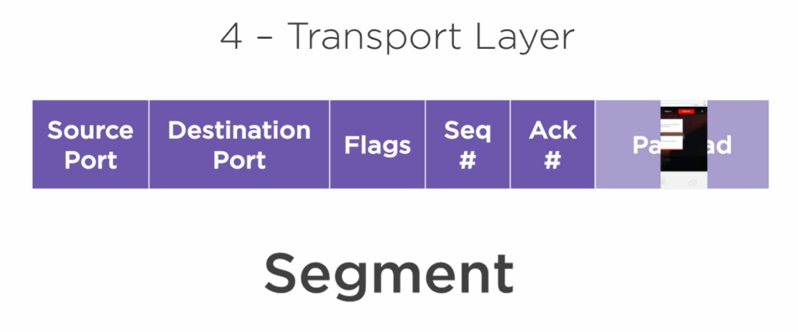
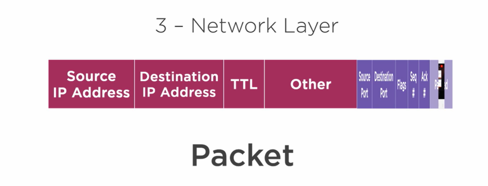
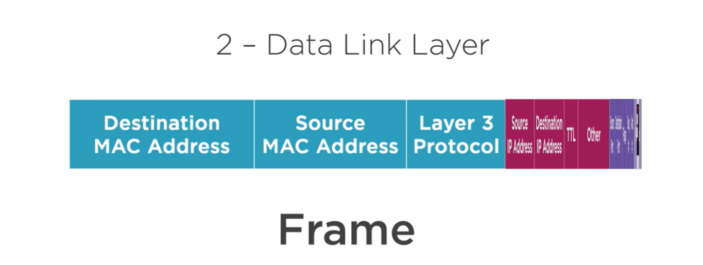
Physical Layer: 010101001010101101010101010

# 6 Data Networks and Addressing

## Addresing the Network

Local Address(MAC Address)
000C:29FC:70A5

First 24 bits are for Manufacturer ID
Second 24 bits are for Serial Number

MAC Address are printed into the Network Interface Card(网卡).
NIC is responsible for Physical Layer -> Data Link Layer transfer.

## How Local Communication Works

Frames are only allowed in local networks. Router(Gateway, Default Gateway) separates networks into inside and outside. Frames in inside will never go out to the outside.

## How Global Addressing Works

So in order to visit pluralsight.com(outside) from your home(inside), the packet is first send within frames to the router, then, the router pull out the packet and put it into a outside frame and send to the internet.

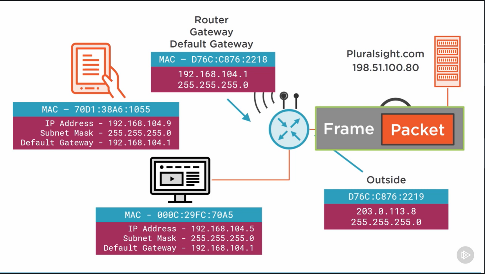

## IP Networks

So since router has different IP addresses (inside vs. outside), it's a layer-3 devices.

### The Subnet Mask

The Subnet Mask is used to seperate IP address into two parts, network and host portions.

For example, we have two pairs of IPs and subnet mask

192.168.104.1
255.255.255.0

203.000.113.8
255.255.255.0

That makes 192.168.104, 203.000.113 be the **network** portion, and 1 and 8 be the **host** portion of the IP address.

When send message to different network IP address(for exampple, from 192.168.104 to 203.000.113.8), the device won't even send it directly. That's because the network portions of these two IPs are different. We need router in the middle to send message between two different network IP address.

## Demo: Examining the IP Address of a Workstation

`certmgr.msc`

# Cisco Certification Resources

- Todd Lammele for Cisco study guide
- Wendel Odom for Cisco study guide
- Cisco Network Academy
- GNS3 / VIRL
- Packet Tracer

# Introduction to IP Addressing

## What is an IP Address

Network Portion identifies a group of device, and host portion is the individual device identifier.

1. Classful Addressing (1995 and prior)
2. Classless Addressing (1995 to present)

## Classless Addressing

Subnet Mask determine which part of IP Address is network prefix and which is host portion.
Network prefix portion is the 1s part of subnet mask and host is the 0s part of subnet mask.
For example,

- 203.0.113.10 with 255.255.255.0, will give us last 8 bits for host and 24 bits at beginning for network prefix.
- 10.0.0.10 with 255.255.240.0, will give us last 12 bits for host and 20 bits at beginning for network prefix.

## Classful Addressing

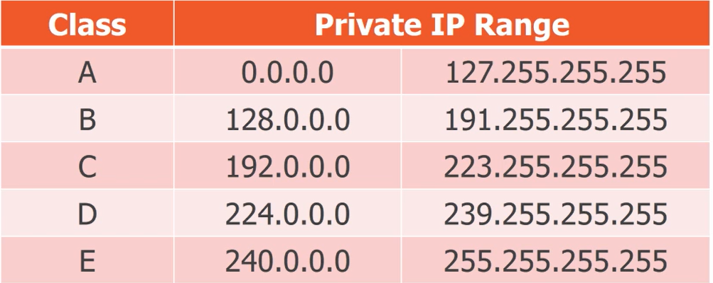
ClassA : beginning 8 bits are network prefix
ClassB : beginning 16 bits are network prefix
ClassC : beginning 24 bits are network prefix
ClassD : 32 bits are all network prefix, used for multicasting

## Address Types

Network Address

- Identifier for a group of devices
- Network prefix

Broadcast Address

- Identifier for all devices on a network

Host Address

- Identifier for unique device on a network

### Network Address Example

203.0.113.0 with 255.255.255.0, then it is a network address, because all the host portion is 0s.

### Broadcast Address Example

203.0.113.255 with 255.255.255.0, then it is a broadcast address, because all the host portion is 1s.

> Never assign these two types of address to any device.

## Private and Public Addresses

Only allowed to be used within an organization.
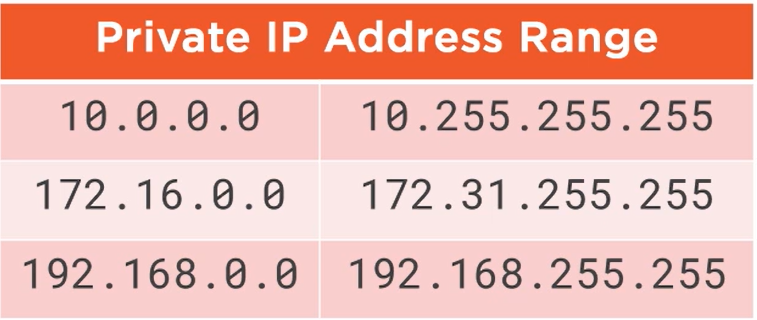
127.0.0.1 is loopback address for local.

Except private IP Address and loopback gives us the public IP Address.

# Introduction to Subnetting

Simple way to write IP Address and Subnet Mask with Classless Inter-Domain Routing Notation(CIDR notation).

203.0.113.10/24 means 203.0.113.10 with 255.255.255.0

# Introduction to IPv6

Bit

- 1 or 0

Nibble - 4 bits

- 1010
- Hex - 0xA

Byte - 8 bits

- 11001001
- Hex - 0xC9

Hextet - 16 bits

- 10101010 01000110
- Hex - 0xAA46

## IPv4 Addresses vs. IPv6 Addresses

IPv6 Address Size is 128 bits long

2001:0DB8:0002:008D:0000:0000:00A5:52F5

## The Structure of an IPv6 Addresses

64 bits at beginning is for network prefix.

64 bits at the end is for host portion.

## IPv6 Address Types

Unicast Address

- Global Unicast Address
- Link Local Address
  - FE80::/10

Loopback Address

- ::1/128

# Configuring a Cisco Router

## The Router Boot Process

1. Power On: Self Test
2. Load Bootstrap: operate minimum hardware to run router. it's in EEPROM.
3. Load IOS: System for router, it's in Flash Drive
4. Load Configuration: start-config file, it's in NVRAM, when you turn power off it will still memorize it. (Same as 1-3 above)

(5). When we run router, the configuration is in RAM which is called running-config file, and running-config will lose when power off. So we need to sync between start-config and running-config files.

# Physical Layer Technologies

## RJ-45 Connecotrs and Cable Types

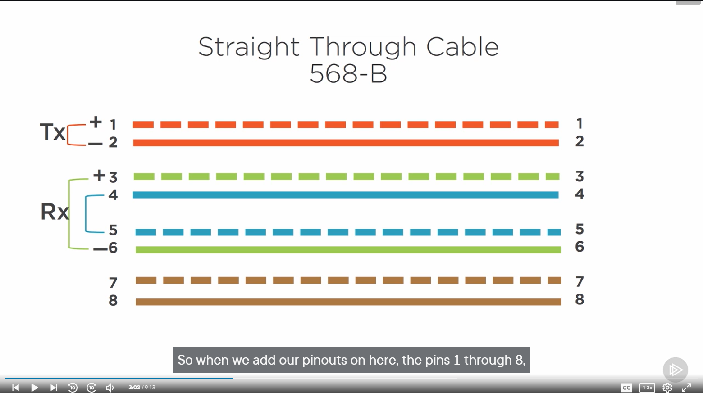
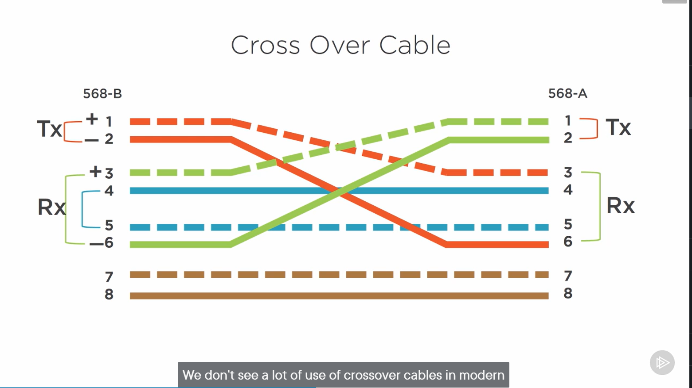

# Data Link Layer Technologies

## Ethernet

802.3 wire ethernet
802.11 wireless ethernet

## CSMA/CD

When multiple workstations(PCs/carriers) connect to each other with one wire. There should be only one device sending the message, other devices can all listen to that message.(So the message is broadcast to all devices and you can't prevent this happening) If another device wants to send message, this device must wait until the previous message is sent. If two devices sending messages at the same time (they both checked there's no one sending and send the message simultaneously), it's called collision.

CSMA/CD stands for carrier sense multiple access with collision detection.

## Duplex and Speed

Half duplex, two devices connect to each other, and only one device is allowed to send message.

Full duplex, two devices can send message at same time.

| Ethernet Name     | Ethernet Speed | Half Duplex allowed |
| ----------------- | -------------- | ------------------- |
| Ehternet          | 10Mbps         | yes                 |
| FastEthernet      | 100Mbps        | yes                 |
| GigabitEthernet   | 1Gbps          | no                  |
| 10GigabitEthernet | 10Gbps         | no                  |
| 40GigabitEthernet | 40Gbps         | no                  |

## Ethernet II Frame

The frame on Data Link Layer consists
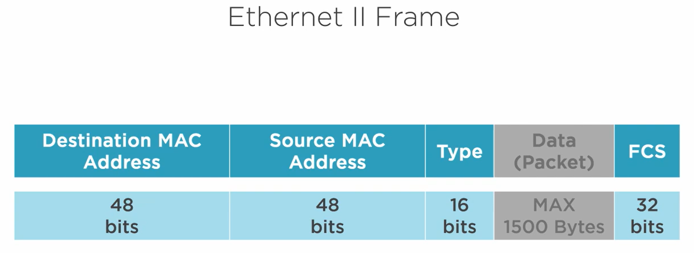

### Type

- If it is IPv4 type:
  0x0800
- If it is IPv6 type:
  0x86DD
- If it is ARP type:
  0x0806

### Data

A packet from IP Layer

### FCS

When devcie sends frame, will pull all the 1s and 0s from Destination MAC Address to the Data portion, throw them into CRC algorithm and generate 32 bits binary code. And send this 32 bits at FCS part with the rest of the frame. When device receives frame, will throw all 1s and 0s from Destination MAC Address to Data into CRC algorithm and also generate 32 bits, and compare this with the sent FCS. If there's difference, then it means there should be severe electrical magnetic interference. So the frame has no integrity. Device will drop this frame. However, device can't ask to send frame again through Data Link Layer, we must recover this through TCP/IP Layer.

# Ethernet Switching

## Network Topologies

- Bus topologies
- Ring topologies (IBM Token Ring)
- Star topologies
  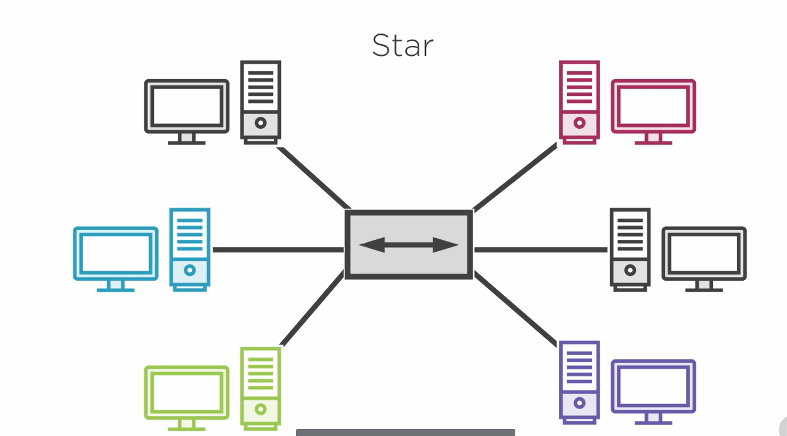

At the center, the grey box could be hub or switch. When one device send message, hub will repeat this message and deliver to all the other devices.

### Collision Domain

A group of networked devices that will simultaneously detect a voltage spike. Star topology with a hub will still have collision domain.

### The MAC Address Table

If you have a Star topology with a switch.

The Switch will have a MAC Address Table in it's memo.

The MAC address table(Suppose we have 6 ports with this switch)
|Port| MAC|
|-|-|
|1|6E|
|2|B3|
|3|3F|
|4|DF|
|5|C2|
|6|A7|

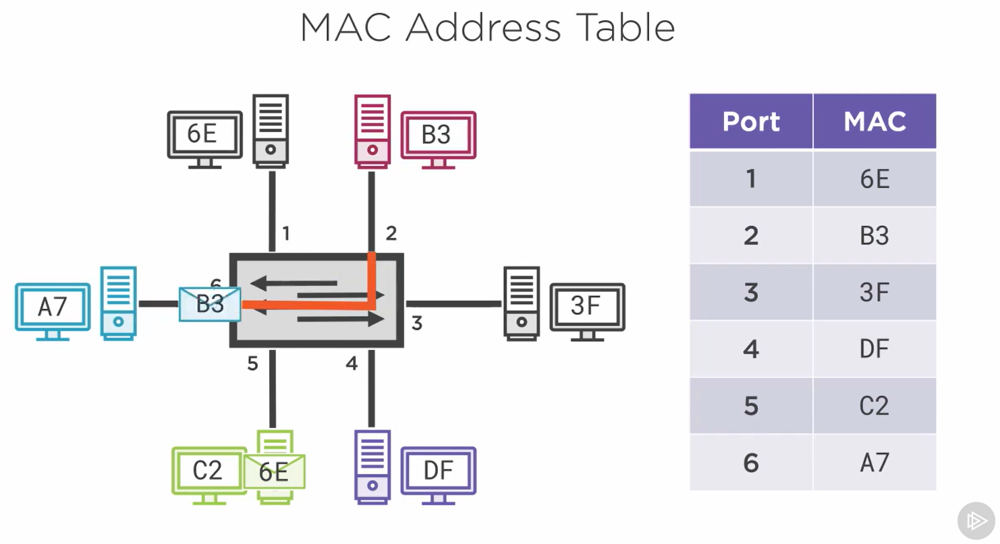

The Switch will have a chip, called ASIC(Application Specific Integrated Circuist), for each port. ASIC in switch is for reading the frame header. When A7 is sending message to the B3, Switch will build a circuit between A7 and B3, all other devices cannot receive the message. So when other devices want to send message simultaneously they are able to do it now, because there will be no collision.

## MAC Addressing Aging

Switch also need to keep a MAC Address Table in memory. So that switch knows MAC Address to Port mapping(Which MAC Address is which port). May be 3F is not sending any frames and just keep idle there, MAC Address will lose the 3F at port 3. When some device is sending message to 3F now, it causes flooding.

### Flooding

Flooding is when destination MAC address of the frame is not in MAC Address Table, the frame is sent out all active interfaces, except the receiving interface.

## Broadcasts and Broadcast Domains

If you put all Fs in destination MAC address, then it's broadcast message.

### Broadcast

When the destination MAC address of the frame is all Fs, the frame is sent out all active interfaces, except the receiving interface.

# Routing IPv4 and IPv6

## Address Resolution Protocal

The topology of this section
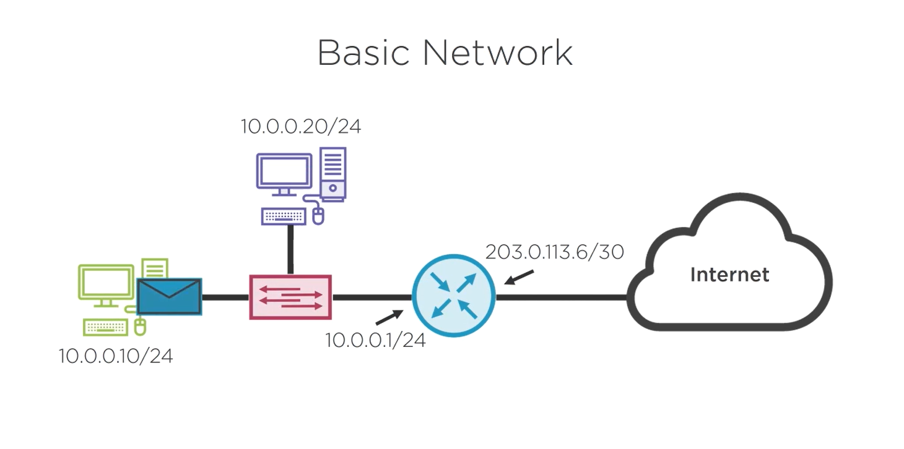

This section we examine what actually happened when we do ping in the command prompt.

## How Address Resolution Protocol works

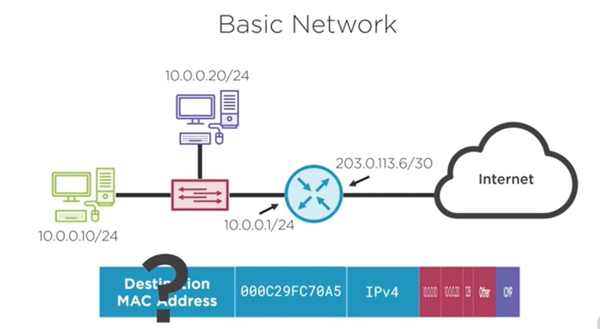

When we do Ping, we actually do it at IP layer. So we start to fill out the packet with destination IP which is 10.0.0.20 and source IP is 10.0.0.10 and TTL(Time to live) is 128 which is default for Windows Operating System. (TTL will decrement when it hits a router) and for the Data part, we use ICMP protocol. Then we needs to put packet into a frame. Where Type will be IPv4, Data will be the packet, and Source MAC Address is 000C29FC70A5.

But Destination is missing!!!!!

How we gonna retrieve this message?

### ARP(Address Resolution Protocol)

So before sending the Ping frame, this 10.0.0.10 device needs to create a frame for ARP.

We can see that this is a broadcast message.

So it sends to the switch, and switch will forward to 10.0.0.20 and 10.0.0.1, and 10.0.0.20 will say I have that IP Address. Then 10.0.0.20 will send a ARP Echo reply message.

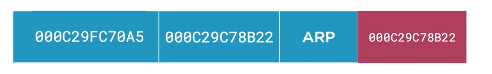

Then we have complete ping message with destination MAC address filled.

### ARP Cache

Devices maintain an ARP Cache (Table) which each entry will age out in 90s.

`arp -a` command prompt in windows
`arp -d *` to delete all your ARP table cache

### Using WireShark

wireshark.org

_Introduction to wireshark_ in Pluralsight

## The Default Gateway - How ping get to another network

The topology of this section
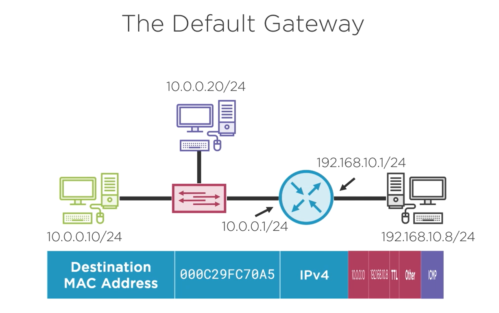

When we send ping outside of local network (to another network outside router), we cannot use ARP directly, because we cannot ARP IP Address that is not on our local subnet.

For example, when we send ping from 10.0.0.10/24 to 192.168.10.8/24.

We can check our routing through command prompt `route PRINT`

When you enter the command above, you will get something like following:
|Destination|Mask|Gateway|Description|
|-|-|-|-|
|10.0.0.0|/24|on-link|Represents all devices within the local subnet, and you can ARP these devices directly|
|0.0.0.0|/0|10.0.0.1|All IP Address is anything but 10.0.0.0, we gonna send ARP through this gateway address|

This route PRINT gives us info that when need to ARP some other network, we need to send ARP to 10.0.0.1.

We are now asking "Who has 10.0.0.1?".

Now this broadcast message will be sent to any devices in the subnet except receiving device. So when the router receives it, it will send router's MAC to the receiving device. And receiving device will send Ping message to that router right after.

Then the router will compare that destination IP and the routing table in the router.

Then if the router found the Destination IP in the routing table (`show ip route`), it will send the ARP first and then PING later.

## IPv4 Static Routing

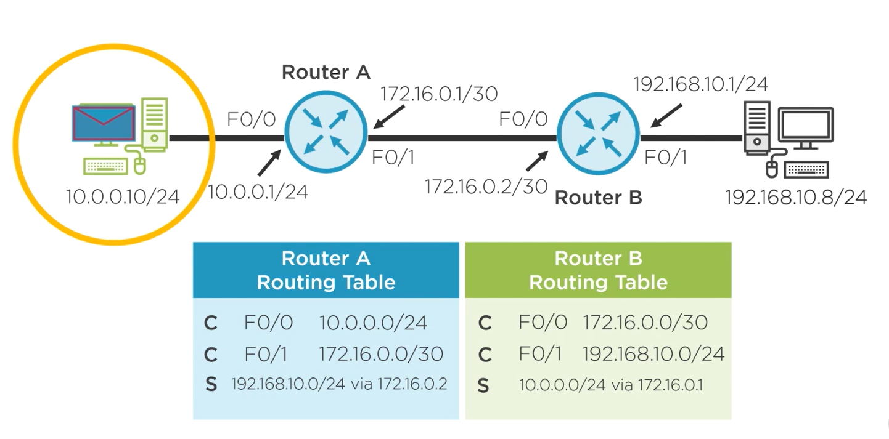

We need to add route table in Router A and Router B a forward entry to let router A to know we can get to 192.168.10.0/24 through 172.16.0.0/30 from 10.0.0.0/24.

## How to configure?

# Troubleshooting IPv4 Static Routes

`tracert -d 192.168.10.8`

Here is a sample of redundant network. It means there are multiple link from one point get to another point. The problem with static routing with redundant network is the routing table maintenance will be complicated.

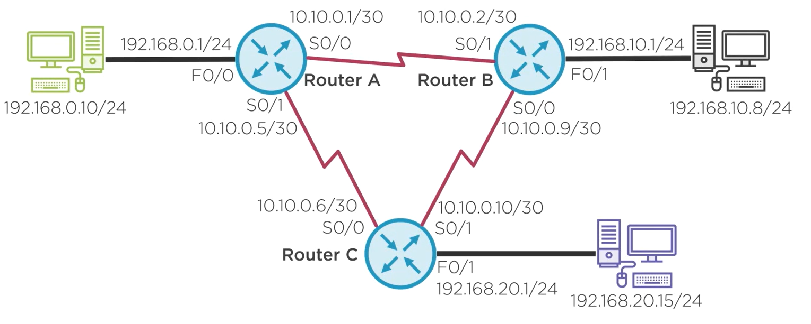

# TCP

TCP uses a client and server model.

3 way handshake and 4-way DIsconnect Closed.

SYN => SYN-ACK => ACK

FIN => FIN-ACK => FIN => FIN-ACK

## Transport Layer Addressing Port Numbers

Port Numbers could be 0 - 65535.
Well Known Port Numbers(Server Port)
0-1023 (Well known)
1024-49151 (Registered)

Ephemeral(Client Port Numbers)
49512 - 65535

Examples for Well known.
| Application Protocol | Port Number |
| -------------------- | ----------- |
| HTTP | 80 |
| HTTPs | 443 |
| FTP | 20, 21 |
| SSH | 22 |
| Telnet(Unencrypted SSH) | 23 |

For example if we use Putty to telnet a router, it should follow procedures below.

First workstation send SYN with a source port of a ephemeral port(49512 for this time), and destination port of 23, and data will be empty, flag will be SYN, and put this segment into packet, with 10.0.0.1:23 of Destination Socket, and 10.0.0.2:49512 of Source Socket, and TTL is 128 as usual, and put all of this into Frame, where Destination MAC Address with A and Source MAC Addres with B.

## Using Netstat to see Active TCP Sessions

`netstat -help` in command prompt in Windows.

`netstat -n` lookup without translation of port numbers.

`netstat -n 1` 1 second refresh version or above.

`netstat -na` all tcp sessions and their states including those your device is listening.

`netstat -nap TCP` Only TCP sessions

`netstat -naop TCP` Only TCP sessions and add another column for PID

`netstat -naobp TCP` Only TCP sessions and the owner

`netstat -r` route table

## TCP Sequence Number

## User Datagram Protocol (UDP)

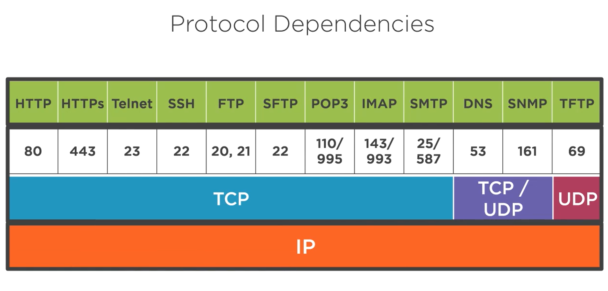

Only one request and one response. There are no 3 way handshake and 4 way goodby as TCP does.

# Domain Name System(DNS)

Uniform Resource Locator (URL)

For example: www.pluralsight.com

.com is the Top Level Domain(TLD)

There are other TLD:

.com .edu .org .net .gov .mil .ca

Second Level Domain is

pluralsight

Third Level Domain/Host name is

www

So when we type www.pluralsight.com, we get specific IP address for www server IP Address at pluralsight.com.

For example: www.engineering.university.edu

engineering is the third level domain, www is the hostname.

## How DNS works

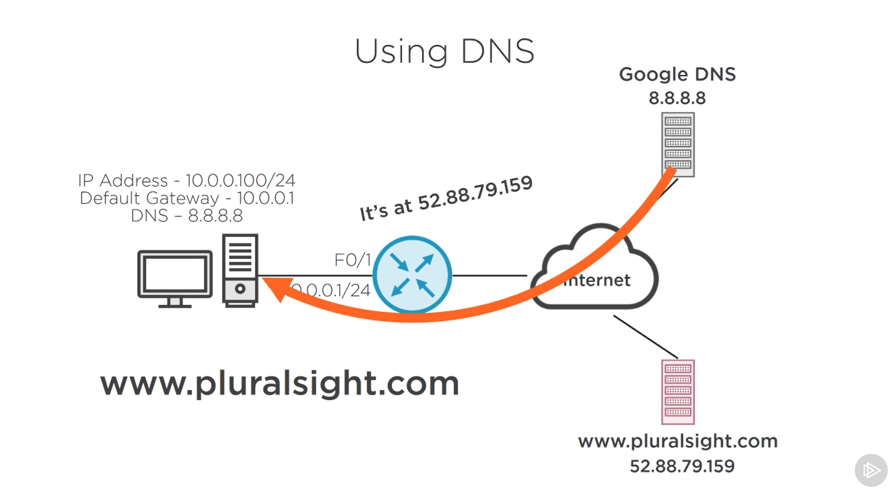

We can set DNS server at our own router.

## nslookup

`nslookup` to show DNS server at local
`nslookup www.pluralsight.com`

# DHCP (Dynamic Host Configuration Protocol)

It simplify the process of workstation to set up IP address and DNS. When workstation is online, it will send out a discovery message, and when DHCP receive this will provide a DHCP offer. Then workstation will send a DHCP Request, and DHCP will follow up with DHCP ACK. At this point, workstation set up IP Address. DHCP also will have a DHCP binding and map MAC Address to IP Address handed out, so that it will not hand out duplicate IP Address.

Usually it's in our router, but when there are thousands of networks we may set up a DHCP server at outside of each router and solve IP Address, Default Gateway and DNS. We use IP Helper Address settings in local router to achieve this.
