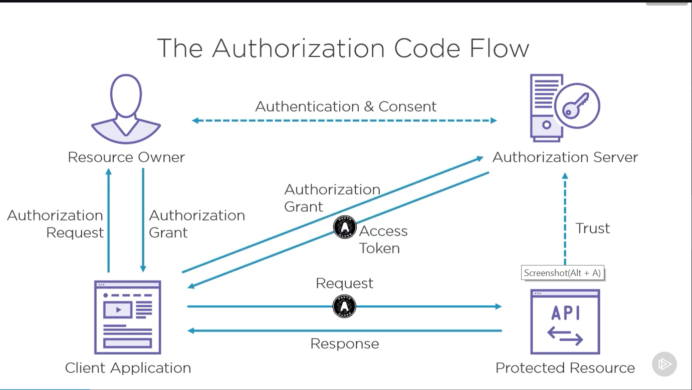
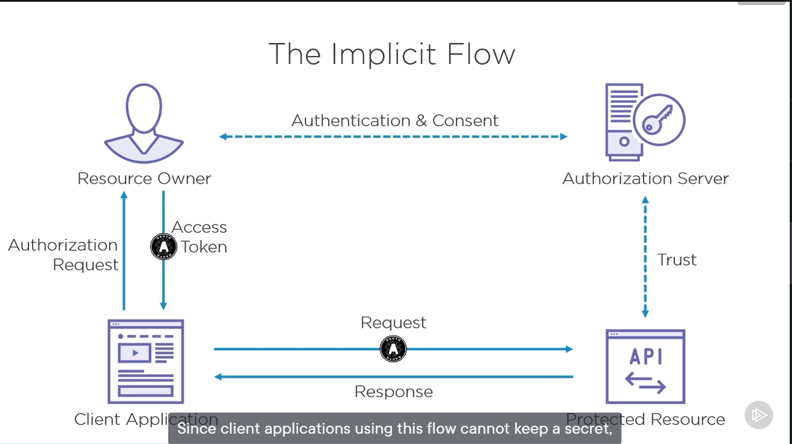
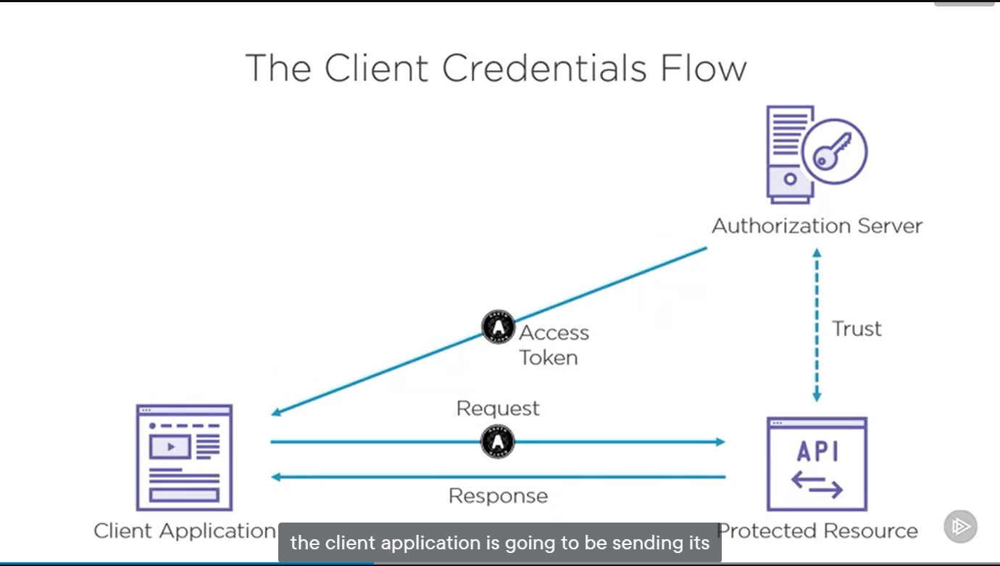
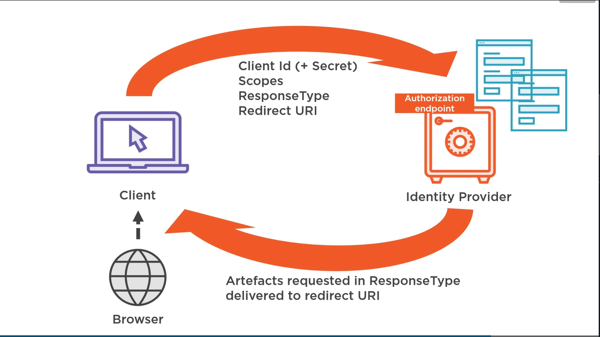

# 3 OAuth in Detail
## Authorization Code for Web Applications

### Authorization Request
```
https://authserver.example.com/authorize
    ?response_type=code
    &client_id=apdsoifapsoidfu
    &redirect_uri=https://client.example.com/callback
    &state=xyz
    &scope=api1 api2.read
```
### Authorization Response
```
https://client.example.com/callback
    ?code=zcoivuqrelqewqiewur
    &state=xyz
```
### Token Request
```
POST /token HTTP/1.1
    Host: server.example.com
    Content-Type: application/x-www-form-urlencoded
    (Authorization: Basic qpoeiurqwer)

    client_id=asdfqwer
    &client_secret=zcxvwerqwer
    &grant_type=authorization_code
    &code=zcoivuqrelqewqiewur
    &redirect_uri=https://client.exaple.com/cb
```

Basic Authentication:
Base64(client_id : client_secret)

OAuth Style
Base64(urlformencode(client_id):urlformencode(client_secret))

Try these two types when you get a 401

### Token Response
```
HTTP/1.1 200 OK
    Content-Type: application/json
    {
        "access_token": "123asjvasd0jfadsf",
        "token_type": "Bearer",
        "expires_in": 3600,
        "scope": "api2.read"
    }
```
## Implicit Flow for Single Page Applications
### Authorization Request


```
https://authserver.example.com/authorize
?response_type=token
&client_id=asldkjfqwer
&redirect_uri=https://client.example.com/callback
&state=xyz
&scope=read
```

***redirect_uri is registered ahead to make sure the implicit flow work***

### Authorization Response
```
https://client.example.com/callback
#access_token=pwoeqinrv
?token_type=example
&expires_in=3600
&state=xyz
```
### Security Concerns
* Access tokens exposed to resource owner, since the token is fragment of url
* Acess tokens accessible to Javascript
* use openid connect is much better 
* no cross domain(SPA and authorization server at different domain) token request, because the browser will block it
* Implicit flow is not recommended any more, use CORS + PKCE instead

## The Client Credentials Grant Type


### Token Request
```
POST /token HTTP/1.1
    Host: server.example.com
    Content-Type: application/x-www-form-urlencoded
    Authorization: Basic zpoiqewr

grant_type=client_credentials
&scope=api1 api2.read
```

### Token Response
```
HTTP/1.1 200 OK
Content-Type: application/json
{
    "access_token": "jqowieruzcvn",
    "token_type": "Bearer",
    "expires_in": 3600,
    "scope": "api2.read"

}
```
## The Resource Owner Password Credentials (ROPC) Grant Type

```
POST /token HTTP/1.1
    Host: server.example.com
    Content-type: application/x-www-form-urlencoded
    Authorization: Basic zpouvwlqwer

    grant_type=password
    &username=johndoe
    &password=1234
    &scope=api2 api1.read
```

### Token Response
```
HTTP/1.1 200 OK
Content-Type: application/json
{
    "access_token": "12314adadg",
    "token_type": "Bearer",
    "expires_in": 3600,
    "scope": "api2.read"
}
```

## Long Lived Access with Refresh Tokens
### Authorization Request
```
https://authserver.example.com/authorize
    ?response_type=code
    &client_id=apqoiewru
    &redirect_uri=https://client.example.com/callback
    &state=xyz
    &scope=api1 api2.read offline_access
```

### Authorization Response
```
HTTP/1.1 200 OK
Content-Type: application/json
{
    "access_token": "12314adadg",
    "token_type": "Bearer",
    "expires_in": 3600,
    "refresh_token": "zqewpirqwef;ijadsgj"
    "scope": "api2.read offline_access"
}
```

### Refresh Token Request
```
POST /token HTTP/1.1
    Host: server.example.com
    Content-type: application/x-www-form-urlencoded
    Authorization: Basic zpouvwlqwer

    grant_type=refresh_token
    &refresh_token=zqewpirqwef;ijadsgj
    &scope=api2 api1.read
```

### Refresh Token Response
```
HTTP/1.1 200 OK
Content-Type: application/json
{
    "access_token": "12314adadg",
    "token_type": "Bearer",
    "expires_in": 3600,
    "refresh_token": "zqewpirqwef;ijadsgj"
    "scope": "api2.read offline_access"
}
```

## OpenID Connect


Request
```
Client_Id
Client_Secret
Scopes
ResponseType
RedirectURI
```
Identity Provider will check
1. If the client has the authority for those scopes
2. If the RedirectURI match the white list

If all checked, will show two screen:
1. screen for user to login(eg. provide username and password)
2. screen for user to consent the scope requested

If all checked, will send back the response according the response type requested.

response will have two tokens:
1. IdToken
    * iss: issuer
    * exp: expire date
    * sub: user id
    * other claims
2. AccessToken

