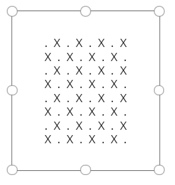

# Learn / Power Platform/ Power Apps / Canvas apps

## Design and build an app

### Configure app functionality

#### Understand variables

- Avoid using variables since you can get inputs values from formulas
- You can use variables in three different ways:
  - Global variables
  - Context Variables
  - Collections

| Variables type    | Scope  | Description                                                                                                                                                                                | Functions that establish |
| ----------------- | ------ | ------------------------------------------------------------------------------------------------------------------------------------------------------------------------------------------ | ------------------------ |
| Global Variables  | App    | Simplest to use. Holds a number, string, Boolean, record table etc. that can be referenced from anywhere in the app                                                                        | Set                      |
| Context variables | Screen | Great for passing values to a screen, much like parameters to a procedure in other languages. Can be referenced from only one screen                                                       | UpdateContext Navigate   |
| Collections       | App    | Holds a table that can be referenced from anywhere in the app. Allows the contents of the table to be modified rather being set as a whole. Can be saved to the local device for later use | Collect ClearCollect     |

- Create and remove variables

  - Create - By define corresponding functions in the apps.
  - Remove - By deleting all the corresponding function and dependents on those variables.

- Variable lifetime and initial value.

  - lifetime - live in local app's memo
  - init - blank value when app is opened

- Global variables

  - `Set(Radius, 12)` - u can set global variables with set function
  - `Pi() * Power(Radius, 2)` - u can use Radius anywhere in the app

If context variables' name collide with global variables, context variables has priority. But user can always refer to global variables with `@Radius`

- Use a context variables

  - `UpdateContext({X : 1})` - to set data
  - `Navigate(Screen1, None, {Running Total: -1000})` - to jump to new screen and set Running Total context variable to -1000.

- Use a collection

  - `Clear(PaperTape); LoadData(PaperTable, "StoredPaperTape", true)`- if you don't clear, stored values in StoredPaperTape will be append to the end of collection of PaperTape
  - `SaveData(PaperTape, "StoredPaperTape")` - save to local device

  _These two function only available in Mobile._

# Learn / Power Platform / Power Fx / Formula reference

## Identifiers

| Symbol     | Type                          | Example                                                                   | Description                                                                                                                                             |
| ---------- | ----------------------------- | ------------------------------------------------------------------------- | ------------------------------------------------------------------------------------------------------------------------------------------------------- |
| '...'      | Identifier                    | 'Account Name'                                                            | Identifiers that contain special characters, including spaces are enclosed in single quotes                                                             |
| "..."      | Text string                   | "Hello, World"                                                            | Text strings are enclosed in double quotes                                                                                                              |
| $"..."     | String interpolation          | $"Dear {FirstName}"                                                       | Formulas embedded within a text string                                                                                                                  |
| .          | Property Selector             | Slider1.Value                                                             | Extracts a property form a table, control, signal, or enumeration                                                                                       |
| .          | Decimal separator             | 1.23                                                                      | Separator between whole and fractional parts of a number                                                                                                |
| ()         | Parentheses                   | Filter(T, A<10)                                                           | Enforces precedence order, and groups subexpressions                                                                                                    |
| =          | Comparison operators          | Price = 100                                                               | Equal to                                                                                                                                                |
| <>         |                               | Price <> 100                                                              | Not Equal to                                                                                                                                            |
| &          | String concatenation operator | "hello" & " " & "world"                                                   | Makes multiple strings appear continous                                                                                                                 |
| && or And  | Logical operators             | Price < 100 && Slider1.Value = 20                                         | Logical conjuction, equivalent to the Add function                                                                                                      |
| \|\| or Or |                               | Price < 100 \|\| Slider1.Value = 20                                       | Logical disjunction, equivalent to the Or function                                                                                                      |
| ! or Not   |                               | !(Price < 100)                                                            | Logical negation, equivalent to the Not function                                                                                                        |
| exactin    | Membership operators          | Gallery1.Selected exactin SavedItems                                      | Belonging to a collection or a table                                                                                                                    |
| exactin    |                               | "Windows" exactin "To display windows in the WIndows operating system..." | Substring test(case-sensitive)                                                                                                                          |
| in         |                               | Gallery1.Selected in SavedItems                                           | Belonging to a collection or a table                                                                                                                    |
| in         |                               | "The" in "The keyboard and the monitor"                                   | Substring test (case-insensitive)                                                                                                                       |
| @          | Disambiguation operator       | MyTable\[@filedname\]                                                     | Field disambiguation                                                                                                                                    |
| @          |                               | \[@MyVariable\]                                                           | Global disambiguation                                                                                                                                   |
| ;          | Formula chaining              | Collect(T,A); Navigate(S1, "")                                            | Separate invocations of functions in behavior properties                                                                                                |
| As         | As operator                   | AllCustomers As Customer                                                  | Overrides ThisItem and ThisRecord in scope functions. As is useful for providing a better, specific name and is especially important in nested senarios |
| Self       | Self operator                 | Self.Fill                                                                 | Access to properites of the current control                                                                                                             |
| Parent     | Parent operator               | Parent.Fill                                                               | Access to properties of a control container                                                                                                             |
| ThisItem   | ThisItem operator             | ThisItem.FIrstName                                                        | Access to fields of a Gallery or form control                                                                                                           |
| ThisRecord | ThisRecord operator           | ThisRecord.FirstName                                                      | Access to the complete record and individual fields of the record within ForAll, Sum, WIth and other record scope functions                             |

### Identifier

There are Display Name and Logical Name from Dataverse/SharePoint. Diaplay Name is the name recommended when using the formula. And we need to put single quote to the Display Name when there is special character in it. For example, space, double quotes, single quotes, @ sign.
| Display Name | Display Name reference in a formula |
|-|-|
|SimpleName|SimpleName|
|NameWith123Numbers|NameWith123Numbers|
|Name with spaces|'Name with spaces'|
|Name with "double" quotes|'Name with "double" quotes'|
|Name with 'single quotes'|'Name with ''Single'' quotes'|
|Name with an @ at sign|'Name with an @ at sign'|

### Disambiguation

- To access values from nested record scopes, use the @ operator with the name of the table being operated upon usin gthis pattern: Table\[@FieldName\]
- To access global values, such as data sources, collections, and context variables, use the pattern \[@ObjectName\]

### Sample

A label with text property of

```
Concat(
    ForAll( Sequence(8) As Rank,
        Concat(
            ForAll( Sequence(8) As File,
                    If( Mod(Rank.Value + File.Value, 2) = 1, " X ", " . " )
            ),
            Value
        ) & Char(10)
    ),
    Value
)

```


