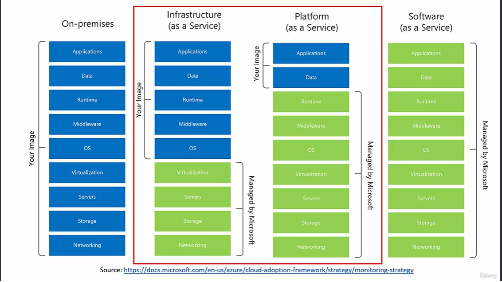
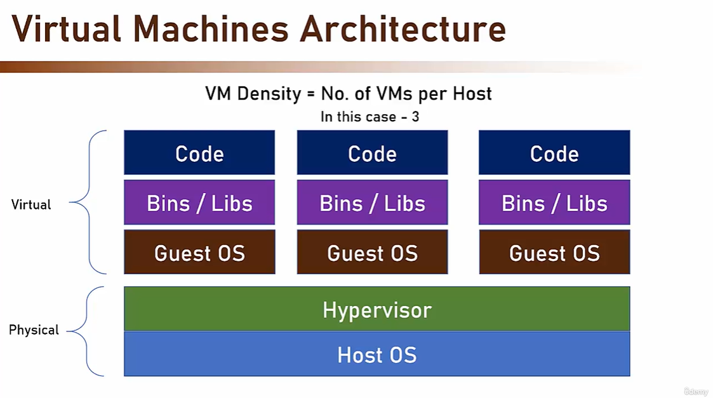
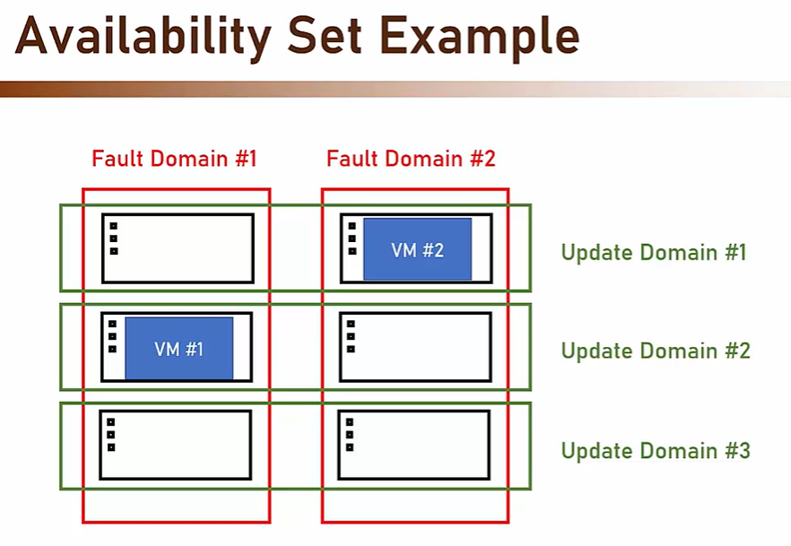

# Concept of Cloud Compute:


* 4 types of Compute Services:
    - Virtual Machines
    - App Services
    - AKS
    - Azure Functions

# Virtual Machines
It's a (not real) server which runs on top of real (physical)server.

We use this in IaaS.



The physical layer is completely managed by Azure, we can do nothing about it.

We can do things in Virtual layer.

- Steps for Creating VM in Azure：
    - Select the location
    - Select the image (OS + Pre-Installed of the software)
    - Select the size
    - CHECK THE PRICE FOR YOUR PLAN/SUBSCRIPTION.


- To Check the price, use pricing calculator in Azure

- Concept of VNet and Subnet is in future course.

- When creating VM choose RDP as port,  remote desktop port.

## The Real Cost of VM
1. VM
2. Disk
3. IP
4. Storage Account

## Reduce the cost of VM
There are some tech to do this:
1. Auto shutdown
    - Option for VM when creating
2. Reserved Instances
    - Means you reserve a machine in future, the fee is charged even if you don't use it. Fee could be charged monthly, but you need to pay upfront.
3. Spot instances
    - Machines run on unused capacity, but will be shut down anytime when azure requires.
    - you can choose to stop your machine, or completely deleted when Azure requires a recycle.
4. Disk optimization
    - Most of time, Azure choose Premium SSD for the disk of VM.

## Availability of a VM

- Microsoft have SLA(service level agreement) with guarantees for availability of VM.

- Availability Concepts in Azure
1. Fault Domain: 
    Physical group of physical hardware that share a common power source and network switch. So this is similar concept of a physical rack/cabinet.
    - servers share a single power within this unit, and if there's a problem with power/networking, all server shut down
    - So you want your servers spread across more than one fault domain
2. Update Domain: 
    Logical group of physical hardware that can undergo maintenance and be rebooted at the same time.
    - this maintenance is controled by Azure, so we don't have choice on this
    - that means we want our servers spread in different update domain, just in case of all servers update in the same time 
3. Availability Set:
    A collection of Fault Domains and Update Domains your VMs will be spread across
    - So it can contain 3 Fault Domains and 20 Update domains
    - however, these domains within the Availability Set will be under the same zone(datacenter)
    - If we choose Availability Set, Azure will set different Fault Domain and Update Domain to us, so that we can have backup if one of our server is down for Fault/Update
    
    - No extra charge for Availability Set
4. Availability Zone
    A physically separate zone within an Azure region
    - It provides protection against a complete zone shutdown


## ARM Template
- ARM stands for Azure Resource Manager Template, a JSON file to describe what setup your creating resources would be.
- It can be exported, modified, uploaded, and deployed.

- ARM Template is a declarative way to create/deploy resources.

|Declarative|Imperative|
|--|--|
|Describes the end result|send instructions to run|
|Can deploy(be copied) to multiple resources|Suited for quick and dirty operations|
|Can be integrated in CI/CD processes||
|Can be source controled||

## Using ARM Template
Steps of using ARM template:
1. After you create VM, you can view Template page for ARM templates preview.

2. When you download, it has two files: `parameters.json`, and `template.json`.

```md
continued on 2025.05.19, topics are skipped:
- App Service
- docker
- AKS
```
# Azure Functions

- A function that executes when a event is triggered.

## Concept: Triggers vs. Bindings
- Trigger is when event is raised.
- trigger is deeply binded with other Azure Services
- Trigger makes function to execute

- Bindings is connection to other resources
- Can be used for inputs and outputs

## Concept: Cold Start

- Azure Function is cold start by default. That means, Azure Function host will be shut down if there's no activity. And the host needs time for the next time when triggered on. To avoid this, you need to choose the right hosting plan.

